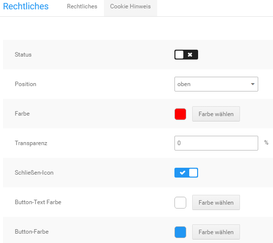
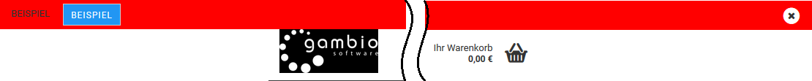
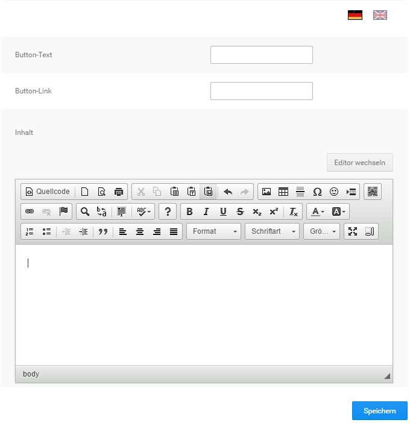

# Cookie Hinweis {#cookie_hinweis}

Der Cookie Hinweis kann unter Shop Einstellungen \> Rechtliches über den Reiter Cookie Hinweis konfiguriert werden. Der Hinweis erscheint beim ersten Aufruf des Shops und kann durch den Kunden bestätigt oder \(je nach Konfiguration\) geschlossen werden. Zur Bestätigung des Hinweises wird ein eigener Button angezeigt, dessen Beschriftung du frei festlegen kannst.

**Note:**

Wenn eine andere Seite des Shops oder die Startseite nochmals geladen wird, erfolgt keine erneute Anzeige des Cookie Hinweises.

Um die Funktion und/oder Darstellung bei Bedarf zu testen, empfehlen wir den Browser-Cache und die Cookies zu löschen oder wahlweise ein privates Browser-Fenster zu verwenden. Auf diese Weise wird der Shop wie beim ersten Aufruf geladen.

Folgende Einstellungen können allgemein vorgenommen werden:

-   Status: setzen des Hakens \(✔\) zum Aktivieren des Cookie-Hinweises, entfernen \(✖\) zum Deaktvieren
-   Position: oben/unten, Cookie Hinweis wird wahlweise am oberen oder unteren Bildschirmrand angezeigt

    

-   Farbe: hierüber kann die Hintergrunfarbe des Hinweises eingestellt werden
-   Transparenz: Transparenz der Hintergrundfarbe in Prozent \(0 - 100\)
-   Schließen-Icon: ist der Haken gesetzt \(✔\) wird ein x-Symbol zum Schließen des Hinweises angezeigt
-   Button-Text-Farbe: Farbe für die Beschriftung der Schaltfläche
-   Button-Farbe: Hintergrundfarbe der Schaltfläche

Folgende Einstellungen sind sprachabhängig. Klicke eine der Landesflaggen an, um die Einstellungen für die jeweilige Sprache vorzunehmen.

-   Button-Text: Beschriftung des Buttons zur Bestätigung des Cookie Hinweises
-   Button-Link: Link der beim Anklicken des Buttons aufgerufen werden kann
-   Inhalt: Hier kann der Text für den Cookie Hinweis hinterlegt werden

**Note:** Eine Übersicht über die einzelnen Schaltflächen des Editor-Fensters findest du im Kapitel CK-Editor unter Funktionsübersicht

Bestätige alle gemachten Änderungen mit Klick auf Speichern.

