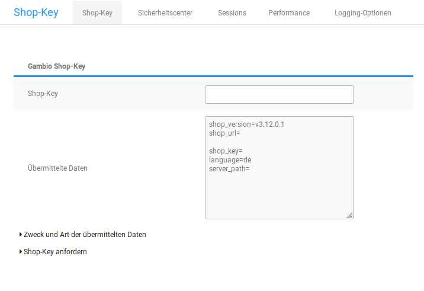

# Grundkonfiguration 

Nehme nach der Installation des Shopsystems die erstmalige Konfiguration des Shops vor. Im Folgenden findest du Informationen zur Grundkonfiguration deines Shops.

##Persönliche Daten

### Shopbetreiber-Anschrift

Die Absenderadresse auf der Bestellbestätigung entspricht der unter _**Shop Einstellungen \> Mein Shop**_ bzw. _**Einstellungen / Shop / Allgemein**_ im Feld _**Adresse**_ bzw. _**Geschäftsadresse und Telefonnummer etc.**_ eingetragenen Adresse. Füge deine Geschäftsadresse in das Feld _**Adresse**_ bzw. _**Geschäftsadresse und Telefonnummer etc.**_ ein und speichere die Änderung. Bei zukünftigen Bestellungen wird diese Adresse im Kopfbereich ausgegeben.

Für die korrekte Berechnung der Umsatzsteuer und der Versandkosten mancher Versandarten muss der Standort deines Shops bekannt sein. Wähle unter _**Shop Einstellungen \> Mein Shop**_ bzw. _**Einstellungen / Shop / Shopbetreiber**_ aus der Liste _**Land**_ das Land aus, aus dem der Versand stattfindet. Wähle anschließend aus der Liste _**Region**_ das Bundesland aus. Wenn du aus mehreren Ländern versendest, beachte bitte die Hinweise aus dem Kapitel _**Lokalisierung**_.

Trage deine E-Mail Adresse unter _**Shop Einstellungen \> Mein Shop**_ bzw. _**Einstellungen / Shop / Shopbetreiber**_ im Feld _**E-Mail-Adresse**_ ein. Zur weiteren Konfiguration des E-Mail Versands in deinem Shop beachte bitte auch das Kapitel _**E-Mail-Optionen**_.

Die Absenderadresse auf der PDF-Rechnung bei installiertem PdfCreator-Modul entspricht der Standard-Adresse des Hauptadministrators. Die Adresse des Hauptadministrators kannst du über das Adressbuch im Shopbereich ändern.

1.  Melde dich in deinem Onlineshop mit dem Administratorkonto an, das du während der Installationsroutine angelegt hast
2.  Wechsele nicht in den Administrationsbereich
3.  Klicke auf _**Ihr Konto**_ im oberen rechten Menü
4.  Klicke auf _**Adressbuch bearbeiten**_ im Hauptbereich des Shops
5.  Ändere die Standardadresse oder lege eine neue Adresse an; wenn du eine neue Adresse angibst, aktiviere das Kontrollkästchen _**Standardadresse**_
6.  Speichere die Standardadresse

Bei zukünftigen Rechnungen wird diese Adresse als Absenderadresse ausgegeben.

Für das Widerrufsformular stehen unter _**Shop Einstellungen \> Mein Shop**_ bzw. _**Einstellungen / Shop / Shopbetreiber**_ separate Eingabefelder zur Verfügung:

|Feldname|Beschreibung|
|--------|------------|
|Vorname|Der Vorname des Shop-Betreibers|
|Nachname|Der Nachname des Shop-Betreibers|
|Straßenname|Der Straßenname des Firmensitzes|
|Hausnummer|Die Hausnummer des Firmensitzes|
|Postleitzahl|Die Postleitzahl des Firmensitzes|
|Ort|Der Ort des Firmensitzes|
|Telefonnummer|Die Telefonnummer des Shop-Betreibers|
|Faxnummer|Die Faxnummer des Shop-Betreibers|

### Shopname

Lege den Namen deines Shops unter _**Shop Einstellungen \> Mein Shop**_ bzw. _**Einstellungen / Shop / Allgemein**_ im Feld _**Name des Shops**_ fest. Der Name deines Shops wird in automatisch erstellten E-Mails sowie abhängig von der im Kapitel _**Meta-Titel**_ beschriebenen Einstellungen in der Titelleiste des Webbrowsers angezeigt.

## Shop-Key 

!!! note "Hinweis"

	 Dieser Bereich des Gambio Admins ist nur in selbstgehosteten Shops verfügbar.

Der Shop-Key wird für die Verknüpfung deines Gambio Shops mit dem Gambio Kundenportal verwendet. Den Shop‑Key erhältst du im Gambio Kundenportal.

Den Shop-Key kannst du im Administrationsbereich deines Shops unter _**Shop Einstellungen \> System Einstellungen \> Shop-Key**_ bzw. _**Einstellungen / System / Shop Key**_ in das Feld _**Shop-Key**_ eingeben. Wenn du den Shop-Key eingegeben hast, klicke auf _**Speichern**_. Das Shopsystem übermittelt nun in regelmäßigen Abständen folgende Versionsinformationen zu deinem Shop an das Gambio Kundenportal:

-   die Internetadresse \(URL\) deines Shops
-   die aktuelle Shopversion
-   den Shop‑Key
-   die zum Zeitpunkt der Übermittlung aktive Sprache im Gambio Admin
-   wenn vorhanden, eine Liste mit vorherigen Shopversionen

Eine Liste mit den genauen Daten, die an das Gambio Kundenportal weitergegeben werden, kannst du im Gambio Admin deines Shops unter _**Shop Einstellungen \> System Einstellungen \> Shop‑Key**_ bzw. _**Einstellungen / System / Shop Key**_ nach Aufruf der Seite über den Link _**Zweck und Art der übermittelten Daten**_ einsehen.