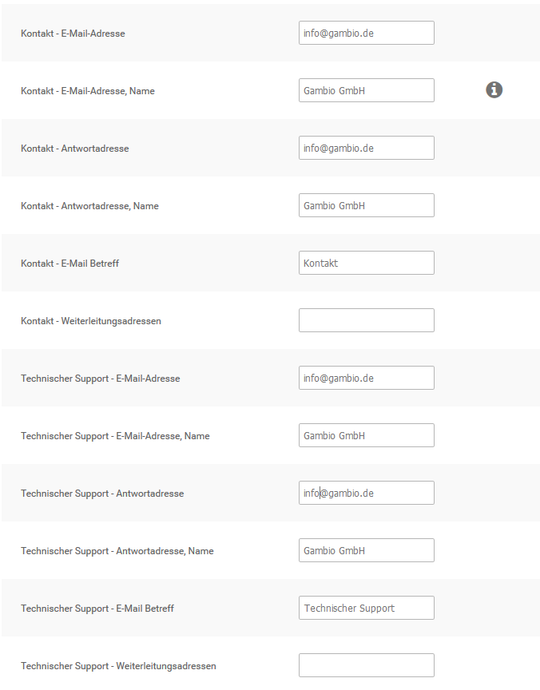

# E-Mail-Optionen 

!!! danger "Achtung"

	 Änderungen an den Einstellungen unter _**Kunden \> E-Mails \> E-Mail-Optionen**_ können dazu führen, dass keine E-Mails aus dem Shopsystem versendet werden können!

!!! note "Hinweis" 

	 Die E-Mail Transport-Methode wird in den meisten Fällen durch die Installationsroutine korrekt festgelegt. Sollte der E-Mail Versand fehlschlagen, stelle zunächst die Option bei _**Absender der Bestellbestätigungsmail**_ von _**Betreiber E-Mail**_ auf _**Kunden E-Mail**_. Wenn nach wie vor kein E-Mail Versand möglich ist, setze den _**Absender der Bestellbestätigungsmail**_ wieder auf die Standard-Einstellung zurück, ändere die _**E-Mail Transport-Methode**_ auf _**SMTP**_ und trage die SMTP-Daten ein. Achte hierbei auch den korrekten _**SMTP Port**_ und die Auswahl der richtigen _**SMTP Verschlüsselung**_ sowie die Aktivierung der Einstellung _**SMTP AUTH**_, falls der Server eine Verschlüsselung erfordert.

## E-Mail-Optionen

An der Grundkonfiguration der E-Mail-Optionen muss bei Verwenden der E-Mail Transport- Methode _**mail**_ keine Änderung vorgenommen werden.

### Sendmail

Die E-Mail Transport-Methode _**sendmail**_ sollte nicht verwendet werden. Wenn du _**sendmail**_ aus technischen Gründen verwenden musst, stelle sicher, dass der Pfad zu Sendmail korrekt konfiguriert ist. Wenn du sendmail verwendest, stelle außerdem sicher, dass unter _**Shop Einstellungen \> Mein Shop**_ bzw. Einstellungen / Shop / Shopbetreiber im Feld _**E-Mail von**_ bzw. _**E-Mail-Adresse**_ eine gültige E-Mail Adresse eingetragen ist.

### SMTP-Einstellungen

Wenn du die E-Mail Transport-Methode auf _**SMTP**_ umstellst, beachte die Konfigurationsvariablen aus der Tabelle _**SMTP Konfigurationsvariablen**_.

|Feldname|Beschreibung|
|--------|------------|
|Adresse des SMTP Servers|Die Adresse des Servers für den E-Mail Versand|
|Adresse des SMTP Backup Servers|Falls der Server für den E-Mail Versand nicht erreichbar ist, werden E-Mails über den Backup Server verschickt|
|SMTP Port|Port für den E-Mail Versand \[25\]|
|SMTP Username|Benutzername für den E-Mail Versand|
|SMTP Passwort|Passwort für den E-Mail Versand|
|SMTP AUTH|Aktivieren, wenn der SMTP-Server AUTH voraussetzt \[nein\]|

!!! note "Hinweis" 

	 Wenn der Mailversand trotz korrekt vorgenommener Konfiguration im Shop nicht erfolgt, wende dich an deinen Hosting-Provider.

### Erweiterte Einstellungen

!!! danger "Achtung"

	 Änderungen an den erweiterten Einstellungen können dazu führen, dass E-Mails fehlerhaft angezeigt oder gar nicht versendet werden.

|Feldname|Beschreibung|
|--------|------------|
|E-Mail Linefeeds|Art der Zeilenumbrüche, die in E-Mails verwendet werden sollen|
|HTML E-Mails senden|Versenden von E-Mails als MIME HTML oder Reintext|
|Überprüfen der E-Mail- Adressen über DNS|E-Mails von Kunden vor dem Senden automatischer Mails auf Erreichbarkeit prüfen|
|Senden von E-Mails|Automatischen Versand von E-Mails aktivieren \(beispielsweise Bestellbestätigungen\)|
|Maximale Anzahl E-Mails pro Versand|Schränkt die Anzahl der E-Mails ein, die gleichzeitig versendet werden können|

### E-Mail Einstellungen

Das Shopsystem versendet E-Mails von und an drei verschiedene shopinterne E-Mail Konten. In der Grundkonfiguration wird allen E-Mail Konten die bei Erstellung des Hauptadministrators während der Installationsroutine angegebene E-Mail Adresse hinterlegt.

Alle E-Mails werden im Namen des Shopbetreibers versandt. Den Namen des Shopbetreibers kannst du unter _**Shop Einstellungen \> Mein Shop**_ bzw. _**Einstellungen / Shop / Shopbetreiber**_ im Feld _**Inhaber**_ festlegen.

|Kontoname|Beschreibung|
|---------|------------|
|Kontakt|Vom E-Mail Konto Kontakt werden E-Mails von Kontaktformularen verschickt \(zum Beispiel Kundenkontakt, Artikel Weitermpfehlen\)|
|Technischer Support|Vom E-Mail Konto Technischer Support werden Kundenkonto bezogene E-Mails versendet \(zum Beispiel Kontoerstellungsmails, Passwortänderungen\)|
|Verrechnung|Vom E-Mail Konto Verrechnung werden E-Mails aus dem Verrechnungssystem verschickt \(zum Beispiel Bestellbestätigungen, Bestellstatus-Änderungen\)|

Jedem E-Mail Konto sind die folgenden Konfigurationsvariablen zugewiesen. Das Feld _**Weiterleitungsadressen**_ ist im jeweiligen E-Mail Konto optional.

|Feldname|Beschreibung|
|--------|------------|
|E-Mail-Adresse|gib hier die Absenderadresse ein|
|E-Mail-Adresse, Name|gib hier den Absendernamen ein|
|Antwortadresse|gib hier eine gegebenenfalls abweichende Antwortadresse ein|
|Antwortadresse, Name|gib hier den Namen für die abweichende Anwortadresse ein|
|E-Mail Betreff|gib hier den Betreff für E-Mails von diesem Konto ein|

!!! note "Hinweis"

	 Der Betreff der Bestellbestätigung wurde in den Shopversionen 4.3 und 4.4 nach _**Kunden \> E-Mails \> E-Mail Vorlagen**_ verschoben.

|Feldname|Beschreibung|
|--------|------------|
|Weiterleitungsadressen|gib hier kommagetrennt weitere E-Mail Adressen ein, an die ausgehende Nachrichten ebenfalls gesendet werden sollen; darf nicht die Adresse aus dem Feld E-Mail-Adresse enthalten|

!!! note "Hinweis" 
	 Bei manchen Server- und E-Mail-Konfigurationen kann der E-Mail Empfang beim Kunden fehlschlagen. Wenn deine Kunden keine Bestellbestätigungsmails erhalten, stelle sicher, dass die Option _**Absender der Bestellbestätigungsmail**_ auf _**Betreiber E‑Mail**_ steht.

## E-Mail Vorlagen

Das Shopsystem versendet automatisierte E-Mails. Die Vorlagen kannst du unter _**Kunden \> E-Mails \> E-Mail Vorlagen**_ anpassen.

|Vorlagenname|Beschreibung|
|------------|------------|
|Passwort ändern|Wird dem Kunden nach Ändern des Passworts über den Shopbereich zugesandt|
|Kundenkonto erstellt|Wird dem Kunden nach erfolgreicher Kundenregistrierung zugesandt|
|Neues Passwort|Wird dem Kunden nach der Bestätigung über die Passwort vergessen-Funktion zugesandt|
|Newsletter|Wird dem Kunden nach Anmeldung am Newsletter zugesandt|
|Bestellbestätigung|Wird dem Kunden nach Bestellabschluss zugesandt|

!!! note "Hinweis"
	 In den Shopversionen 4.3 und 4.4 befindet sich an dieser Stelle auch das Eingabefeld für den Betreff der Bestellbestätigung.

|Vorlagenname|Beschreibung|
|------------|------------|
|Passwortbestätigung|Wird dem Kunden zur Bestätigung der Passwort vergessen-Funktion zugesandt|
|Rechnungsversand|Wird dem Kunden beim Erstellen einer E-Mail Rechnung zugesandt|
|Gutschein|Wird verschickt, wenn ein Kunde einen Teil seines Guthabens an einen anderen Kunden verschickt|
|Widerrufssendebestätigung|Wird versendet, wenn der Kunde das Online-Widerrufsformular verschickt|
|Bezahlen über Amazon: Benachrichtigung über abgelehnte Zahlart|Wir verschickt, wenn die gewählte Zahlungsart von Amazon Payments abgelehnt wird|
|Admin: Änderung Bestellstatus|Wird dem Kunden nach Änderung des Bestellstatus im Administrationsbereich zugesandt, wenn das Kontrollkästchen _**Kunde benachrichtigen**_ aktiviert wurde|
|Admin:Kundenkonto angelegt|Wird dem Kunden zugesandt, wenn ein Kundenkonto über den Administrationsbereich angelegt wurde|
|Admin: Gutschein freigeschaltet|Wird dem Kunden zugesandt, wenn die Gutschein-Warteliste verwendet wird und der Gutschein über den Administrationsbereich freigeschaltet wurde|
|Admin: Coupon senden|Wird dem Kunden zugesandt, wenn ein Kupon über _**Gutscheine \> Rabatt Kupons**_ verschickt wird.|
|Admin: Gutschein senden|Wird dem Kunden zugesandt, wenn ein Gutschein über _**Gutscheine \> Gutschein E-Mail**_ verschickt wird|
|Admin: Kundenkonto löschen|Wird dem Administrator zugesandt, wenn ein Kunde sein Kundenkonto über die Funktion im Shopbereich löschen möchte|
|Admin: PayPal-Link senden|Wird dem Kunden zugesandt, wenn der Administrator einen PayPal-Link generiert|

Passe die gewünschte E-Mail Vorlage über den CK-Editor an. Klicke auf _**Vorschau**_, das Vorschaufenster muss geöffnet sein, damit du die vorgenommenen Änderungen speichern kannst.