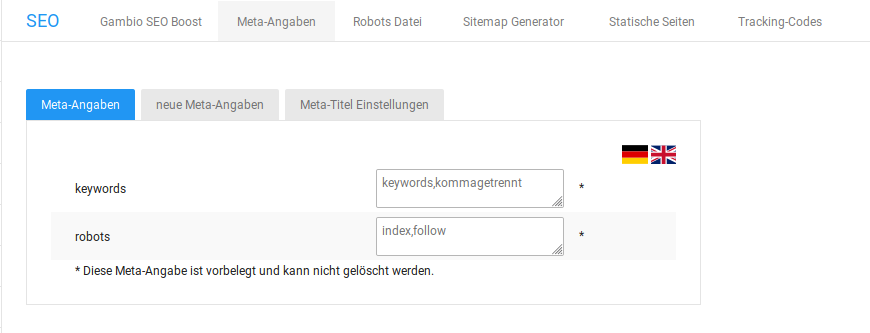

# Vorgaben 

## Robots { .section}

In der Meta-Angabe robots stehen Anweisungen an Suchmaschinen-Roboter, wie mit der vorliegenden Seite umgegangen werden soll. Die Anweisungen zum Indexieren \(index,noindex\) und Folgen von Links \(follow,nofollow\) können nach Bedarf gemischt werden. Die Grundeinstellung index,follow weist den Roboter zum Indexieren der Seite und dem Folgen von Links auf der Seite an.

## Keywords { .section}

In der Meta-Angabe keywords \(Schlagwörter\) kannst du eine kommagetrennte Liste von Schlagwörtern zu deinem Onlineshop hinterlegen. Die Schlagwörter können von Suchmaschinen als Suchwörter berücksichtigt werden, unter denen Kunden deinen Shop finden.

