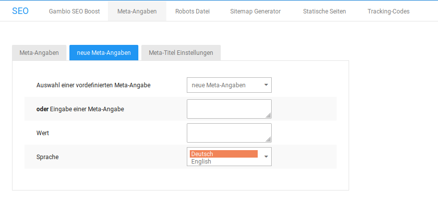

# Eigene Meta-Angaben {#eigene_meta_angaben}

Unter Shop Einstellungen \> SEO \> Meta-Angaben \> neue Meta-Angaben kannst du zusätzliche Meta-Angaben anlegen.

1.  Wähle in der Liste Auswahl einer vordefinierten Meta-Angabe eine Meta-Angabe aus oder trage im Feld Eingabe einer Meta-Angabe eine Meta-Angabe ein, die in der Liste nicht enthalten ist.
2.  Gebe im Feld Wert den Wert für die entsprechende Meta-Angabe ein.
3.  Wähle aus der Liste Sprache die Sprache aus, für die die Meta-Angabe übernommen werden soll.
4.  Speichere die neue Angabe.

|Meta-Angabe|Beschreibung|
|-----------|------------|
|description|Beschreibung der Seite|
|author|Autor der Internetseite \(inhaltlich verantwortlich\)|
|date|gibt an, wann die Seite veröffentlicht wurde|
|copyright|definiert das Copyright deines Shops, also dein Name oder deine Firma|
|publisher|Herausgeber der Seite|
|page-topic|grobe Kategorisierung für den Suchkatalog, in den deine Seite eingetragen wird. Du kannst auch mehrere Begriffe eintragen. \(beispielsweise Kleidung, Baby-Kleidung, Umstandsmode\)|
|page-type|Art deiner Website \(beispielsweise Onlineshop\)|
|audience|Zielgruppe deines Webshops, sofern du das festlegen kannst und möchtest \(beispielsweise Handwerker, Heimwerker, Erwachsene,...\)|

