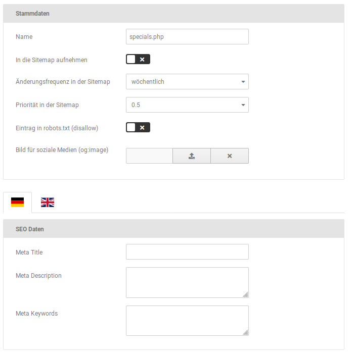

# Meta-Informationen für statische Seiten bearbeiten {#meta_informationen_fuer_statische_seiten_bearbeiten}

Unter Shop Einstellungen \> SEO \> Statische Seiten können die Meta-Informationen für die betreffenden Seiten festgelegt werden. Bewege hierzu den Mauszeiger in die jeweilige Zeile, es werden die Symbole \(bearbeiten, löschen\) angezeigt.

Klicke auf das Bleistift-Symbol, um einen Eintrag zu bearbeiten. Es stehen die folgenden Einstellungen zur Verfügung:

|Feldname|Beschreibung|
|--------|------------|
|Name|Dateiname der statischen Seite|
|In die Sitemap aufnehmen|ist der Haken gesetzt, wird die Seite in die Sitemap aufgenommen|
|Änderungsfrequenz in der Sitemap|Vorgabe wie oft die Seite von Suchmaschinen auf Änderungen geprüft werden soll \(nur Richtwert, der tatsächliche Zeitraum liegt im Ermessen des Suchmaschinenbetreibers\)|
|Priorität in der Sitemap|Wichtigkeit der Seite im Vergleich zum Rest des Shops, von 0.0 \(relativ unwichtig\) bist 1.0 \(sehr wichtig\)|
|Eintrag in robots.txt \(disallow\)|ist der Haken gesetzt, wird die Seite in die Robots-Datei aufgenommen|
|Bild für soziale Medien \(og:image\)|Bild für soziale Medien, wird mit einem Open Graph Meta-Tag eingebunden|
|Meta Title|Titel der Seite, wird auch im Browser-Tab angezeigt|
|Meta Description|Beschreibung der Seite, freier Text|
|Meta Keywords|Schlagwörter, unter denen die Seite von Suchmaschinen gefunden werden soll \(kommagetrennt, ohne Leerzeichen\)|

