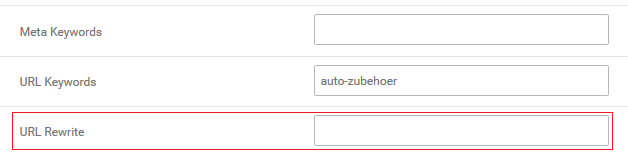
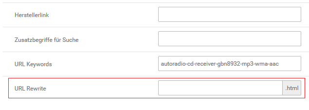
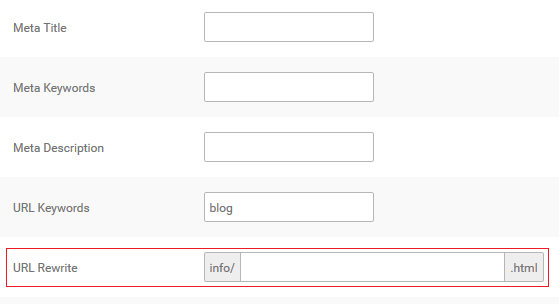

# URL Rewrite 

Über URL Rewrite können die URLs zu Artikeln, Kategorien und Content-Seiten individuell angepasst werden. Die URL der jeweiligen Seite ist unabhängig von bestehenden URL Keywords.

CAUTION:

Die Funktion URL Rewrite arbeitet nur mit aktiviertem Gambio SEO Boost.

Du kannst den Teil der URL anpassen, der direkt hinter deiner Shop-Domain \(bzw. direkt hinter dem Ländercode\) in der Adresszeile deines Browsers angezeigt wird.

!!! Info "Hinweis
	 Content-Seiten werden immer mit einem führenden /info/ aufgerufen. Content- und Artikelseiten schließen immer mit einem .html ab - beides ist fest vorgegeben und muss nicht händisch eingetragen werden. Bei der mehrfachen Verwendung des gleichen Eintrags wird zudem automatisch die ID angehängt.

Bearbeite hierzu den betreffenden Artikel, Content bzw. die betreffende Kategorie und nimm im Feld URL Rewrite den Eintrag für den neuen Adresspfad vor. Hierbei sollte beachtet werden, dass die Shop Bestandteil des Rewrites ist.

!!! Info "Hinweis
	 Trage die neue URL ohne führenden / ein, dieser wird automatisch gesetzt.

Zudem gilt die Änderung jeweils nur für eine Seite. Wenn du beispielsweise die URL einer Kategorie änderst, wird diese Änderung nur für den direkten Aufruf dieser Kategorie wirksam. Sobald eine Unterkategorie oder ein Artikel aufgerufen wird, wird wieder die ursprüngliche URL verwendet.

!!! Info "Hinweis
	 Du verkaufst Blusen und Hemden in den Kategorien Oberbekleidung \>\> Damen bzw. Oberbekleidung \>\> Herren. Dann würde z.B. folgende SEO Boost-URLs für die Kategorien verwendet werden:

www.shop.de/Oberbekleidung/Damen

www.shop.de/Oberbekleidung/Herren

Um den Aufruf zu vereinfachen, bearbeitest du jeweils die Unterkategorien Damen und Herren und trägst unter URL Rewrite als Kategoriepfad Blusen bzw. Hemden ein. Nach der Änderung würden die die Kategorien unter

www.shop.de/Blusen

www.shop.de/Hemden

aufgerufen.

Nach dem Speichern sollten, je nach Änderung, unter Toolbox \> Cache die Caches für

-   Artikel- und Kategoriezuordnungen
-   Modulinformationen und
-   Seitenausgabe

geleert bzw. neu erzeugt werden.

