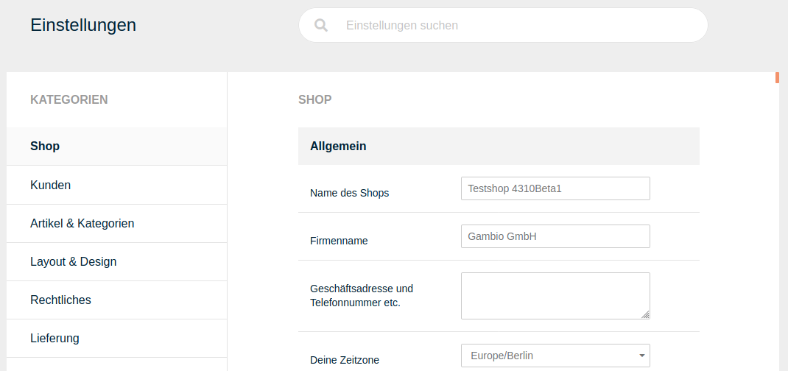

# Einstellungen

Ab Version 4.3 steht im Shop ein überarbeiteter Bereich mit den Grundeinstellungen zur Verfügung. Dieser ist in die Kategorien

-   Shop
-   Kunden
-   Artikel & Kategorien
-   Layout & Design
-   Rechtliches
-   Lieferung
-   Suchmaschinenoptimierung
-   Sprachen, Länder, Steuern
-   System

aufgeteilt. Zudem steht am oberen Ende der Seite eine Suchleiste zur Verfügung, mit der nach Einträgen gefiltert werden kann. Die Ansicht wird hierbei sofort bei der Eingabe angepasst und Übereinstimmungen hervorgehoben.

Am unteren Ende der Seite befindet sich der _**Speichern**_-Button. Dieser ist ausgegraut, solange keine Änderungen vorgenommen worden sind. Der Speichern-Button übernimmt geänderte Einstellungen aus allen Bereichen und Kategorien.

