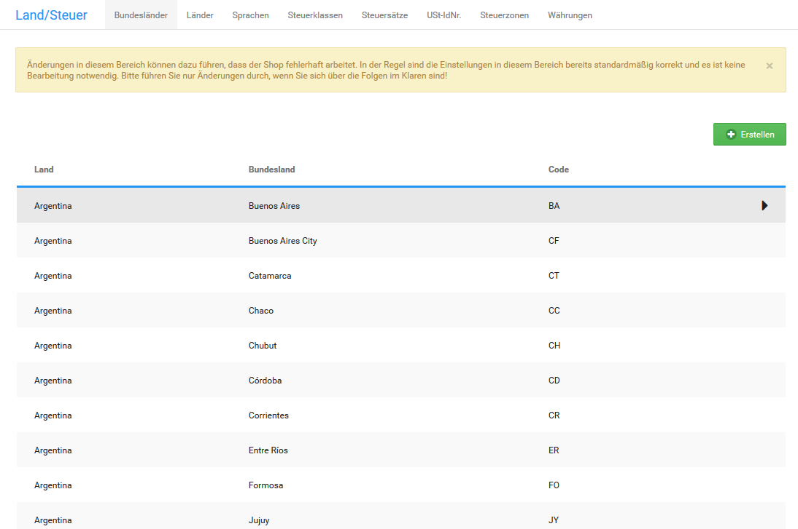

# Bundesländer 

Die Bundesländer für selbst angelegte Länder und voreingestellte Länder kannst du unter Shop Einstellungen \> Land/Steuer \> Bundesländer festlegen.

!!! Info "Hinweis
	 Im Installationsumfang werden nur Bundesländer für europäische Länder und große Länder außerhalb Europas angelegt. Die politische Entwicklung kann nicht in jeder Shopversion berücksichtigt werden, vereinzelt können Bundesländer daher nicht mehr aktuell sein.

## Bundesland hinzufügen 

Wenn du ein neues Land anlegst, oder in einem Lieferziel ein neues Bundesland entstanden ist, lege unter Shop Einstellungen \> Land/Steuer \> Bundesländer ein neues Bundesland an.

1.  Klicke auf Erstellen oberhalb der Bundesland-Liste
2.  Trage den Namen des Bundeslandes im Feld Name des Bundeslandes ein
3.  Trage den Kurznamen des Bundeslandes im Feld Code des Bundeslandes ein
4.  Wähle aus der Liste Land das Land aus, dem du das Bundesland zuweist
5.  Klicke auf Einfügen

## Bundesland bearbeiten 

Wenn die Details eines Bundeslandes in einem deiner Lieferziele geändert wurden, passe das jeweilige Bundesland unter Shop Einstellungen \> Land/Steuer \> Bundesländer an.

1.  Wähle das zu bearbeitende Bundesland aus der Liste Bundesländer aus

    Das aktive Bundesland ist grau hinterlegt.

2.  Klicke auf Bearbeiten
3.  Nimm die gewünschten Änderungen vor
4.  Klicke auf Aktualisieren

## Bundesland löschen 

Wenn du ein Bundesland aus einem selbst angelegten Land nicht mehr benötigst, lösche das Bundesland unter Shop Einstellungen \> Land/Steuer \> Bundesländer.

1.  Wähle das zu löschende Bundesland aus der Liste Bundesländer aus

    Das aktive Bundesland ist grau hinterlegt.

2.  Klicke auf Löschen
3.  Klicke erneut auf Löschen, um das Löschen des gewählten Bundeslandes zu bestätigen

