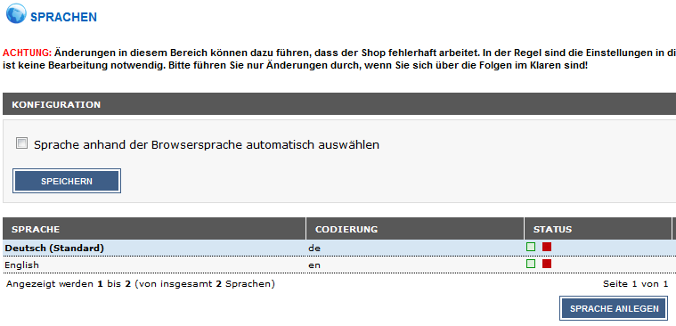
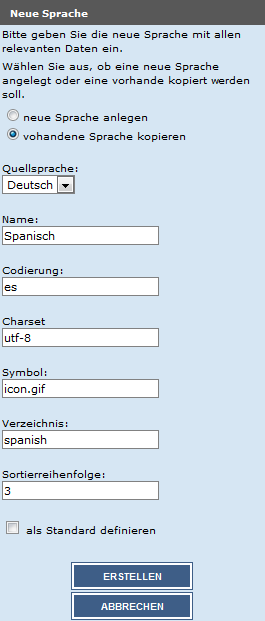
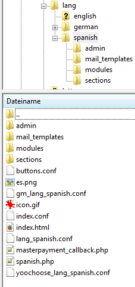

# Sprachen anlegen ab Shopversion 2.1 

CAUTION:

Die neue Sprache sollte **auf keinen Fall** in der Spalte Status aktiviert oder als Standard festgelegt werden, bevor sie auf dem FTP-Server korrekt installiert worden ist. Wir empfehlen die vorinstallierte Sprache Deutsch als Standardsprache zu verwenden.

Das Shopsystem wird vollständig in Englisch und Deutsch lokalisiert ausgeliefert. Zusätzliche Sprachen können nachträglich hinzugefügt werden.

Öffne im Administrationsbereich den Menüpunkt Land/Steuer \> Sprachen und klicke auf Sprache anlegen. Auf der rechten Seite öffnet sich eine Spalte. Hier findet die shopseitige Einrichtung der Sprache statt. Der Hauptbestandteil wird aber erst durch Kopieren der entsprechenden Dateien auf den FTP-Server erstellt. Ein alleiniges Anlegen der Sprache im Administrationsbereich ist keine vollständige Installation. Wenn die Sprache hier aktiv geschaltet wird, bevor die Installation auf dem Server besteht, kann es zu schwerwiegenden Fehlern im Shop kommen! Du hast beim Anlegen der Sprache im Administrationsbereich folgende Einstellungsmöglichkeiten:

!!! Info "Hinweis
	 Wir empfehlen grundsätzlich die Einstellung vorhandene Sprache kopieren beizubehalten. Neue Sprache anlegen kann in Ausnahmefällen verwendet werden, z.B., wenn bereits Sprachdateien aus einer anderen Quelle vorliegen.

Verwende die Einstellung vorhandene Sprache kopieren, um z.B. Artikel- und Kategoriebeschreibungen mit zu übernehmen. Unter Quellsprache kann die Sprache hierzu ausgewählt werden.

Wenn die Sprache mit der Einstellung neue Sprache anlegen festgelegt wurde, müssen ggf. die einzelnen Kategorien unter Artikel \> Artikel/Kategorien bearbeitet und neu gespeichert werden, bevor diese aufgerufen werden können.

Gib unter Name den Namen der Sprache ein \(Beispiel: Spanisch\). Bei Codierung gibst du den zweistelligen ISO

Dies ist deshalb notwendig, damit sich der Shop auf die richtigen Verzeichnisse und Dateien beziehen kann. Anderenfalls können die übersetzten Sprachdateien nicht gefunden werden.

In das Feld Sortierreihenfolge trägst du die gewünschte Sortierreihenfolge der Sprache ein. Die Sortierreihenfolge hat Einfluss auf die Position der Eingabefelder für diese Sprache in den Artikel- und Kategorie-Eingabemasken sowie in der Sprachwahl im Administrations- und Shopbereich.

Kopiere das Verzeichnis Shopsystem\\Dateien\\lang\\german von der Installations-CD oder aus dem Installationsarchiv auf deinem Computer. Als Beispiel wird im Folgenden die Sprache Spanisch hinzugefügt. Benenne das zuvor kopierte Verzeichnis german auf deinem Computer in spanish um. Wir empfehlen, den englischen Namen der Sprache in Kleinbuchstaben zu verwenden.

Wechsele in das Verzeichnis spanish auf deinem Computer. Benenne die nachfolgenden Dateien wie beschrieben um:

CAUTION:

Achte beim Umbenennen darauf, den Rest des Dateinamens nicht zu verändern. Auch die Anzahl der Unterstriche muss erhalten bleiben!

Halte dich beim Übersetzen unbedingt an die vorliegende Struktur. Eine fehlerhafte Übersetzungsdatei kann den Shop in der gewählten Sprache unbenutzbar machen.

|Alter Name|Neuer Name|
|----------|----------|
|de.png|es.png|
|german.php|spanish.php|
|gm\_lang\_german.conf|gm\_lang\_spanish.conf|
|lang\_german.conf|lang\_spanish.conf|
|yoochoose\_lang\_german.conf|yoochoose\_lang\_spanish.conf|
|admin/german.php|admin/spanish.php|

!!! Info "Hinweis
	 Wenn du die Sprache neu anlegst, anstatt eine vorhandene Sprache zu kopieren \(entsprechend der Einstellungen unter Land/Steuer \> Sprachen\), müssen ggf. weitere Sections-Dateien eingebunden werden. Wechsele hierzu in das Verzeichnis spanish/sections/\_samples und verschiebe alle benötigten Dateien in das Verzeichnis spanish/sections. Benenne die mit lang\_\_ beginnenden Dateien so um, dass der Name der neuen Sprache im Dateinamen verwendet wird, also statt

lang\_\_german\_\_admin\_\_german\_\_\_php.lang.inc.php

muss die Datei folgendermaßen heißen:

lang\_\_spanish\_\_admin\_\_spanish\_\_\_php.lang.inc.php

Nimm in den .conf und .php Dateien die notwendigen Übersetzungen vor. Die Übersetzungsdateien für die Shopansicht findest du in den Verzeichnissen spanish und spanish/sections. Übersetzungsdateien für Zusatzmodule befinden sich im Verzeichnis spanish/modules in den jeweiligen Unterverzeichnissen.

Kopiere ein GIF-Bild der Landesfahne der Zielsprache nach spanish/icon.gif. Die Abmessungen sollten 32x35 Pixel betragen. Kopiere anschließend ein GIF-Bild der Landesfahne nach spanish/admin/images/icon.gif. Die Abmessungen für diese Grafik sollten 18x13 Pixel betragen.

Anschließend müssen noch organisatorische Änderungen an folgenden Dateien im Verzeichnis \\lang vorgenommen werden:

-   \\spanish\\admin\\spanish.php
-   \\spanish\\modules\\payment\\shopgate.php
-   \\spanish\\spanish.php

Hierzu zählen:

-   Pfadinformationen:

Es wird z.B. auf lang/german/german.php verwiesen, hier müssen Verzeichnisse und Dateien zu spanish umbenannt werden. Also beispielsweise folgendermaßen:

lang/spanish/spanish.php

-   Spracheinstellungen für die Datenbank

Dies kann z.B. in Zeilen dieser Art vorkommen:

@setlocale\(LC\_TIME, 'de\_DE.utf8', 'de\_DE.UTF-8', 'de\_DE@euro', 'de\_DE', 'de-DE', 'de', 'ge', 'German'\);

define\('HTML\_PARAMS','dir="ltr" lang="de"'\);

Ändere diese Zeilen für unser Beispiel Spanisch wie folgt:

@setlocale\(LC\_TIME, 'es\_ES.utf8', 'es\_ES.UTF-8', 'es\_ES@euro', 'es\_ES', 'es-ES', 'es', 'es', 'Spanish'\);

define\('HTML\_PARAMS','dir="ltr" lang="es"'\);

-   Währungseinstellungen

define\('LANGUAGE\_CURRENCY', 'EUR'\);

Hier sollten die Länder- und Währungscodes entsprechend angepasst werden. Für unser Beispiel Spanisch kann dieser Eintrag beibehalten werden.

Lade das Verzeichnis spanish mit allen übersetzten Dateien und Unterverzeichnissen in das Verzeichnis /lang im Shopverzeichnis auf deinem Webserver hoch.

Kopiere die Datei admin/yoochoose/yoo\_lang\_german.php und benenne die Kopie in admin/yoochoose/yoo\_lang\_spanish.php um. Nimm in dieser Kopie ebenfalls die nötigen Übersetzungen vor. Dupliziere folgende Ordner auf deinem FTP-Server und benenne sie in die Zielsprache um:

|Alter Name|Neuer Name|
|----------|----------|
|/templates/EyeCandy/buttons/german|/templates/EyeCandy/buttons/spanish|

Bitte beachte, dass dieser Schritt für alle verwendeten Templates wiederholt werden muss. Wenn z.B. ein Gambio MobileCandy vorhanden ist, sollte in den aufgeführten Verzeichnissen /templates/EyeCandy gegen /templates/MobileCandy ausgetauscht werden.

Abschließend kann die Sprache unter Land/Steuer \> Sprachen über die Spalte Status aktiviert werden. Sollten zu diesem Zeitpunkt noch Übersetzungen notwendig sein, können diese über Toolbox \> Texte anpassen vorgenommen werden. Anschließend sollte unter Toolbox \> Cache leeren der Cache für Modulinformationen geleert werden.

!!! Info "Hinweis
	 Wenn du Module externer Hersteller verwendest, müssen hier ggf. weitere Sprachdateien kopiert und übersetzt werden. Diese befinden sich im Regelfall im jeweiligen Modulverzeichnis in einem Unterordner/lang/....

