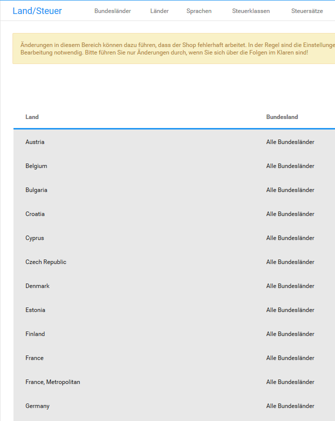
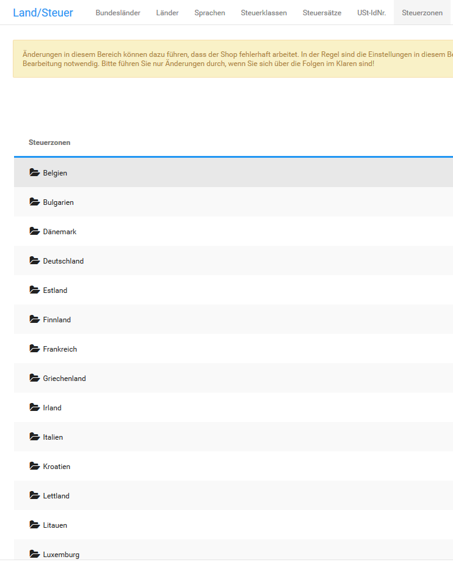

# Steuer 

CAUTION:

Änderungen an den Steuereinstellungen können dazu führen, dass die Steuern in deinem Shop nicht mehr berechnet werden. Unter Umständen können bei fehlerhaften Steuereinstellungen sämtliche Summen nicht berechnet werden.

Admin-Konten haben bei der Steuerberechnung eine andere Priorität als reguläre Kundenkonten und verwenden daher die vorgenommenen Steuereinstellungen nicht eins zu eins. Änderungen sollten daher nicht mit einem Admin-Konto getestet werden, sondern mit einem Konto der entsprechenden Kundengruppe.

Die Steuereinstellungen werden von der Installationsroutine für Deutschland festgelegt. Wenn du deinen Onlineshop in einem anderen Land betreibst, müssen in der Regel die Steuereinstellungen angepasst werden.

**Note:** Wenn du Änderungen an den Steuersätzen vornehmen musst, informiere dich vorher bei deinem Steuer- oder Rechtsberater über die für dich gültigen Einstellungen.

## Notwendige Änderungen innerhalb der EU { .section}

Wenn du deinen Onlineshop in der Europäischen Union betreibst, sind Änderungen an den Steuersätzen unter Shop Einstellungen \> Land/Steuer \> Steuersätze nötig, wenn die Steuersätze in deinem Land von denen in Deutschland abweichen.

1.  Markiere den Steuersatz Standardsatz für die Steuerzone Steuerzone EU
2.  Klicke auf Bearbeiten
3.  Ändere den Wert im Feld Steuersatz auf den für dein Land gültigen Steuersatz
4.  Passe die Beschreibung entsprechend des Steuersatzes an

    Beachte, dass die Beschreibung aus technischen Gründen auf % MwSt. enden muss.

5.  Nimm die Änderungen für dein Land im Steuersatz ermäßigter Steuersatz für die Steuerzone Steuerzone EU vor

## Notwendige Änderungen außerhalb der EU { .section}

Wenn du deinen Onlineshop außerhalb der Europäischen Union betreibst, musst du für dein Land unter Shop Einstellungen \> Land/Steuer \> Steuerzonen eine neue Steuerzone anlegen.

1.  Klicke auf Erstellen

    In der rechten Spalte öffnet sich die Eingabemaske für eine neue Steuerzone.

2.  Trage im Feld Name der Steuerzone einen Namen für die neue Steuerzone ein
3.  Trage im Feld Beschreibung eine kurze Beschreibung der Steuerzone ein
4.  Klicke auf Einfügen

    In der linken Spalte wird die neue Steuerzone hinzugefügt.

5.  Wähle die neue Steuerzone aus

    Die aktive Steuerzone wird grau hinterlegt.

6.  Klicke auf Details \(►\)
7.  Klicke auf Erstellen
8.  Wähle aus der Liste Land in der rechten Spalte das Land aus, aus dem du deinen Shop betreibst
9.  Lasse in der Liste Bundesland den Wert Alle Bundesländer ausgewählt
10. Klicke auf Einfügen

Dein Land wurde in die neue Steuerzone aufgenommen.

Entferne nun dein Land aus der Steuerzone Steuerzone EU-Ausland unter Shop Einstellungen \> Land/Steuer \> Steuerzonen.

1.  Wähle die Steuerzone Steuerzone EU-Ausland aus

    Die aktive Steuerzone wird grau hinterlegt.

2.  Klicke auf Details \(►\)
3.  Markiere dein Land in der Länderliste
4.  Klicke in der rechten Spalte auf Löschen
5.  Klicke erneut auf Löschen um das Löschen zu bestätigen

Lege nun die Steuersätze für dein Land fest. Lege dazu neue Steuersätze unter Shop Einstellungen \> Land/Steuer \> Steuersätze an.

1.  Klicke auf Erstellen

    In der rechten Spalte öffnet sich die Eingabemaske für einen neuen Steuersatz.

2.  Wähle aus der Liste Name der Steuerklasse die gewünschte Steuerklasse aus
3.  Wähle aus der Liste Steuerzone die neue Steuerzone aus
4.  Trage im Feld Steuersatz \(%\) den für dein Land gültigen Steuersatz in Prozent ein

    Verwende bei gebrochenen Steuersätzen einen Punkt als Dezimaltrennzeichen.

5.  Trage im Feld Beschreibung die Beschreibung für den Steuersatz ein, der im Summenblock angezeigt werden soll

    Beachte, dass die Beschreibung aus technischen Gründen auf % MwSt. enden muss.

6.  Trage im Feld Priorität die Priorität des Steuersatzes ein

    Dem Standardsatz und dem ermäßigten Steuersatz sollten die selbe Priorität zugewiesen werden, wenn gemischte Steuersätze im Summenblock addiert werden sollen.

7.  Klicke auf Einfügen
8.  Wiederhole den Vorgang, wenn für dein Land zusätzliche Steuerklassen benötigt werden

## Steuerklassen { .section}

Unter Shop Einstellungen \> Land/Steuer \> Steuerklassen findest du die einzelnen Steuerklassen. Diese werden verwendet, um die einzelnen Steuersätze anhand eines entsprechenden Bezeichners einstellen zu können. Standardmäßig sind die Steuerklassen ermäßigter Steuersatz, elektronisch erbrachte Leistung und Standardsatz im Shop vorhanden.

CAUTION:

Änderungen in diesem Bereich können dazu führen, dass der Shop fehlerhaft arbeitet. In der Regel sind die Einstellungen in diesem Bereich bereits standardmäßig korrekt und es ist keine Bearbeitung notwendig. Bitte führe nur Änderungen durch, wenn du dir über die Folgen im Klaren bist!

Über einen Klick auf die Schaltfläche Erstellen kann eine weitere Steuerklasse erstellt und hinzugefügt werden. Hierbei muss mindestens ein Name vergeben werden. Mit Klick auf Einfügen wird die Steuerklasse mit den gemachten Eingaben angelegt. Durch Klick auf Abbrechen werden die Eingaben verworfen.

Bestehende Steuerklassen können nach Auswahl \(die Zeile ist grau hinterlegt\) über Klick auf die Schaltfläche Bearbeiten angepasst werden. Mit Klick auf Löschen wird die jeweilige Steuerklasse entfernt.

## Verschieben von Ländern in andere Steuerzonen { .section}

**Note:**

Wir gehen hierbei von den Standardeinstellungen aus, d.h. dass z.B. die Steuersätze bisher nicht geändert worden sind.

Ob für Bestellungen aus einem bestimmten Land Steuern berechnet werden, hängt u.a. von der jeweiligen Steuerzone ab, in die das betreffende Land eingetragen worden ist. Für Länder in der Steuerzone EU werden standardmäßig 19% MwSt. als Standardsatz und 7% MwSt. als ermäßigter Satz berechnet. Innerhalb der Steuerzone EU Ausland betragen beide Sätze 0%.

**Steuern für bestimmte Länder nicht berechnen**

Wenn du für bestimmte Länder keine Steuer berechnen möchtest, kannst du diese aus der Steuerzone EU entfernen und in die Steuerzone EU Ausland verschieben.

Gehe hierzu unter Shop Einstellungen \> Land/Steuer \> Steuerzonen und wechsele auf die zweite Seite. Wähle hier die Steuerzone EU mit einem Mausklick aus und wechsele anschließend über das Dreieck-Symbol in die Detailansicht. Wähle das jeweilige Land aus und klicke auf Löschen. Bestätige die Sicherheitsabfrage, wenn für das betreffende Land keine Steuern berechnet werden sollen.

Wähle nun die Steuerzone EU Ausland aus und öffne dort ebenfalls die Detail-Ansicht, wie oben beschrieben. Klicke auf Erstellen, um die zuvor gelöschten Länder unter der neuen Steuerzone anzulegen.

**Steuern für bestimmte Länder berechnen**

Wenn du für bestimmte Länder Steuern berechnen möchtest, kannst du diese aus der Steuerzone EU Ausland entfernen und in die Steuerzone EU verschieben.

Gehe hierzu unter Shop Einstellungen \> Land/Steuer \> Steuerzonen und wechsele auf die zweite Seite. Wähle hier die Steuerzone EU Ausland mit einem Mausklick aus und wechsele anschließend über das Dreieck-Symbol in die Detailansicht. Wähle das jeweilige Land aus und klicke auf Löschen. Bestätige die Sicherheitsabfrage, wenn für das betreffende Land Steuern berechnet werden sollen.

Wähle nun die Steuerzone EU aus und öffne dort ebenfalls die Detail-Ansicht, wie oben beschrieben. Klicke auf Erstellen, um die zuvor gelöschten Länder unter der neuen Steuerzone anzulegen.

