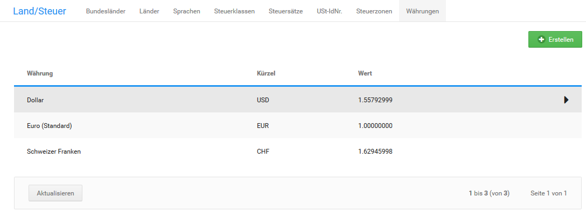

# Währungen 

Bei der Installation des Shopsystems werden die Währungen Euro, Schweizer Franken und US Dollar mit geschätzten Wechselkursen angelegt. Die Wechselkurse werden nicht automatisch aktualisiert.

## Wechselkurse aktualisieren { .section}

Klicke im Gambio Admin deines Shops unter Shop Einstellungen \> Land/Steuer \> Währungen auf Wechselkurse aktualisieren. Die Wechselkurse aller Währungen werden kostenfrei bei einem externen Dienstleister abgefragt. Als Referenzkurs wird die als Standardwährung festgelegte Währung verwendet.

**Note:** Unter Umständen können einzelne Währungskurse nicht aktualisiert werden. Ob alle Währungskurse aktualisiert werden konnten, siehst du in den Erfolgs- und Fehlermeldungen oberhalb der Tabelle. Wenn das Abrufen eines Wechselkurses fehlschlägt, führe die Aktion erneut aus.

## Währung hinzufügen { .section}

Wenn du weitere Währungen anbieten möchtest, füge unter Shop Einstellungen \> Land/Steuer \> Währungen eine neue Währung hinzu.

1.  Klicke auf Erstellen
2.  Trage im Feld Name den Namen und im Feld Kürzel das Kürzel für die Währung ein

    Beachte, dass das Währungskürzel der ISO Normierung entsprechen muss, damit Wechselkurse korrekt abgefragt werden können.

3.  Trage im Feld Symbol links oder Symbol rechts das Währungssymbol ein

    Beachte, dass Sonderzeichen unter Umständen nicht korrekt angezeigt werden. Trage im Zweifelsfall ebenfalls das Kürzel als Symbol ein.

4.  Trage in die Felder Dezimaltrennzeichen, Tausendertrennzeichen und Dezimalstellen die für deine Währung geltenden Formatierungszeichen ein

    Europäische Währungen verwenden in der Regel ein Komma als Dezimaltrennzeichen, kein Tausendertrennzeichen und zwei Dezimalstellen.

5.  Wenn dir der aktuelle Wechselkurs zur Standardwährung bekannt ist, trage den Kurs im Feld Wert ein
6.  Aktiviere das Kontrollkästchen als Standard definieren, um die neue Währung als Standardwährung festzulegen
7.  Klicke auf Einfügen
8.  Aktualisiere die Wechselkurse für die Währungen, wie unter Wechselkurse aktualisieren beschrieben

## Standardwährung ändern { .section}

Sofern die Option Automatisch auf Landeswährung umstellen unter Shop Einstellungen \> Mein Shop nicht aktiviert ist, werden alle Preise im Shop in der Standardwährung dargestellt. Die Währung muss in diesem Fall über einen der Währungswechsel im oberen rechten Menü oder in der linken Menüleiste umgestellt werden. Wenn du deinen Shop außerhalb der Eurozone betreibst, muss die Standardwährung unter Shop Einstellungen \> Land/Steuer \> Währungen angepasst werden.

1.  Markiere in der Liste Währungen die Währung, die du als Standardwährung festlegen möchtest

    Die aktuell markierte Währung ist grau hinterlegt.

2.  Klicke auf Bearbeiten
3.  Aktiviere das Kontrollkästchen als Standard definieren
4.  Trage im Feld Wert den Wert 1.0000 ohne Anführungszeichen ein
5.  Klicke auf Aktualisieren
6.  Aktualisiere die Wechselkurse für die Währungen, wie unter Wechselkurse aktualisieren beschrieben

**Note:** Änderungen an der Standardwährung werden erst nach einem erneuten Anmelden im Shop wirksam. Wenn du Änderungen an der Standardwährung vornimmst, melde dich von deinem Shop ab und wieder an.

## Währung löschen { .section}

Wenn du eine Währung nicht mehr benötigst, kannst du diese unter Shop Einstellungen \> Land/Steuer \> Währungen entfernen. Die Standardwährung kann nicht gelöscht werden. Wenn du die Standardwährung löschen möchtest, lege zuvor eine neue Standardwährung fest, wie unter Standardwährung ändern beschrieben.

1.  Markiere in der Liste Währungen die Währung, die du als Standarwährung festlegen möchtest

    Die aktuell markierte Währung ist grau hinterlegt.

2.  Klicke auf Löschen
3.  Klicke erneut auf Löschen, um das Löschen zu bestätigen

