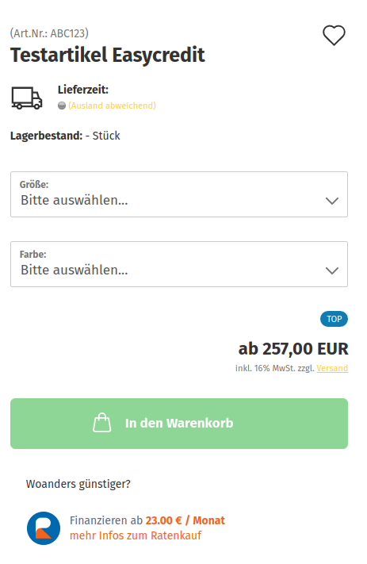
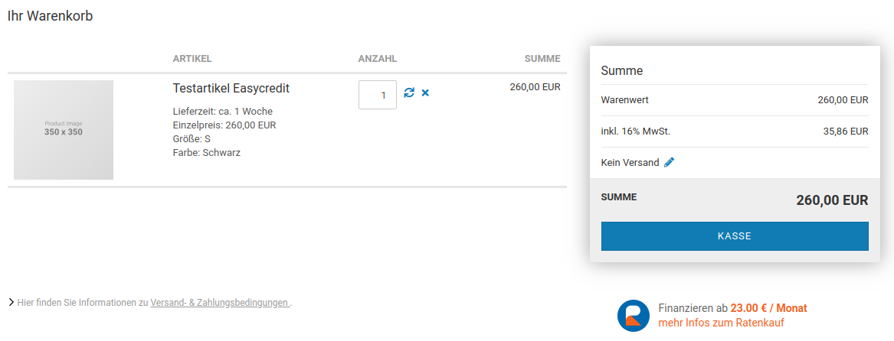
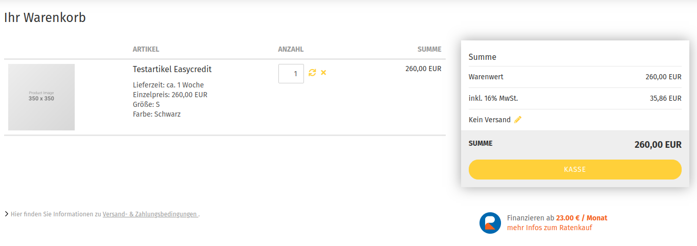
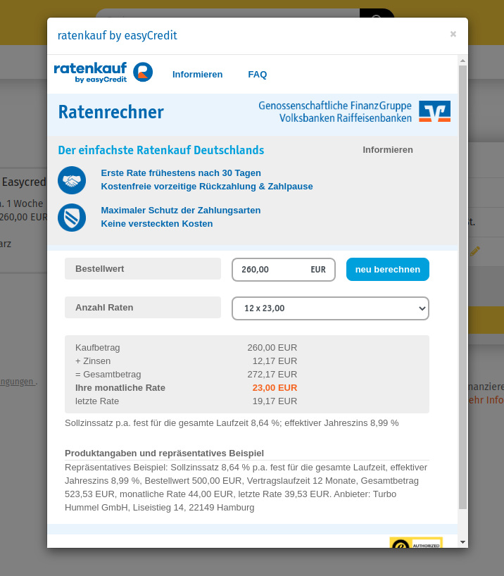

# Darstellung im Shop 

## Anzeige des Widgets in der Preisbox auf der Artikeldetailseite 

|

|

|

## Anzeige des Widgets im Warenkorb 

## Anzeige des Ratenrechners 

Klickt man auf den Link im Widget, öffnet sich der Ratenrechner.

