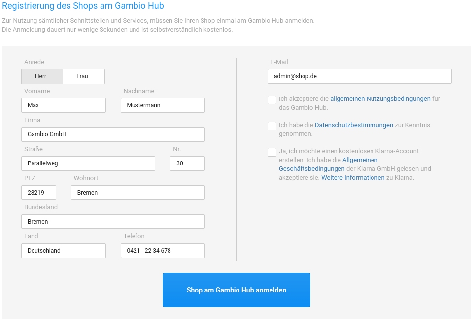
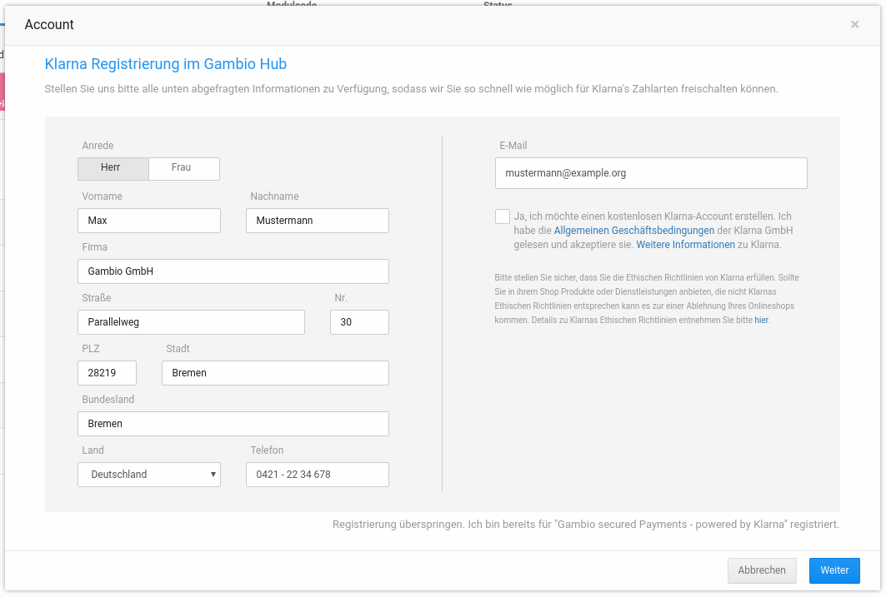

# Gambio Hub Anmeldung 

Sofern du noch nicht am Gambio Hub angemeldet bist, führe nun im Backend deines Gambio Shops die Anmeldung durch. Klicke hierzu auf den Menüpunkt Gambio Hub im linken Menü des Adminbereichs deines Shops. Die Anmeldung findet schnell und einfach aus dem Shop heraus statt und ist sofort wirksam.

Die Nutzung des Gambio Hubs ist dauerhaft kostenfrei und auch für Shopbetreiber ohne aktives Kundenkonto bei Gambio möglich. Bei erfolgreicher Anmeldung leuchtet das Gambio Hub Badge in der Fußleiste des Shops grün auf.

Solltest du Fragen zu oder Probleme mit diesem Schritt haben, hilft dir auch hier der Gambio-Support gerne weiter, nutze dazu die in vorigem Schritt beschriebenen Kontaktmöglichkeiten, um mit Gambio in Kontakt zu treten.

Die Anmeldung bei Klarna kann zusammen mit der Hub Anmeldung durchgeführt werden. Setze hierzu einfach den Haken bei Ja, ich möchte einen kostenlosen Klarna-Account erstellen. Diese Einstellung ist optional.

!!! Info "Hinweis"
    Über die Links im zweiten Absatz der Checkbox kannst du die Allgemeinen Geschäftsbedingungen von Klarna anzeigen lassen und Weitere Informationen aufrufen.

!!! Info "Hinweis"
    Die Anmeldung bei Klarna kann auch später aus dem Bereich Module \> Zahlungsweisen \> Gambio Payment Hub vorgenommen werden.

