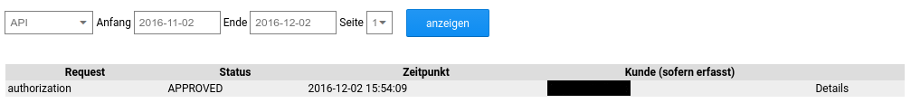

# Payone API Log 

Hier kann für den gewünschten Zeitraum eine Liste aller erfolgten Transaktionen abgerufen werden. Der Eintrag Details verweist auf ein ausführliches Log, in dem die zu Payone übermittelten Daten der Zahlung aufgeführt werden.

