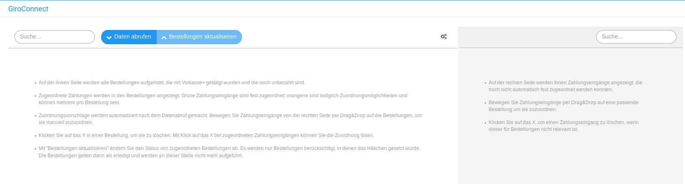
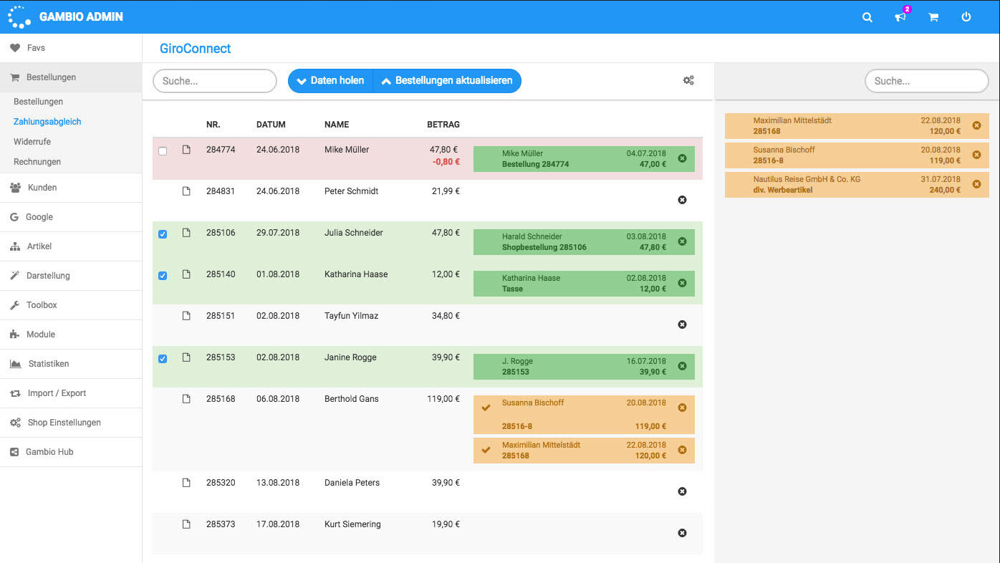

# Zahlungsabgleich 

Bei Aufruf des Menüpunkts Bestellungen \> Zahlungsabgleich werden zuerst die Daten aktualisiert, unter Umständen wird erneut PIN/Kennwort zum hinterlegten Bankkonto abgefragt. Liegen noch keine Zahlungen und Vorkasse-Bestellungen vor, enthält die Seite nur Hilfetexte.

Linke Seite

-   Auf der linken Seite werden alle Bestellungen aufgelistet, die mit GiroConnect getätigt wurden und die noch unbezahlt sind.
-   Zugeordnete Zahlungen werden in den Bestellungen angezeigt. Grüne Zahlungseingänge sind fest zugeordnet; orangene sind lediglich Zuordnungsmöglichkeiten und können mehrere pro Bestellung sein.
-   Zuordnungsvorschläge werden automatisiert nach dem Datenabruf gemacht. Bewege Zahlungseingänge von der rechten Seite per Drag&Drop auf die Bestellungen, um sie manuell zuzuordnen.
-   Klicke auf das X in einer Bestellung, um sie zu löschen. Mit Klick auf das X bei zugeordneten Zahlungseingängen kannst du die Zuordnung lösen.
-   Mit "Bestellungen aktualisieren" änderst du den Status von zugeordneten Bestellungen ab. Es werden nur Bestellungen berücksichtigt, in denen das Häkchen gesetzt wurde. Die Bestellungen gelten dann als erledigt und werden an dieser Stelle nicht mehr aufgeführt.

Rechte Seite

-   Auf der rechten Seite werden dir Zahlungseingänge angezeigt, die noch nicht automatisch fest zugeordnet werden konnten.
-   Bewege Zahlungseingänge per Drag&Drop auf eine passende Bestellung um sie zuzuordnen.
-   Klicke auf das X, um einen Zahlungseingang zu löschen, wenn dieser für Bestellungen nicht relevant ist.

-   Bestellnr. 284774, rot hinterlegt: die Zahlung ist grün hinterlegt, wurde also zugewiesen. Man kann erkennen, dass der Bestellwert 47,80 Euro betrug, aber nur 47 Euro bezahlt wurden. Es liegt daher eine Unterzahlung von 0,80 Euro vor, die dort auch ausgewiesen wird.
-   Bestellnr. 285106, grün hinterlegt: Die Zahlung konnte problemlos zugeordnet werden und stimmt in allen Angaben - Name, Bestellnummer und Summe - mit den Bestelldaten überein.
-   Bestellnr. 285168, orange hinterlegt: Für die Bestellung von Herrn Gans kommen zwei Zahlungen in Frage, bei denen die Bestellnummer und der Betrag nicht identisch sind, aber ähnlich. Der Shopbetreiber kann die richtige Zahlung nun aus der rechten Spalte links auf die Bestellung ziehen, um der Bestellung eine der Zahlungen zuzuordnen.
-   Bestellnr. 285320, nicht farbig hinterlegt: für diese Bestellung gibt es noch keine vorgeschlagenen Zahlungseingänge.

