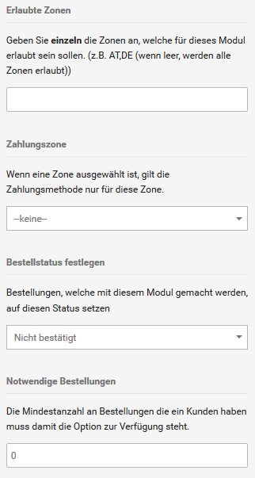

# Rechnung 

Bei der Zahlung per Rechnung legst du dem Kunden der ausgelieferten Ware eine Rechnung mit Zahlungsziel und Kontoverbindung bei. Bei dieser Zahlungsweise erhält der Kunde erst die Ware und nimmt dann die Zahlung vor.

1.  Wähle unter Module \> Zahlungsweisen \> Sonstige das Modul Rechnung aus
2.  Klicke in der rechten Spalte auf Installieren
3.  Klicke in der rechten Spalte auf Bearbeiten
4.  Nimm die Konfiguration des Moduls anhand der Tabelle Konfiguration der Zahlungsweise Rechnung vor
5.  Klicke auf Aktualisieren, um die Änderungen an der Konfiguration zu übernehmen

|Feldname|Beschreibung|
|--------|------------|
|Rechnungsmodul aktivieren|Bei ✔ kann der Kunde die Zahlungsweise im Bestellvorgang auswählen \[✔\]|
|Erlaubte Zonen|kommagetrennte Liste der zweistelligen ISO-Codes für Länder, aus denen die Zahlungsweise verwendet werden darf \(alle Länder bei keinem Eintrag\)|
|Zahlungszone|Steuerzone, aus der die Zahlungsweise verwendet werden darf \(überschreibt Erlaubte Zonen\) \[--keine--\]|
|Bestellstatus festlegen|Bestellstatus, der einer Bestellung mit dieser Zahlungsweise nach Eingang zugewiesen wird \[Standard\]|
|Notwendige Bestellungen|Anzahl der notwendigen Bestellungen, bevor Kunden im Bestellvorgang die Zahlungsweise auswählen dürfen|
|Anzeigereihenfolge|Reihenfolge, in der installierte Zahlungsmodule im Bestellprozess angezeigt werden \(je größer die Zahl, desto weiter unten wird das Modul angezeigt\); einmaliger Wert je Modul \[0\]|

!!! Info "Hinweis"
	 Zahlung per Rechnung ist beim Versand an Behörden oder an Händler eine häufig genutzte Zahlungsweise. Wie du die Zahlung per Rechnung auf bestimmte Kundengruppen eingrenzt, erfährst du im Kapitel Kundengruppen.

