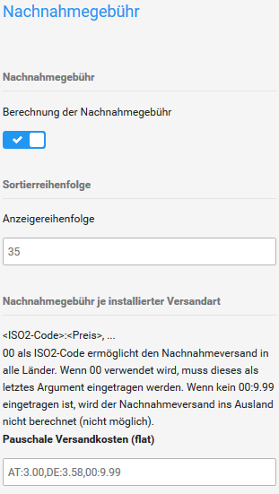

# Nachnahmegebühr 

Das Modul zur Berechnung der Nachnahmegebühr kannst du im Gambio Admin deines Shops unter Module \> Zusammenfassung installieren.

1.  Wähle in der Modul-Liste das Modul Nachnahmegebühr aus
2.  Klicke in der rechten Spalte auf Installieren
3.  Klicke in der rechten Spalte auf Bearbeiten
4.  Nimm die Konfiguration des Moduls anhand der Tabelle Konfiguration des Moduls Nachnahmegebühr vor
5.  Klicke in der rechten Spalte auf Aktualisieren, um die Änderungen zu speichern

|Feldname|Beschreibung|
|--------|------------|
|Nachnahmegebühr|Bei ✔ wird das Modul in der Bestellzusammenfassung und auf der Rechnung ausgewiesen und berechnet \[✔\]|
|Sortierreihenfolge|legt fest, an welcher Position in der Bestellzusammenfassung das Modul ausgegeben wird, dies wirkt sich auf die Berechnung aus \[35\]|
|Nachnahmegebühr je installierter Versandart|enthält die Nachnahmegebühren je Versandart im Format ISO2:Gebühren\(netto, Beispiel: DE:2.35\); alle nicht separat aufgebrachten Länder werden mit dem Universalcode 00 zusammengefasst|
|Steuerklasse|eine Liste der konfigurierten Steuerklassen; die Gebühr wird anhand der gewählten Steuerklasse berechnet|
|Übermittlungsentgeld je installierter Versandart|Es kann zusätzlich noch ein Übermittlungsentgeld erhoben werden. Die Konfiguration der Gebühren erfolgt genauso wie bei der Nachnahmegebühr.|

