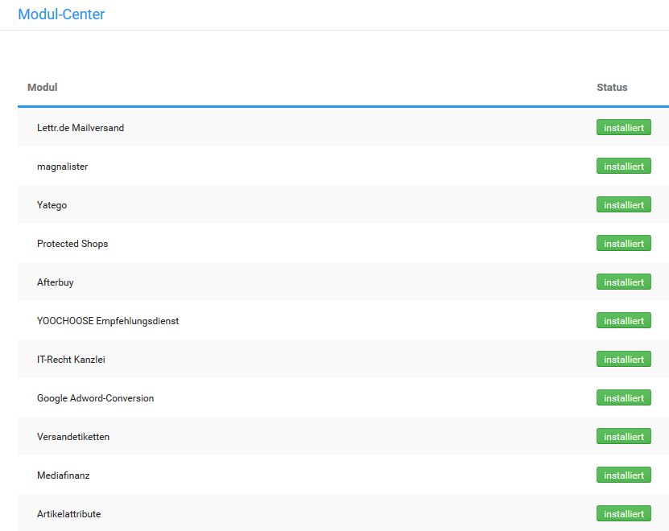

# Modul-Center 

Der Bereich Module \> Modul-Center enthält eine Zusammenstellung von Modulen zu verschiedenen Anwendungszwecken, sowie einzelne Unterfunktionen des Shops, die hier aktiviert bzw. konfiguriert werden können. Genauere Informationen zu den einzelnen Modulen kannst du den zugeordneten Unterkapiteln oder der jeweiligen Modulanleitung entnehmen.

  

  

  

  

  

  

  

  

  

  

  

  

  

  

  

  

  

  

  

  

  

  

  

  

  

  

  

