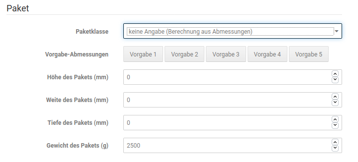

# Verwendung 

In der Bestellübersicht kann über die Dropdown-Schaltfläche rechts neben der Bestellung Hermes \(HSI\) gewählt werden. Auch aus der Bestelldetailseite heraus steht diese Option zur Verfügung.

 über die Dropdown-Schaltfläche")

Es erscheint nun ein Modal-Dialogfenster, in dem verschiedene Angaben zur Sendung gemacht werden können.

## Empfänger 

Die Adressdaten des Empfängers werden aus der Lieferadresse der Bestellung übernommen, Änderungen sind hier nur notwendig, wenn noch ein Adresszusatz hinzugefügt oder eine Korrektur vorgenommen werden soll.

CAUTION:

Bei Lieferungen in manche Länder \(z.B. Dänemark oder Schweden\) ist die Angabe einer Kontaktmöglichkeit wie Telefonnummer oder E-Mail-Adresse nötig. Diese kann unterhalb der Adressdaten in speziellen Feldern hinterlegt werden.

## Paket 

Hier wird die Größe des Paketes angegeben. Dabei kann entweder aus den Hermes-Größen S bis XXL gewählt oder alternativ eine Berechnung aus den zuvor im Modul angegeben Paketgrößen gewählt werden.

## Optionen 

Hier kann der Nachnahme-Betrag manuell festgelegt werden. Bei Bestellungen über Nachnahme ist dies nicht nötig, hier wird der Gesamtbestellwert inklusive Nachnahmegebühr hinterlegt, wie er auch in der Bestellung erfasst ist.

## Absender 

Die Absenderangaben werden automatisch mit den Werten befüllt, die zuvor im Modul selbst vorgenommen wurden. Änderungen sind jedoch möglich.

