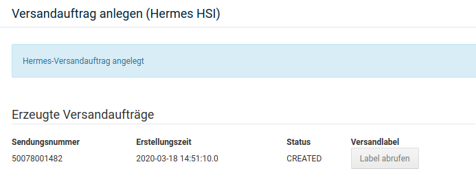
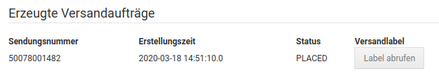
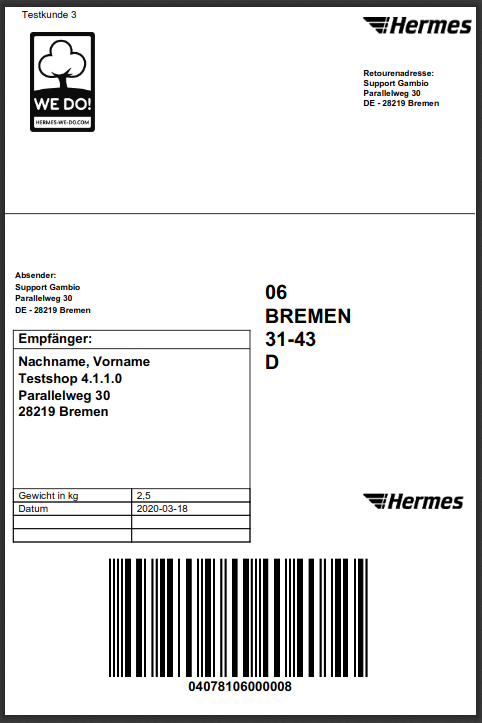

# Label abrufen 

Nach dem erfolgreichen Erstellen eines Labels wird die Meldung Hermes-Versandauftrag angelegt angezeigt. Darunter finden sich dann Details zum Label und ein Button für den Abruf. Der Status ist hier CREATED - das Label wurde also erstellt, aber noch nicht abgerufen.

Nach dem Abruf ändert sich die Darstellung, der Status ändert sich in PLACED.

## Label 

Das abgerufene Label weist Empfänger, Absender und die Retourenadresse aus. Auch das Versandgewicht und das Datum der Labelerstellung wird angezeigt.

## Darstellung in Bestellung 

Die Sendungsnummer wurde automatisch in den Bestelldetails hinterlegt und kann jetzt bei einer händischen Änderung des Bestellstatus an den Kunden versendet werden.

")

