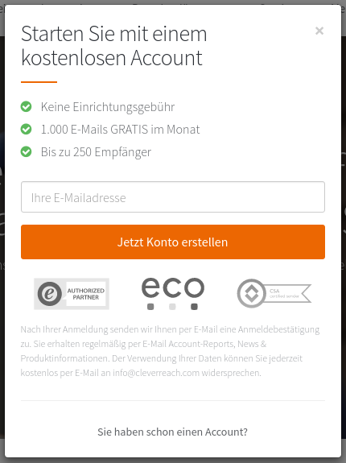
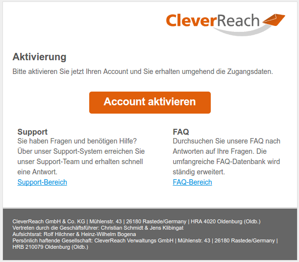

# Registrierung bei CleverReach 

Wer CleverReach benutzen möchte, kann sich unter https://www.cleverreach.com/de/ über den Button Jetzt kostenlos testen ein Konto anlegen.

|Abbildung|Erläuterung|
|---------|-----------|
|

|Für die Anmeldung ist es ausreichend, die E-Mail-Adresse einzutragen und die Kontoerstellung zu bestätigen.|
|

|Anschließend erhält man eine E-Mail, über die die Kontoerstellung noch einmal bestätigt werden muss. Es öffnet sich ein neuer Browertab mit dem CleverReach-Benutzerkonto. Parallel wird eine E-Mail mit den Nutzerdaten versendet.|

