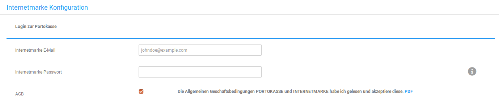
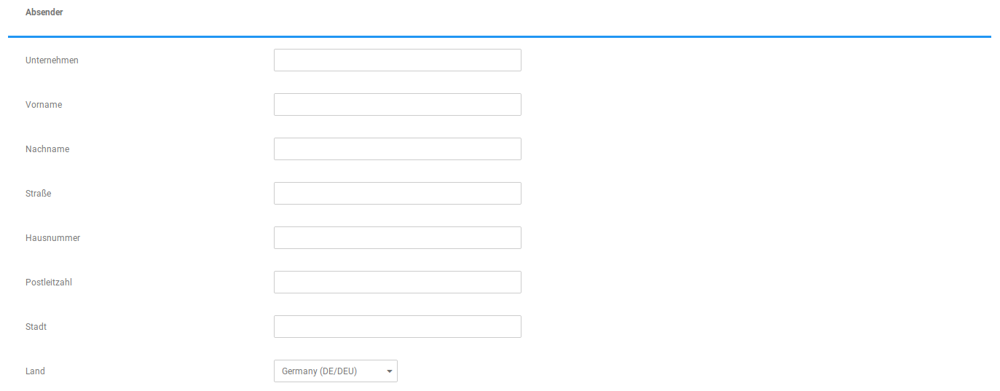
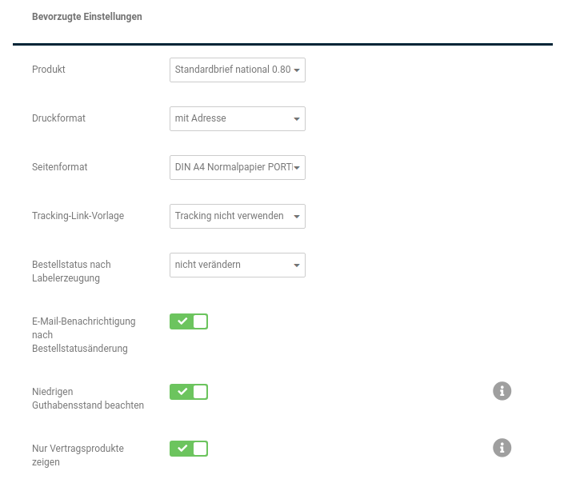
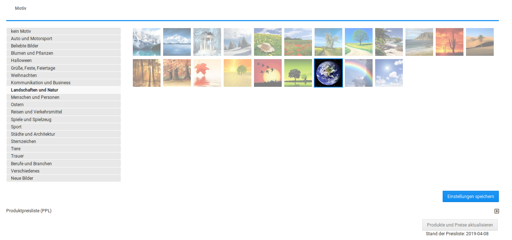

# Konfiguration 

Um das Modul zu konfigurieren, wird dieses unter Module \> Modul-Center ausgewählt. Klicke anschließend auf Bearbeiten.

## Login zur Portokasse 

Hier werden die Login-Daten zur Portokasse benötigt.

CAUTION:

Die Dienste Portokasse und efiliale sind nicht identisch! Mit den Daten der efiliale kann das Modul nicht verwendet werden!

## Absender 

Diese Felder werden automatisch vorausgefüllt, können aber nachträglich angepasst werden. Es handelt sich hier um die Absenderangaben des Shopbetreibers, die vollständig vorliegen sollten und unter Shop Einstellungen \> Mein Shop bzw. Einstellungen \> Shop \(ab Shopversion 4.3\) sowie in diesem Formular bearbeitet werden können.

## Bevorzugte Einstellungen 

-   Produkt: Hier kann die gewünschte Art des Versands \(Umschlaggröße, Warensendung, Büchersendung, etc\) ausgewählt werden.
-   Druckformat: Mit/ohne Adresse; Gibt an, ob Kunden- und Absenderadresse mit auf die Marke gedruckt werden
-   Seitenformat: Hier kann das Format des zu bedruckenden Papiers/Umschlags gewählt werden. Es stehen verschiedene Umschlaggrößen zur Verfügung
-   Tracking-Link-Vorlage: Möchtest du einen Tracking-Link anbieten \(wahrscheinlich nicht bei allen Produkten möglich\), so kann hier eine selbst erstellte Vorlage ausgewählt werden. Unter Shop Einstellungen \> Paketdienste bzw. Einstellungen \> Lieferung \(ab Shppversion 4.3\) können weitere Vorlagen angelegt werden. Über die Option E-Mail-Benachrichtigung nach Bestellstatusänderung wird jedoch bereits ein Tracking-Link erstellt und versendet, die Auswahl der Vorlage ist also nur dann interessant, wenn ein spezieller Trackinglink verwendet werden soll.
-   Bestellstatus nach Labelerzeugung: Wenn der Bestellstatus nach Erstellen des Labels verändert werden soll, kann dieser hier ausgewählt werden.
-   E-Mail-Benachrichtigung nach Bestellstatusänderung: Versendet eine Nachricht an den Kunden, die einen Trackinglink enthält.
-   Niedrigen Guthabensstand beachten: Wenn aktiviert, werden nur Produkte angezeigt, die mit dem aktuellen Guthabensstand deiner Portokasse erworben werden können. Bei Verwendung von Portokasse auf Rechnung \(Guthaben kann negativ sein\) bitte deaktivieren.
-   Nur Vertragsprodukte zeigen: Wenn aktiviert, stehen nur die explizit im Vertrag freigeschalteten Produkte bei der Markenerstellung zur Auswahl

## Motiv 

Hier kann ein Motiv ausgewählt werden, welches mit auf die Marke gedruckt werden kann, wenn die Kundenadresse nicht mit ausgegeben wird. Dies kann direkt bei der Labelerstellung ausgewählt werden

## Produktpreisliste \(PPL\) 

Du kannst dir hier die aktuellen Preise anzeigen lassen. Es gibt die Möglichkeit, die Preise über den Button Produkte und Preise aktualisieren zu aktualisieren, da diese sich von Zeit zu Zeit ändern.

