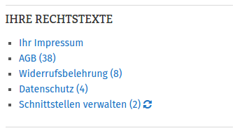
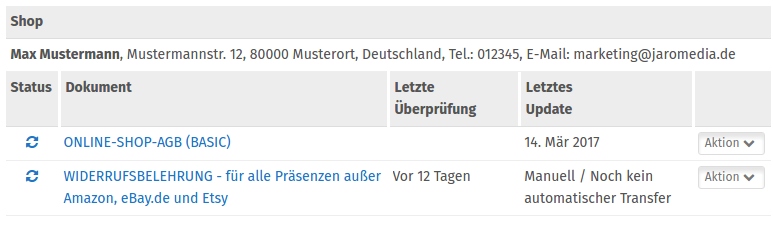
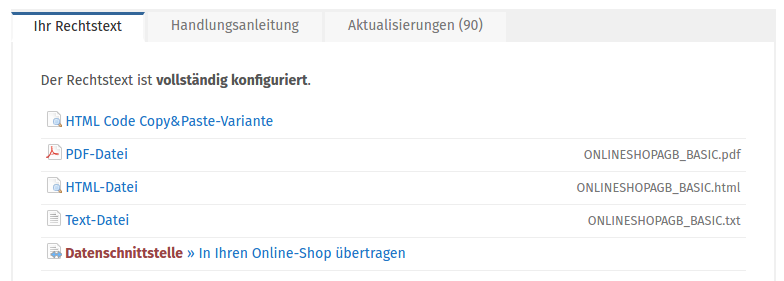
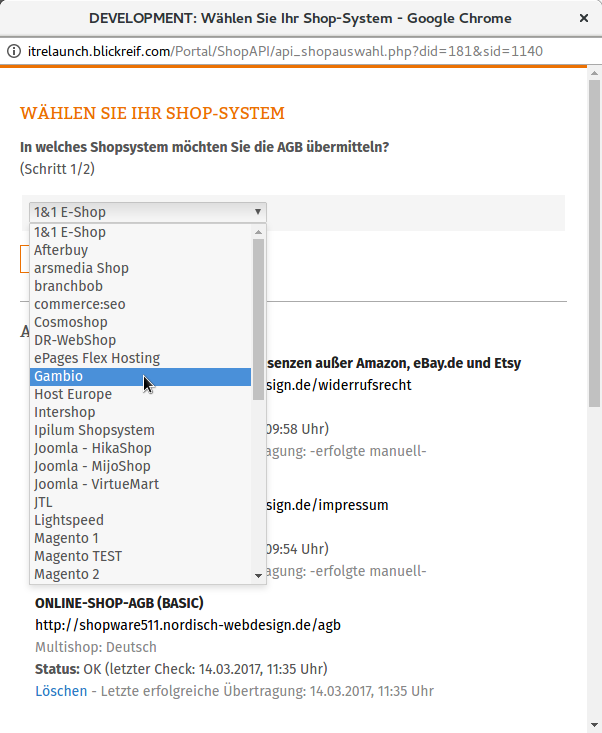
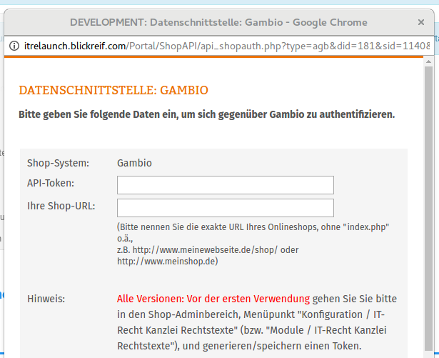
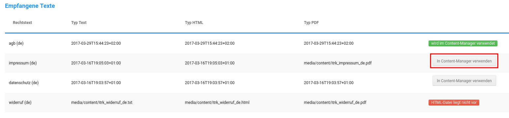
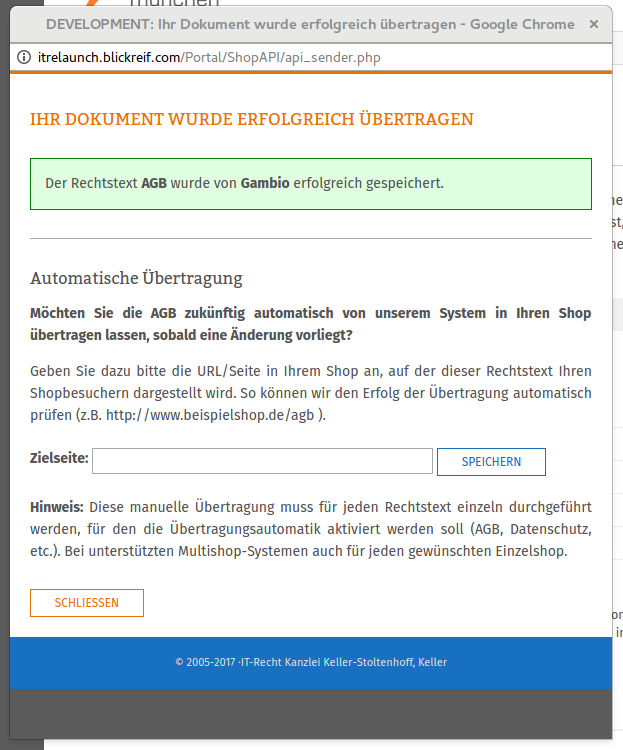

# Ersteinrichtung 

Wechsele in den Reiter Konfiguration, um die Ersteinrichtung vorzunehmen und deinen Shop mit IT-Recht Kanzlei zu verbinden.

CAUTION:

Damit der Shop erfolgreich mit IT-Recht Kanzlei verbunden werden kann, muss dieser unter Darstellung \> Shop online/offline online geschaltet werden. Anderenfalls ist ein Abgleich der Rechtstexte nicht möglich und die Anbindung kann nicht abgeschlossen werden.

## API-Token 

Der API-Token wird benötigt, um die Verbindung zwischen dem Shop und IT-Recht Kanzlei herzustellen. Der Token wird über den Button Token generieren im Shop erstellt und dann bei IT-Recht Kanzlei in deinem Kundenkonto hinterlegt. Gehe hierzu wie folgt vor:

|1. Klicke auf den Link Schnittstellen verwalten in der linken Seitenleiste||
|2. Wähle Online-Shop-AGB \(BASIC\)||
|3. Wähle bei IT-Recht Datenschnittstelle aus||

Es öffnet sich nun ein Popup, über das die Art des Shops ausgewählt und der Token hinterlegt werden kann:

|1. Wähle das Shopsystem aus||
|2. Trage API-Token und Shop-URL ein||
|3. Rufe in einem zweiten Tab deines Browsers die Konfigurationsseite des Moduls im Gambio Admin auf und klicke unter Empfangene Texte auf die Schaltfläche In Content-Manager verwenden.||
|4. Bestätige die Angaben||

## AGB-Text in PDF-Rechnung verwenden 

Wird dieser Punkt aktiviert, wird der AGB-Text in die PDF-Rechnung übernommen. Der Text von IT-Recht Kanzlei ersetzt dann den Text, der ggf. unter Shop Einstellungen \> Rechnung/Lieferschein im Tab Inhalt für AGB/Widerruf hinterlegt worden ist.

## Widerrufsbelehrung in PDF-Rechnung verwenden 

Wird dieser Punkt aktiviert, wird der Widerrufstext in die PDF-Rechnung übernommen. Der Text von IT-Recht Kanzlei ersetzt dann den Text, der ggf. unter Shop Einstellungen \> Rechnung/Lieferschein im Tab Inhalt für AGB/Widerruf hinterlegt worden ist.

