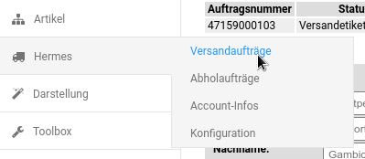

# Installation 

Das Hermes-Modul wird im Gambio Admin unter Module \> Modul-Center installiert. Wähle hierzu den Eintrag Hermes-Versand aus und klicke auf die Schaltfläche Installieren in der rechten, unteren Bildschirmecke. Nach der Installation erscheinen links im Menü weitere Einträge.

