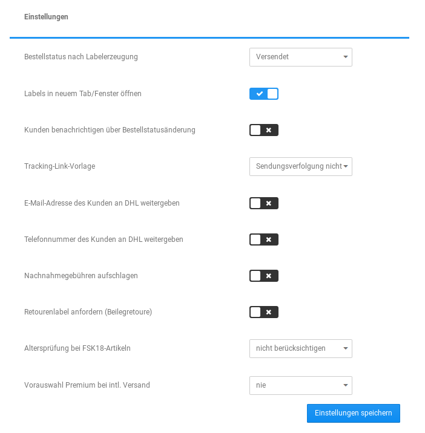
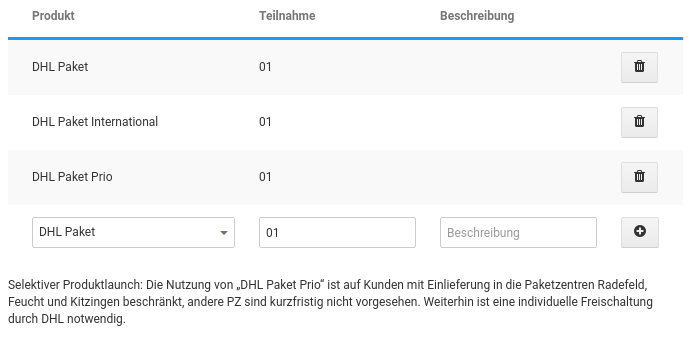

# Einstellungen 

|Feldname|Beschreibung|
|--------|------------|
|Bestellstatus nach Labelerzeugung|Nach der Labelerzeugung kann automatisch ein Bestellstatus gesetzt werden, z.B. Label erstellt, o.ä. Dies hilft dir, die Bestellungen mit bereits erstelltem Label schon in der Bestellübersicht anhand des Status zu erkennen.|
|Labels in neuem Tab/Fenster öffnen|Hier kann eingestellt werden, ob das Label gleich in einem neuen Tab geöffnet werden soll.|
|Kunden benachrichtigen über Bestellstatusänderung|Wenn der Status automatisch geändert wurde, kann vom Shop auch automatisch eine Benachrichtigung darüber an den Kunden versendet werden.|
|Tracking-Link-Vorlage|Als Tracking-Link-Vorlage sollte DHL eingestellt werden. Ausgewählt wird aus den Vorlagen, die unter Shop Einstellungen \> Paketdienste eingesehen und bearbeitet werden können. Die Vorlage wird um die Sendungsnummer des erstellten Labels ergänzt und bildet so den Link zur Sendungsverfolgung, der dem Kunden zugeschickt werden kann. Auch die Auswahl Sendungsverfolgung nicht verwenden ist möglich, wenn kein Tracking-Link angeboten werden soll.|

!!! Info "Hinweis"
	 Würde als Tracking-Linkg-Vorlage z.B. Hermes ausgewählt, wird als Tracking-Link in der Bestellung ein Link zu Hermes mit der Sendungsnummer von DHL erstellt. Es sollte daher keine abweichende Vorlage eingestellt werden.

|Feldname|Beschreibung|
|--------|------------|
|E-Mail-Adresse / Telefonnummer des Kunden an DHL weitergeben|Hier kann generell festgelegt werden, ob die Kontaktdaten der Kunden an DHL weitergegeben werden sollen. Hat der Kunde der Weitergabe im Bestellvorgang jedoch widersprochen, werden die Daten nicht übermittelt. Unter Shop Einstellungen \> Rechtliches kann eine entsprechende Abfrage im Bestellvorgang aktiviert werden.|
|Verpackungsgewicht addieren|Hiermit wird das Verpackungsgewicht dem Artikelgewicht hinzugefügt.|
|Retourenlabel anfordern \(Beilegretoure\)|Wenn du diese Option bei DHL gebucht hast, wird bei jeder Labelerstellung auch ein Retourenlabel erstellt, das dem Paket gleich beigelegt werden kann. **Achtung**: Diese Option darf nur aktiv sein, wenn Retourenlabel auch in deinem Vertrag enthalten sind. Ist dies nicht der Fall, wird es zu Problemen bei der Labelerstellung kommen.|
|Altersprüfung bei FSK18-Artikeln|Hier kann die Art der Altersprüfung bei FSK18-Artikeln gewählt werden.|
|Vorauswahl Premium bei intl. Versand|Ist diese Option aktiv, wird Premium bei der Labelerstellung vorausgewählt.|

## Produkte 

Du kannst über das Dropdown-Menü aus den verschiedenen Produkten auswählen und diese hinzufügen. Es sollten nur Produkte ausgewählt werden, die du auch gebucht hast. Welche Produkte gebucht wurden und welche Teilnahmenummer zum jeweiligen Produkt gehört, kannst du in deinem Konto bei DHL Versenden, bzw. beim DHL Support erfahren.

