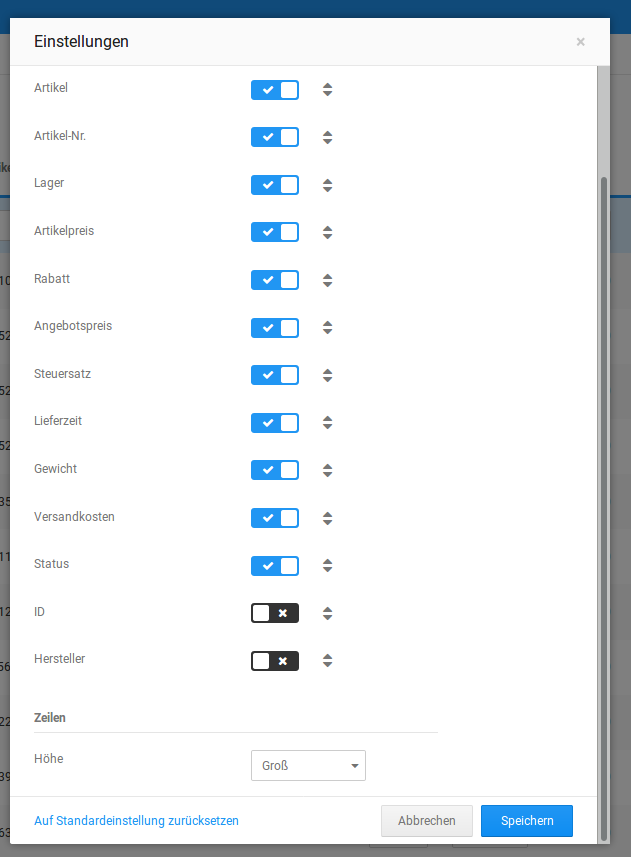

# Anpassung der Übersicht 

Über das Rädchen-Symbol oben rechts lassen sich die Einstellungen zur Anzeige aufrufen. Hier kann ausgewählt werden, was für Spalten angezeigt werden sollen. Auch lässt sich die Reihenfolge verändern, wenn man mit der Maus das Pfeil-Symbol gedrückt hält und die Spalten nach oben oder unten zieht. Unterhalb der Spalten kann zusätzlich die Größe der Einträge gewählt werden.

