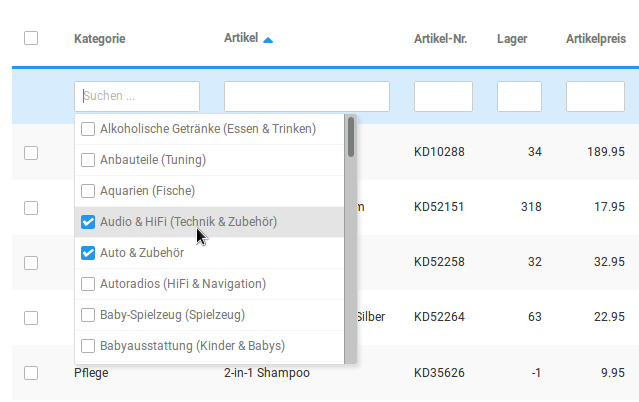
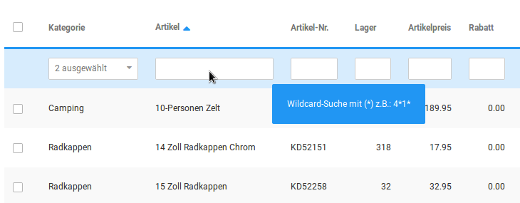

# Filtern der Artikel {#filtern_der_artikel}

In der oberen Leiste lassen sich verschiedene Filter setzen, um Artikel in der Liste besser finden zu können. Es können mehrere Kategorien ausgewählt und zugleich auch Suchbegriffe verwendet werden. Hierbei muss beachtet werden, dass einige Felder die Verwendung von Wildcards, also Platzhaltern, voraussetzen um die Suche nach Teilbegriffen zu ermöglichen.

**Note:** Wenn du dort zum Beispiel nach 'Artikel' suchst, dann werden nur die Kategorien oder Artikel mit dem Namen "Artikel" ausgegeben, weil der Shop nur nach vollständigen Namen sucht. Wenn du allerdings

**\*Artikel\***

mit Sternchen eingibst, dann werden auch entsprechende Artikel gefunden, welche diesen Begriff als Teilbegriff enthalten.

