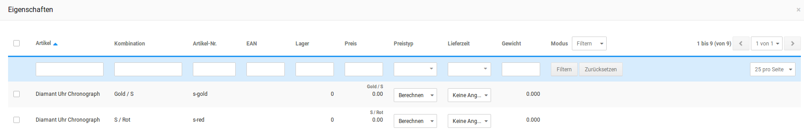

# Eigenschaften {#quickedit_eigenschaften}

Will man die Eigenschaften mehrerer Artikel bearbeiten, so kann man im Dropdown Eigenschaften auswählen. Es öffnet sich ein Fenster, in dem die angelegten Eigenschaftskombinationen aufgeführt werden. Die Bearbeitung erfolgt hier genauso wie in der Artikelübersicht des QuickEdit.

Bei den Eigenschaften kann zudem noch der Preistyp gewählt werden. Hiermit wird festgelegt, ob der Preis aus den Kombinationen berechnet oder der Festpreis aus der Eigenschaft selbst bezogen werden soll.

