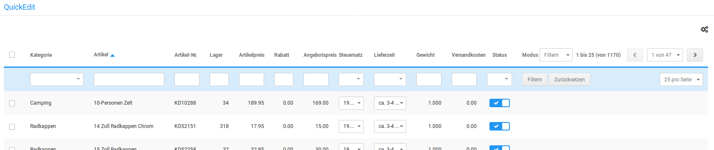

# QuickEdit {#quickedit}

QuickEdit ist ein Werkzeug zur Massenbearbeitung von Artikeln. Es können also Änderungen an mehreren Artiklen gleichzeitig vorgenommen werden. Der QuickEdit kann unter Artikel \> QuickEdit aufgerufen werden.

-   **[Anpassung der Übersicht](8_10_1_AnpassungDerUebersicht.md)**  

-   **[Filtern der Artikel](8_10_2_FilternDerArtikel.md)**  

-   **[Inventarliste](8_10_3_Inventarliste.md)**  

-   **[Artikel bearbeiten](8_10_4_ArtikelBearbeiten.md)**  

-   **[Eigenschaften](8_10_5_Eigenschaften.md)**  

-   **[Sonderangebote](8_10_6_Sonderangebote.md)**  

-   **[Staffelpreise](8_10_7_Staffelpreise.md)**  

