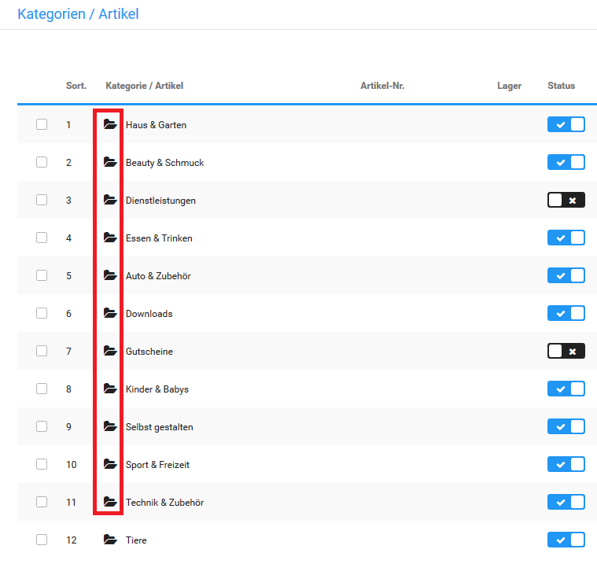
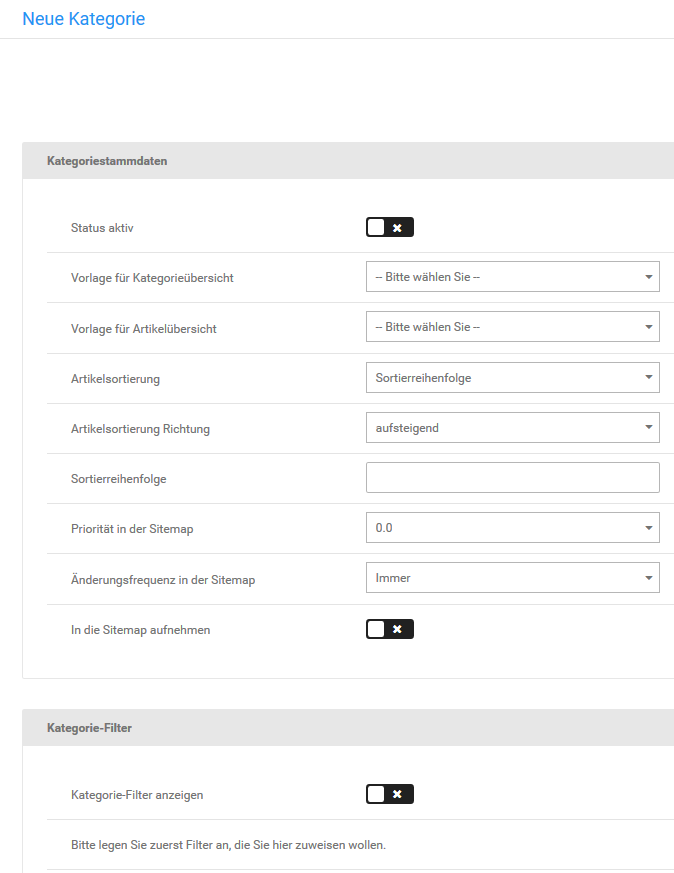

# Kategorie anlegen 

In der Artikel- und Kategorieübersicht unter Artikel \> Artikel/Kategorien kannst du neue Kategorien über die Schaltfläche Erstellen \> Kategorie hinzufügen. Neue Kategorien werden immer in der Kategorie angelegt, die in der Übersicht aufgelistet wird. Im Listenfeld Gehe zu oberhalb der Artikel- und Kategorieliste wird dir die aktive Kategorie angezeigt.

!!! Info "Hinweis
	

Wechsele zunächst in die gewünschte Oberkategorie, wenn du Unterkategorien anlegen möchtest.

!!! Info "Hinweis
	 Um in eine Kategorie zu wechseln, klicke auf das schwarze Ordnersymbol vor dem Kategorienamen, oder wähle die gewünschte Kategorie aus der Liste Gehe zu rechts in der Leiste am unteren Bildschirmrand aus.

In der Kategorie-Eingabemaske konfigurierst du die neue Kategorie.

1.  Trage im Feld Kategorie Name einen Kategorienamen ein
2.  Aktiviere das Kontrollkästchen Status aktiv, wenn die Kategorie nach dem Anlegen sofort im Shop sichtbar sein soll
3.  Eine Übersicht über die Bedeutung der Felder in der Kategorie-Eingabemaske findest du in der Tabelle Übersicht über die Kategorie-Eingabemaske
4.  Klicke auf Speichern, um die neue Kategorie anzulegen

!!! Info "Hinweis
	 Nach dem Hinzufügen einer Kategorie müssen die Caches für Artikel- und Kategoriezuordnungen, Modulinformationen und die Seitenausgabe unter Toolbox \> Cache gelöscht bzw. neu erzeugt werden.

!!! Info "Hinweis
	 Alle Felder in der Eingabemaske sind optional und sollten nur verwendet werden, wenn die entsprechende Information zur Verfügung steht.

|Feldname|Beschreibung|
|--------|------------|
|Kategorie Name|der Name der Kategorie, der im Kategorie-Menü verwendet werden soll|
|Kategorie Überschrift|wenn angegeben, abweichende Überschrift für die Kategorieseite der Kategorie|
|Status aktiv|wenn aktiviert, wird die Kategorie im Shop angezeigt|
|Vorlage für Kategorieübersicht|HTML-Vorlage für die Kategorieseite, wenn Unterkategorien mit angezeigt werden|
|Vorlage für Artikelübersicht|HTML-Vorlage für die Kategorieseite ohne Unterkategorien|
|Artikelsortierung|Wert, der für die Sortierung der Artikel verwendet wird \(Sortierreihenfolge für die manuelle Sortierung über die Artikel-Eingabemaske\)|
|Sortierreihenfolge|Reihenfolge für die Anzeige der Kategorie in Menüs und in der Kategorieübersicht|
|Lagerbestand anzeigen|wenn aktiviert, wird in der Listenansicht der Lagerbestand der Artikel angezeigt|
|Artikelattribute anzeigen|wenn aktiviert, wird in der Listenansicht die Auswahl der Artikelattribute angezeigt|
|Staffelpreise anzeigen|wenn aktiviert, werden in der Listenansicht die Staffelpreise angezeigt|
|Mengeneingabefeld anzeigen|wenn aktiviert, wird in der Listenansicht das Mengeneingabefeld neben der Schaltfläche In den Warenkorb angezeigt|
|In die Sitemap aufnehmen|wenn aktiviert, wird die Kategorie in die Sitemap für Suchmaschinen aufgenommen|
|Priorität in der Sitemap|steuert, wie wichtig der Eintrag in der Sitemap für die Suchmaschinen ist \(1: sehr wichtig bis 0: unwichtig\)|
|Änderungsfrequenz in der Sitemap|Vorgabe, wie oft die Sitemap-Einträge der Suchmaschinen aktualisiert werden sollten. Die tatsächliche Änderungsfrequenz hängt von der Suchmaschine ab|
|GX-Customizer Set|fügt allen Artikeln der Kategorie ein GX-Customizer Set hinzu \(siehe Kapitel GX-Customizer\)|
|Unterkategorien einbeziehen|fügt allen Artikeln der Kategorie inklusive aller Unterkategorien ein GX-Customizer Set hinzu \(siehe Kapitel GX-Customizer\)|
|Set-Zuweisung aller Artikel löschen|wenn aktiviert, werden GX-Customizer Set-Zuweisungen aus Artikeln entfernt, wenn kategorieweite Sets verwendet werden|
|Artikel aus Unterkategorien anzeigen|wenn aktiviert, werden auch Artikel aus Unterkategorien in der Artikelliste angezeigt|
|Gekachelte Artikelauflistung|wenn aktiviert, wird die Kategorie zuerst in der gekachelten Ansicht angezeigt \(Grundeinstellung: nicht aktiviert, Kategorien werden in der Listenansicht angezeigt\)|
|Unterkategorien anzeigen|wenn aktiviert, werden die Unterkategorien der aktuellen Kategorie aufgelistet|
|Bild der Unterkategorien anzeigen|wenn aktiviert, werden die Kategoriebilder der Unterkategorien angezeigt|
|Überschrift der Unterkategorien anzeigen|wenn aktiviert, werden die Kategorie-Überschriften der Unterkategorien angezeigt|

Im Abschnitt Kategorie-Filter kannst du Artikel-Filter zur Auswahl in den Artikeln der Kategorie festlegen. Nähere Informationen zu Artikel-Filtern findest du im Kapitel Artikel-Filter.

