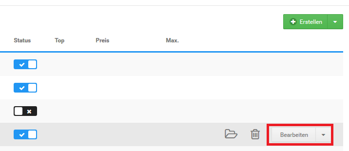

# Kategorie bearbeiten 

Zum Bearbeiten von Kategorien, klicke in der Artikel- und Kategorieübersicht auf den Namen der Kategorie und klicke in der zugehörigen Zeile auf die Schaltfläche Bearbeiten.

Nimm die gewünschten Änderungen an den Konfigurationsfeldern der Kategorie vor. Eine Übersicht über die Bedeutung der Felder in der Kategorie-Eingabemaske findest du in der Tabelle Übersicht über die Kategorie-Eingabemaske.

