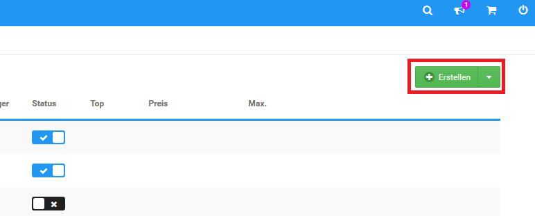
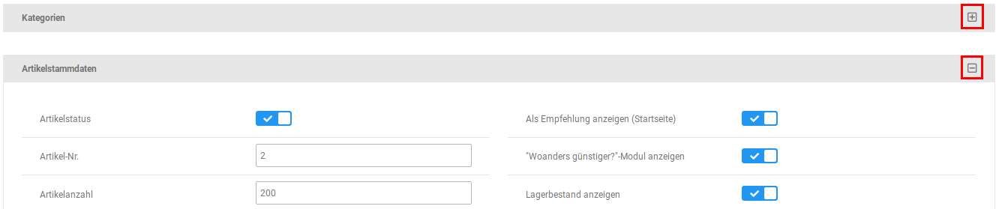
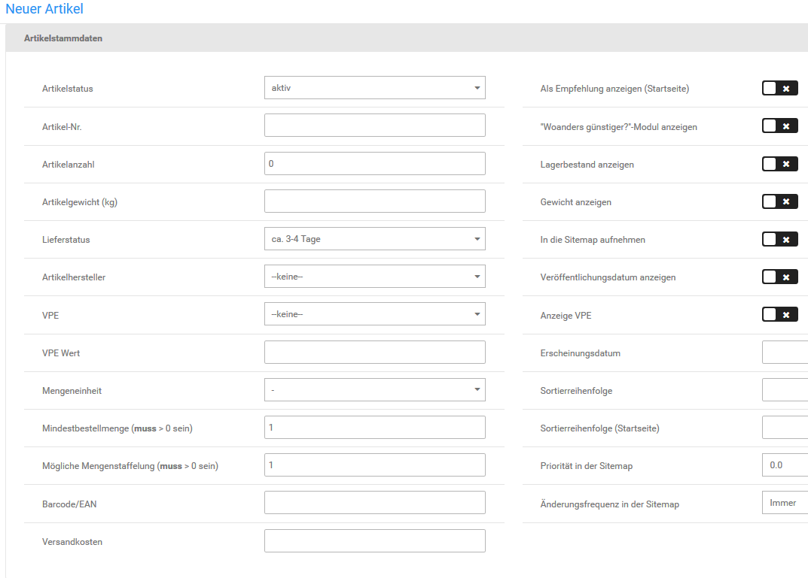
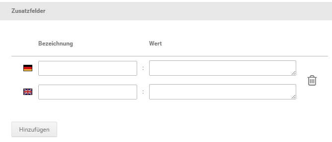
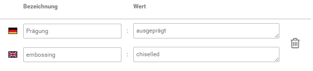
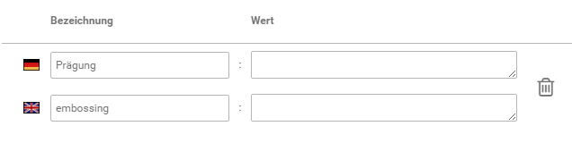
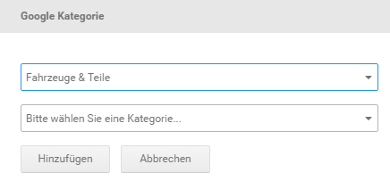
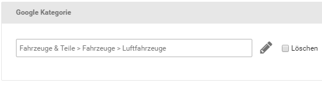
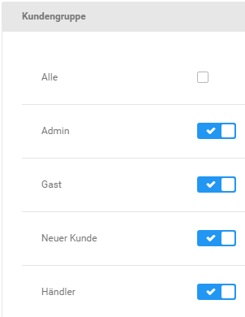
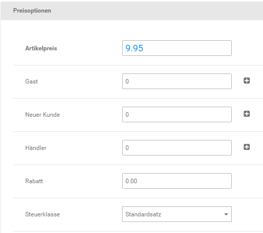

# Artikel anlegen 

Neue Artikel kannst du in der Artikel- und Kategorieübersicht unter Artikel \> Artikel/Kategorien hinzufügen. Neue Artikel werden immer in der Kategorie angelegt, die in der Übersicht aufgelistet wird. Im Listenfeld Gehe zu oberhalb der Artikel- und Kategorieliste wird dir die aktive Kategorie angezeigt.

!!! Info "Hinweis"
	 Um in eine Kategorie zu wechseln, klicke auf das schwarze Ordnersymbol vor dem Kategorienamen, oder wähle die gewünschte Kategorie aus der Liste Gehe zu rechts in der Leiste am unteren Bildschirmrand aus.

1.  Klicke in der Artikel- und Kategorieübersicht auf Erstellen \> Artikel
2.  Trage den Artikelnamen in das Feld Artikelname ein
3.  Trage den Artikelpreis in das Feld Artikelpreis ein

    Beachte, dass Preise grundsätzlich mit einem Punkt als Dezimaltrennzeichen angegeben werden müssen \(Beispiel: 12.95 für 12,95 EUR\)!

4.  Wähle aus der Liste Steuerklasse die Steuerklasse für deinen Artikel aus
5.  Eine Übersicht über die Bedeutung der Felder in der Artikel-Eingabemaske findest du in der Tabelle Übersicht über die Artikel-Eingabemaske
6.  Klicke auf Speichern, um den neuen Artikel zu speichern

!!! Info "Hinweis"
	 Alle Felder in der Eingabemaske ohne Grundeinstellung sind optional und sollten nur verwendet werden, wenn die entsprechende Information zur Verfügung steht.

!!! Info "Hinweis"
	 Die einzelnen Bereich der Artikelmaske können mit Klick auf das Minus-Icon minimiert und über das Plus-Icon maximiert werden. Wenn also ein hier aufgeführter Bereich nicht angezeigt wird, klicke am rechten Ende der grauen Leiste auf das Plus-Icon.

## Kategorien 

Im Bereich Kategorien wird aufgeführt in welchen Kategorien der Artikel verlinkt ist, der gerade bearbeitet wird. Hierüber können auch Verweise auf weitere Kategorien hinzugefügt werden.

Je nach Anzahl der verlinkten Kategorien werden diese entweder als Liste von Dropdown-Menüs oder als sogenanntes Multiselect-Element angezeigt.

Mit einem Klick auf Hinzufügen wird ein neues Dropdown am unteren Ende der Liste angezeigt, über das eine Kategorie angelegt werden kann.

Wird das Multiselect angezeigt, kann durch einen Mausklick eine einzelene Kategorie direkt ausgewählt werden.

In aller Regel sollen jedoch zusätzliche Kategorien verlinkt werden. Hierzu können die gewünschten Einträge mit gedrückter STRG-Taste angeklickt werden. Die Auswahl mehrerer, direkt untereinanderstehender Einträge ist mit gedrückter SHIFT-Taste möglich.

## Artikelstammdaten 

|Feldname|Beschreibung|
|--------|------------|
|Artikelstatus|wenn aktiv, wird der Artikel im Shop angezeigt|
|Artikel-Nr.|frei vergebbare Artikelnummer des Artikels|
|Artikelanzahl|lagernde Menge des Artikels|
|Artikelgewicht \(kg\)|Gewicht des Artikels in Kilogramm mit vier Dezimalstellen \( . ist Trennzeichen\)|
|Lieferstatus|Lieferstatus des Artikels \(siehe Kapitel Lieferstatus\)|
|Artikelhersteller|Hersteller des Artikels; muss zunächst unter Artikel \> Hersteller angelegt werden \(siehe Kapitel Hersteller\)|
|VPE|Verpackungseinheit des Grundpreises \*|
|VPE Wert|Umrechnungsfaktor für die Berechnung des Grundpreises \*|
|Mengeneinheit|die ausgewählte Mengeneinheit wird neben dem Mengeneingabe-Feld auf der Artikel-Detailseite, im Warenkorb und auf der Bestellbestätigung angezeigt; Einheiten müssen zunächst unter Artikel \> Mengeneinheiten angelegt werden|
|Mindestbestellmenge \(muss \> 0 sein\)|Mindestmenge, die Kunden bestellen müssen; darf nicht 0 sein \(Grundeinstellung: 1\)|
|Mögliche Mengenstaffelung \(muss \> 0 sein\)|mögliche Schritte in der Bestellmenge; darf nicht 0 sein \(Grundeinstellung: 1\)|
|Barcode/EAN|Europäische Artikelnummer des Artikels|
|Versandkosten|Versandkostenzuschlag für den Artikel|
|Als Empfehlung anzeigen \(Startseite\)|wenn aktiviert, wird der Artikel im Abschnitt Unsere Empfehlungen auf der Startseite angezeigt|
|"Woanders günstiger?"- Modul anzeigen|wenn aktiviert, wird das Kontaktformular Woanders günstiger? unterhalb der Schaltfläche In den Warenkorb eingebunden|
|Lagerbestand anzeigen|wenn aktiviert, wird die Artikelanzahl auf der Artikel-Detailseite angezeigt|
|Gewicht anzeigen|wenn aktiviert, wird das Artikelgewicht auf der Artikel-Detailseite angezeigt|
|In die Sitemap aufnehmen|wenn aktiviert, wird der Artikel in die Sitemap für Suchmaschinen aufgenommen|
|Veröffentlichungsdatum anzeigen|wenn aktiviert, wird das Erscheinungsdatum auf der Artikel-Detailseite unterhalb der Artikelbeschreibung eingeblendet|
|Anzeige VPE|wenn aktiviert, wird der Grundpreis auf der Artikel-Detailseite unterhalb des Artikelpreises angezeigt \*|
|Erscheinungsdatum|das Erscheinungsdatum für vorbestellbare Artikel|
|Sortierreihenfolge|Priorität für die Anzeige in der Kategorieübersicht \(je kleiner der Wert, desto weiter oben/vorne die Anzeige; benötigt weitere Konfiguration in der Kategorie, siehe Kapitel Kategorien anlegen/bearbeiten\)|
|Sortierreihenfolge \(Startseite\)|Priorität für die Anzeige auf der Startseite \(je kleiner der Wert, desto weiter oben/vorne die Anzeige; benötigt keine weitere Konfiguration\)|
|Priorität in der Sitemap|steuert, wie wichtig der Eintrag in der Sitemap für die Suchmaschinen ist \(1.0: sehr wichtig bis 0.0: unwichtig\)|

\* Nähere Informationen zu Verpackungseinheiten findest du im Kapitel Verpackungseinheiten.

!!! Info "Hinweis"
	 Bitte beachte: Diese Darstellung entspricht der Grundkonfiguration des Shopsystems. Zusatzfunktionen und Drittanbietermodule können die Darstellung der Artikel-Eingabemaske beeinflussen. Nähere Informationen zu hier nicht dokumentierten Eingabefeldern findest du in der Anleitung des jeweiligen Moduls.

## Erweiterte Konfiguration 

|Feldname|Beschreibung|
|--------|------------|
|Vorlage für Artikeldetailseite|HTML-Vorlage für die Artikel-Detailseite \(Grundeinstellung: standard.html\)|
|Vorlage für Artikelattribute|HTML-Vorlage für Artikelattribute auf der Artikel- Detailseite \(Grundeinstellung: product\_options\_dropdown.html\)|
|Vorlage für Artikelattribute in Übersicht|HTML-Vorlage für Artikelattribute in der Kategorieübersicht \(Grundeinstellung: product\_options\_dropdown.html\)|
|Artikeltyp|legt fest, ob der Artikel ein Standardartikel, ein Downloadartikel oder eine Dienstleistung ist; damit der Kunde bei Downloads und Dienstleistungen ggf. auf das Widerrufsrecht verzichten kann|
|Produkt Teaser-Slider|ausgewählter Teaser-Slider für den Artikel|
|Artikelpreisstatus|Käuflichkeit des Artikels; normal: Artikel ist käuflich, Preis auf Anfrage: Artikel kann nicht direkt in den Warenkorb gelegt werden, nicht käuflich: Artikelpreis wird angezeigt, der Artikel kann jedoch nicht gekauft werden|
|Hermes ProfiPaketService|Auswahl der Paketklasse \(Hermes-Versandmodul\)|
|GX-Customizer Set|das ausgewählte GX-Customizer Set zum Individualisieren von Artikeln wird auf der Artikel-Detailseite eingebunden \(siehe Kapitel GX-Customizer\)|
|Verfallsdatum|Verfallsdatum des Artikels, wird z.B. beim Google Artikelexport verwendet|
|Zustand \(Google Export Pflicht\)|Pflichtfeld für Google Artikelexport, Einstellung über ein Dropdown \(neu / gebraucht / erneuert\)|
|Ab 18|wenn aktiviert, wird der Artikel als ab 18 Artikel ausgewiesen; der Kauf von ab 18 Artikeln kann je Kundengruppe verboten werden \(siehe Kapitel Kundengruppen\)|
|G-Motion aktivieren|wenn aktiviert, kann das Modul zur Animation von Artikelbildern verwendet werden \(siehe Kapitel Artikelbilder, Abschnitt G-Motion verwenden\)CAUTION:

G-Motion wird vom Honeygrid-Template nicht mehr unterstützt.

|
|Kennzeichnung existiert|Angabe für Google Artikelexport, sollte gesetzt werden, wenn mindestens eines der folgenden Felder verwendet wird: EAN, UPC, JAN, ISBN|
|ISBN \(Internationale Standardbuchnummer\)|Internationale Standardbuchnummer des Artikels|
|UPC \(Universal Product Code\)|Universeller Produktcode des Artikels|
|MPN \(Manufacturer Part Number\)|Herstellernummer des Artikels|
|JAN \(Japanese Article Number\)|Japanische Artikelnummer des Artikels|
|Marke|Marke des Artikels, wird z.B. beim Google Artikelexport verwendet|
|Geschlecht|Für welches Geschlecht ist der Artikel vorgesehen, wird z.B. beim Google Artikelexport verwendet|
|Altersgruppe|Für welche Altersgruppe ist der Artikel vorgesehen, wird z.B. beim Google Artikelexport verwendet|

!!! Info "Hinweis"
	 Bitte beachte: Diese Darstellung entspricht der Grundkonfiguration des Shopsystems. Zusatzfunktionen und Drittanbietermodule können die Darstellung der Artikel-Eingabemaske beeinflussen. Nähere Informationen zu hier nicht dokumentierten Eingabefeldern findest du in der Anleitung des jeweiligen Moduls.

## Zusatzfelder 

Über Zusatzfelder können weitere Informationen zu einem Artikel gespeichert werden. Die Angaben werden hauptsächlich für den Export zu Preisportalen verwendet, können jedoch auch auf der Artikel-Detailseite ausgegeben werden. Jedes Zusatzfeld hat eine Bezeichnung und einen Wert.

!!! Info "Hinweis"
	 Die Anzeige der Zusatzfelder kann unter Darstellung \> Template-Einstellungen an- und abgeschaltet werden. Setze bzw. entferne hierzu den Haken Zusatzfelder auf Detailseite aktivieren und bestätige die Änderung mit einem Klick auf Speichern.

Um ein Zusatzfeld anzulegen, klicke auf die Schaltfläche Hinzufügen. Es werden pro im Shop verwendete Sprache jeweils ein Feld für Bezeichnung und Wert angezeigt. Nach der Eingabe kann das Zusatzfeld mit Klick auf Speichern oder Übernehmen übernommen werden.

Nach dem Speichern kann das gleiche Zusatzfeld in den anderen Artikeln des Shops ebenfalls mit einem Wert belegt werden.

Mit einem Klick auf das Mülltonnen-Symbol kann ein Zusatzfeld gelöscht werden. Es wird eine Sicherheitsabfrage angezeigt, klicke auf Löschen, um das Entfernen des Zusatzfelds zu bestätigen. Mit Klick auf Schließen wird das Löschen abgebrochen, ohne das Zusatzfeld zu entfernen.

CAUTION:

Das Löschen eines Zusatzfelds findet in **allen** Artikeln statt, auch wenn diese mit einem Wert belegt sind. Wenn du die Verwendung des Zusatzfelds in einem einzelnen Artikel verhindern möchtest, sollten stattdessen die Einträge unter Wert entfernt werden.

## Artikel-Filter 

Im Abschnitt Filterauswahl kannst du Artikel-Filter für deinen neuen Artikel festlegen. Nähere Informationen zu Artikel-Filtern findest du im Kapitel Artikel-Filter.

## Google Kategorie 

Über Google Kategorie kann der Artikel der internen Taxonomie von Google Shopping zugeordnet werden, wenn dieser zu Google Shopping exportiert wird. Die Auswahl hat auf die Kategorien des Shops keinen Einfluss.

Über die Schaltfläche Kategorie hinzufügen kann dem Artikel eine Google Kategorie zugeordnet werden. Es werden hierbei nacheinander verschiedene Dropdown-Menüs angezeigt, aus der die jeweiligen Kategorien und Unterkategorien ausgewählt werden können. Klicke erneut auf Hinzufügen, um die Auswahl zu bestätigen. Über Abbrechen wird der Vorgang beendet, ohne die Google Kategorie hinzuzufügen.

Eine bestehende Google Kategorie kann mit Klick auf das Bleistift-Symbol bearbeitet werden. Wird der Haken in der Box Löschen gesetzt, wird die Google Kategorie beim nächsten Klick auf Speichern oder Aktualisieren wieder entfernt.

## Artikeldetails 

!!! Info "Hinweis"
	 Für jede im Shop angelegte Sprache \(standardmäßig Deutsch und Englisch\) gibt es einen eigenen Bereich für die Artikeldetails.

Der Bereich Artikeldetails dient hauptsächlich zum Festlegen des Inhalts der Artikeldetailseite. Es können folgende Einstellungen gemacht werden:

-   Artikelname: der Name des Artikels, welcher im Shop angezeigt wird
-   Artikelbeschreibung: die detaillierte Beschreibung des Artikels, welche direkt auf der Artikeldetailseite angezeigt wird
-   Tabs: Artikeltabs dienen zum Anzeigen zusätzlicher Inhalte auf der Artikeldetailseite, siehe Kapitel Artikeltabs
-   Kurzbeschreibung: diese Beschreibung wird auf den Artikelseiten \(Kategorie- und Suchergebnisseiten\) angezeigt, wenn diese in der gelisteten Ansicht dargestellt werden
-   Wesentliche Merkmale \(Bestellzusammenfassung\): diese Beschreibung wird auf der letzten Seite des Bestellvorgangs zum Artikel angezeigt
-   Herstellerlink: Link zum Hersteller des Artikels
-   Zusatzbegriffe für Suche: Liste von Suchbegriffen \(kommagetrennt, ohne Leerzeichen\), können von der Shopsuche, aber nicht von Suchmaschinen, gefunden werden, werden nicht auf der Artikeldetailseite angezeigt
-   URL Keywords: Bestandteil des Links zum Artikel, wenn der Gambio SEO Boost verwendet wird, muss mindestens 3 Zeichen lang sein

CAUTION:

URL Keywords dürfen weder Leerzeichen, noch Umlaute oder Sonderzeichen enthalten. Wir empfehlen das Feld leer zu lassen, es wird von Shop automatisch befüllt.

-   URL Rewrite: Feld zur Angabe einer alternativen URL, siehe Kapitel URL Rewrite
-   Meta Title: Titel der Seite für die Meta-Informationen \(siehe Kapitel Meta-Angaben\)
-   Meta Keywords: Schlagwörter, die von Suchmaschinen berücksichtigt werden können. Angabe als kommagetrennte Liste \(ohne Leerzeichen\), siehe auch Kapitel Meta-Angaben
-   Meta Description: Beschreibung des Artikels für die Meta-Informationen \(siehe auch Kapitel Meta-Angaben\)

!!! Info "Hinweis"
	 Die Eingabe der Artikelbeschreibung, Kurzbeschreibung und wesentlichen Merkmale erfolgt über den CK-Editor. Eine Übersicht über die einzelnen Funktionen findest du im Kapitel CK-Editor.

Über die Schaltfläche Editor wechseln kann auf einen alternativen HTML-Editor mit Zeilennummerangabe umgeschaltet werden.

## Artikelbilder 

siehe Kapitel Artikelbilder

## Kundengruppe 

!!! Info "Hinweis"
	 Der Bereich Kundengruppe wird nur angezeigt, wenn unter Shop Einstellungen \> Zusatzmodule der Kundengruppencheck aktiviert ist.

Über die Einstellung Kundengruppe kann festgelegt werden welche Kundengruppe einen Artikel sehen und aufrufen kann. Ist der Haken für eine Kundengruppe nicht gesetzt, wird dieser in Kategorien, Suchergebnissen und sonstigen Artikelseiten \(z.B. Unsere Empfehlungen\) nicht angezeigt. Auch wenn der Link zum Artikel aus anderer Quelle bekannt sein sollte, kann dieser über eine Kundengruppe ohne Haken nicht aufgerufen werden.

Wird der Haken für Alle gesetzt, werden nach dem nächsten Klick auf Speichern oder Aktualisieren die Rechte für alle Kundengruppen vergeben.

## Preisoptionen 

Im Bereich Preisoptionen stehen folgende Einstellungen zur Verfügung

-   Artikelpreis: der Preis des Artikels in der eingestellten Währung
-   Rabatt: möglicher Rabatt auf den Artikel in Prozent \(siehe Kapitel Artikelrabatt\)
-   Steuerklasse: Steuerklasse des Artikels, bestimmt den verwendeten Steuersatz \(siehe Kapitel Steuer\)

Zudem steht für jede Kundengruppe außer Admin \(typischerweise Gast, Neuer Kunde und Händler\) je ein Eingabefeld für einen eigenen Kundengruppenpreis zur Verfügung. Über das dahinterstehende + kann zudem ein Staffelpreis für die jeweilige Kundengruppe eingerichtet werden \(siehe Kapitel Staffelpreise\).

Wird der Kundengruppenpreis nicht verwendet, wird der reguläre Artikelpreis angezeigt und berechnet.

