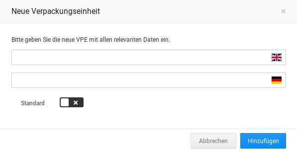
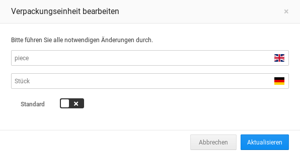
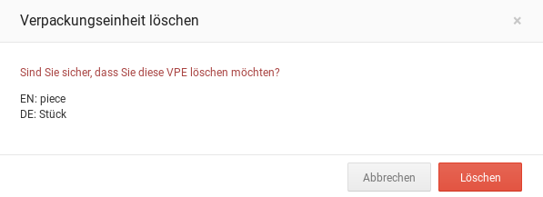
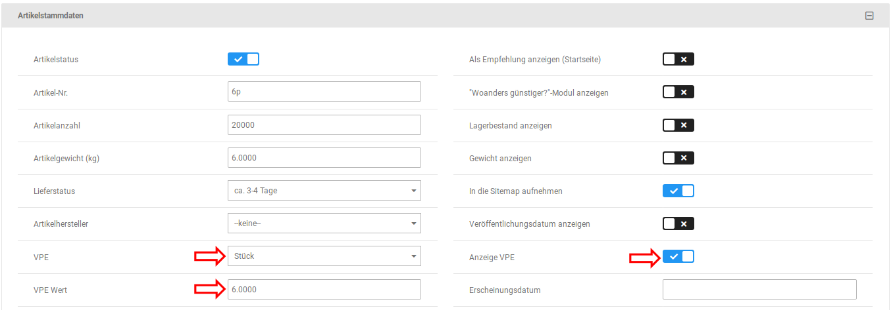
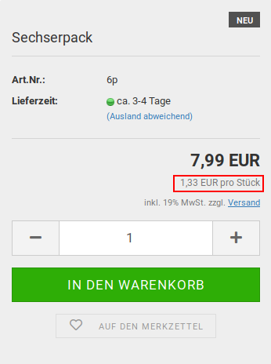
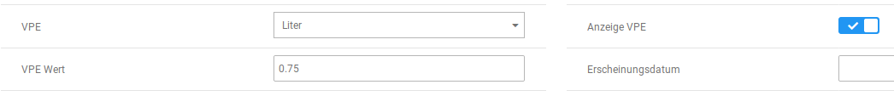
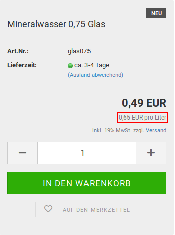

# Verpackungseinheiten {#verpackungseinheiten}

Mit Verpackungseinheiten \(VPE\) wird angegeben in welchen Einheiten ein Artikel verkauft wird, wie z.B. Stück, Liter, Kilogramm usw. Diese Angabe wird für die Grundpreisangabe benötigt.

Unter Artikel \> Verpackungseinheiten können neue Verpackungseinheiten angelegt und bestehende Verpackungseinheiten bearbeitet oder entfernt werden.

**Note:**

Bei der Installation des Shops werden standardmäßig keine Verpackungseinheiten hinzugefügt, sie müssen also händisch angelegt werden.

## Verpackungseinheiten anlegen { .section}

Um eine Verpackungseinheit anzulegen, gehe im Gambio Admin unter Artikel \> Verpackungseinheiten.

Klicke hier in der rechten, oberen Ecke auf die Schaltfläche Erstellen

Es öffnet sich das Eingabefenster zum Anlegen einer neuen Verpackungseinheit. Trage hier den Namen der Einheit für die im Shop vorhandenen Sprachen ein und bestätige die Eingabe mit einem Klick auf Hinzufügen. Über Abbrechen kann das Dialogfenster geschlossen werden, ohne die Einheit anzulegen. Wenn du vor dem Anlegen den Haken für Standard setzt, wird die neue Einheit als Standard-Verpackungseinheit definiert.

## Verpackungseinheiten bearbeiten { .section}

Um eine Verpackungseinheit zu bearbeiten, gehe unter Artikel \> Verpackungseinheiten und bewege den Mauszeiger in die Zeile der Verpackungseinheit, die du bearbeiten möchtest.

Klicke hier auf das Bleistift-Symbol, um die Eingabemaske zum Bearbeiten zu öffnen.

Es kann jeweils der Name der Verpackungseinheit pro Sprache angepasst werden. Zudem kann eine Verpackungseinheit nachträglich als Standard definiert oder diese Festlegung wieder entfernt werden.

Bestätige die Änderungen mit Klick auf Aktualisieren. Über Abbrechen kannst du das Dialogfenster verlassen, ohne die gemachten Einstellungen zu übernehmen.

## Verpackungseinheien löschen { .section}

Um eine Verpackungseinheit zu löschen, gehe unter Artikel \> Verpackungseinheiten und bewege den Mauszeiger in die Zeile der Verpackungseinheit, die du löschen möchtest.

Klicke auf das Mülltonnen-Symbol, um die Verpackungseinheit zu entfernen.

Es wird eine Sicherheitsabfrage angezeigt. Bestätige mit einem Klick auf Löschen, dass du die Verpackungseinheit wirklich entfernen möchtest. Über einen Klick auf Abbrechen kann der Vorgang abgebrochen werden.

**Note:**

Die Standard-Verpackungseinheit kann nicht gelöscht werden, daher wird für sie kein Mülltonnen-Symbol angezeigt.

## Verpackungseinheiten auswählen { .section}

Die Verpackungseinheit wird im Artikel ausgewählt und eingestellt. Gehe hierzu unter Artikel \> Artikel/Kategorien und bearbeite den gewünschten Artikel. Die notwendigen Einstellungen können im Bereich Artikelstammdaten vorgenommen werden.

Verwende hier das Dropdown VPE um die gewünschte Verpackungseinheit auszuwählen.

## Festlegen des VPE Werts { .section}

Der VPE Wert legt fest, wie viele Einheiten der Grundeinheit \(z.B. Stück, Liter, Kilogramm\) mit dem Artikel verkauft werden.

Bei einer 1,5-Liter-Flasche wäre die Verpackungseinheit Liter und der VPE Wert 1.5, bei einer 500 Gramm Packung Mehl und der Verpackungseinheit Kilogramm wäre der VPE Wert entsprechend 0.5 usw. Für die Berechnung des Grundpreises gilt:

Artikelpreis / VPE Wert = Grundpreis

Trage den Wert in das Feld VPE Wert in der Artikelmaske ein.

CAUTION:

Bitte beachte, dass Kommazahlen mit einem Punkt als Dezimaltrenner angegeben werden müssen.

Zudem muss der Haken für Anzeige VPE gesetzt werden.

**Note:**

Beispiel: Sechserpack eines Produkts

Gehen wir davon aus, dass du ein Produkt in einem Gebinde von jeweils sechs Stück zu 7,99 Euro verkaufst. In diesem Fall wähle die Verpackungseinheit Stück aus und trage als VPE Wert 6 ein.

Der Grundpreis errechnet sich wie folgt:

7,99 / 6 = 1,331666667 =\> 1,33 Euro pro Stück

**Note:**

Beispiel: Glasflasche 0,75 Liter

Hier möchten wir den Grundpreis pro Liter angeben. Wir wählen für VPE den Eintrag Liter aus und tragen den Faktor 0.75 als VPE Wert ein.

Bei einem Verkaufspreis von 49 Cent errechnet sich der Grundpreis entsprechend:

0,49 / 0,75 = 0,653333333 =\> 0,65 Euro pro Liter

