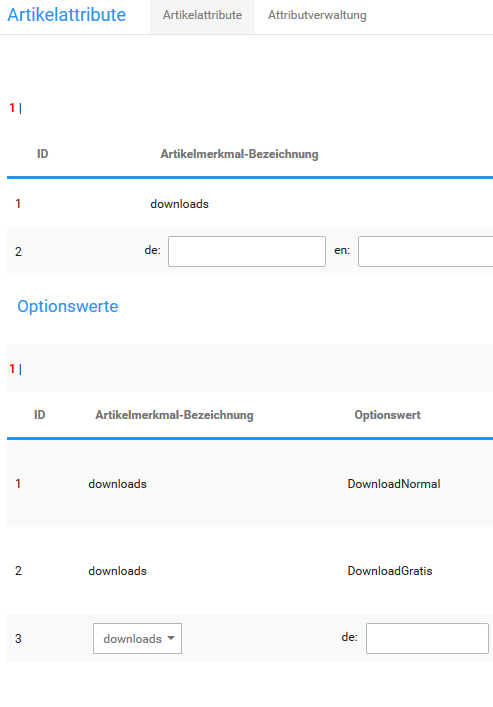

# Attribute anlegen 

Mit Artikelattributen kannst du Variationen deiner Artikel erstellen. Zu jedem Artikelattribut kannst du beliebig viele Optionswerte anlegen. Jedem Optionswert kann zusätzlich ein Attribut-Bild zugewiesen werden, das im Shopbereich unterhalb der Attributauswahl auf der Artikel-Detailseite angezeigt wird. Beachte, dass das Attribut-System nicht an das Imageprocessing angeschlossen ist und Attribut-Bilder daher unverändert angezeigt werden.

!!! Info "Hinweis
	 Um Artikelattribute verwenden zu können, muss das zugehörige Modul unter Module \> Modul-Center installiert sein.

Neue Artikelattribute kannst du im Gambio Admin deines Shops unter Artikel \> Artikelattribute anlegen.

1.  Trage in der Spalte Artikelmerkmal-Bezeichnung der Tabelle Artikelattribute in das Feld de: die deutsche Bezeichnung für das neue Attribut ein
2.  Trage die Bezeichnung auch in die anderen Felder ein, wenn du deinen Shop mehrsprachig betreibst
3.  Klicke auf Einfügen, um das neue Attribut anzulegen

Neue Optionswerte können angelegt werden, sobald das zugehörige Attribut angelegt wurde. Scrolle zum unteren Ende der Tabelle Optionswerte, in der letzten Zeile findest du ein leeres Dropdown-Menü mit den bekannten Eingabefeldern de: und en: \(sowie Feldern für weitere Sprachen, falls vorhanden\). Zudem steht ein Dialog zum Hinterlegen eines Bildes zur Verfügung. Das Bild wird im Artikel angezeigt, wenn der jeweilige Optionswert ausgewählt wurde. Das Haupt-Artikelbild wird hierbei nicht ersetzt.

Wähle in der Spalte Artikelmerkmal-Bezeichnung über das Dropdown-Menü das neu angelegte Attribut aus. Trage in das Feld de: den Namen des neuen Optionswerts ein.

Wahlweise kann über Durchsuchen ein Bild für den jeweiligen Optionswert hinterlegt werden.

!!! Info "Hinweis
	 Es wird für alle Artikel, die das neu angelegte Attribut und den Optionswert verwenden, das selbe Bild angezeigt. Wenn verschiedene Bilder zu jedem Artikel angezeigt werden sollen, müssen hierfür Eigenschaften verwendet werden.

Klicke auf Einfügen um den neuen Optionswert anzulegen. Wiederhole den Vorgang für alle Optionswerte des neuen Attributs.

