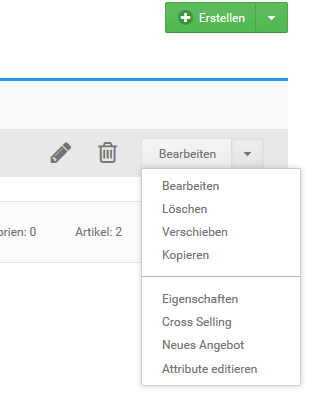
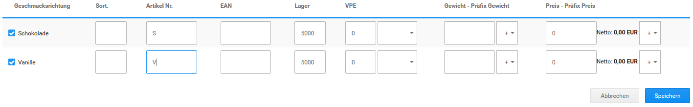

# Attribute zuweisen {#attribute_zuweisen}

Damit du deine neuen Attribute im Shop nutzen kannst, müssen diese einem Artikel zugewiesen werden. Markiere unter Artikel \> Artikel/Kategorien den Artikel, dem du neue Variationen zuweisen möchtest und wähle über die Dropdown-Schaltfläche Attribute editieren. Über den Reiter Attributverwaltung kann zudem ein Artikel für die Zuweisung ausgewählt oder die Zuweisung eines anderen Artikels kopiert werden.

**Note:** Aktiviere bei dem Attribut Lehne die Kontrollkästchen für die Optionen Typ A und Typ B und bei Polster die Optionen Typ C und Typ D. Über die Spalte Sort. kann die Anzeigereihenfolge der Optionen innerhalb des Attributs beeinflusst werden. Für jede Option kann eine eigene Artikelnummer und eine EAN eingetragen werden. In das Feld Lager wird der Lagerbestand für jede einzelne Option eingetragen.

Verschiedene Varianten können ein unterschiedliches Gewicht haben und den Preis des Artikels beeinflussen. Die Einstellungen Gewicht und Preis beziehen sich auf die Einstellungen, die für den Artikel in der Eingabemaske hinterlegt wurden. Sowohl Preis als auch Gewicht werden als Aufschlag oder Nachlass konfiguriert. Wenn du grundpreispflichtige Artikel verkaufst, nimm für deine Varianten bei abweichendem Grundpreis in der Spalte VPE eigene Einstellungen für die Verpackungseinheiten vor.

Klicke auf Speichern, um die vorgenommenen Änderungen zu sichern.

