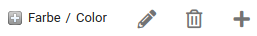
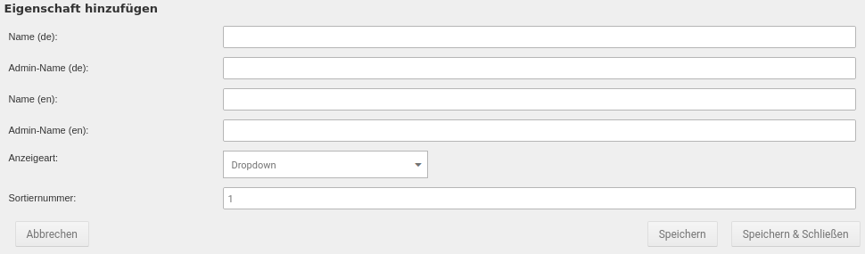

# Eigenschaften erstellen und bearbeiten {#artikeleigenschaften_eigenschaften_erstellen_und_bearbeiten}

Unter _**Artikel \> Artikeleigenschaften**_ werden, sofern vorhanden, die im Shop angelegten Eigenschaften angezeigt.

Für jede Eigenschaft kann über das kleine Plus-Zeichen die Anzeige mit den Eigenschaftswerten ausgeklappt werden.

Rechts neben dem Namen werden die Icons für die einzelnen Funktionen angezeigt:

Diese sind von links nach rechts

-   Eigenschaft bearbeiten
-   Eigenschaft löschen
-   Eigenschafswert hinzufügen

## Eigenschaft erstellen { .section}

Über den Button _**Erstellen**_ können neue Eigenschaften angelegt werden

Über _**Speichern**_ bzw. _**Speichern & Schließen**_ kann die Eigenschaft mit den gemachten Eingaben angelegt werden. Über _**Abbrechen**_ kann die Maske geschlossen werden, ohne die Eigenschaft anzulegen.

## Eigenschaft bearbeiten { .section}

Über das Bleistift-Symbol kann eine bestehende Eigenschaft bearbeitet werden.

Über die Schaltflächen _**Speichern**_ bzw. _**Speichern & Schließen**_ in der Eingabemaske werden die gemachten Änderungen an der Eigenschaft übernommen. Mit _**Abbrechen**_ wird der Dialog verlassen, ohne gemachte Änderungen zu speichern.

## Eingabemaske der Eigenschaft { .section}

In der Eingabemaske können die folgenden Angaben gemacht werden:

|Feldname|Beschreibung|
|--------|------------|
|Name \(de\)|Name der Eigenschaft, Sprache Deutsch|
|Admin-Name \(de\)|Admin-Name der Eigenschaft, Sprache Deutsch|
|Name \(en\)|Name der Eigenschaft, Sprache Englisch|
|Admin-Name \(en\)|Admin-Name der Eigenschaft, Sprache Englisch|
|Anzeigeart|Wie soll die Auswahl im Artikel angezeigt werden \(`_**Dropdown**_`, _**Bild**_, _**Radio**_ \(Radio-Buttom\), _**Text**_, _**Eingerahmter Text**_\)|
|Sortiernummer|Position der Eigenschaft unter _**Artikel \> Artikeleigenschaften**_|

!!! note "Hinweis"

    Der Admin-Name kann verwendet werden, um zwischen Eigenschaften mit gleichem Namen zu unterscheiden. Eine Eigenschaft _**Größe**_ kann z.B. mit dem Admin-Namen _**Konfektionsgröße**_ oder _**Schuhgröße**_ angelegt werden. Im Shop wird für beide Artikel, egal ob T-Shirt oder Turnschuh, die Auswahl _**Größe**_ angezeigt.

## Eigenschaft löschen { .section}

Über das Mülltonnen-Symbol kann eine bestehende Eigenschaft gelöscht werden. Es erfolgt eine Sicherheitsabfrage, in der das Löschen bestätigt werden muss.

!!! danger "Achtung"

    Eigenschaften sollten auf keinen Fall gelöscht werden, wenn diese noch in Eigenschaften-Kombinationen enthalten sind. Ist dies der Fall, wird eine entsprechende Warnung angezeigt.

