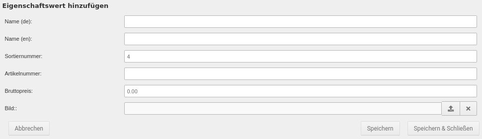
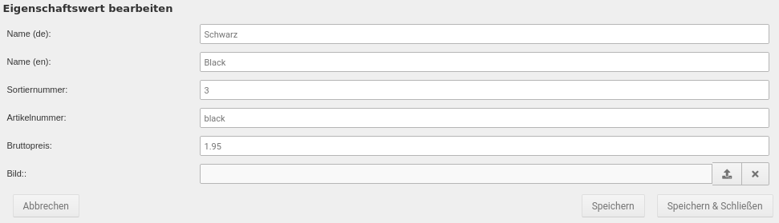

# Eigenschaftswerte erstellen und bearbeiten {#artikeleigenschaften_eigenschaftswerte_erstellen_und_bearbeiten}

## Eigenschaftswert hinzufügen { .section}

Über das Plus-Zeichen hinter der Eigenschaft kann ein neuer Eigenschaftswert hinzugefügt werden. Hierbei können die folgenden Einstellungen gemacht werden:

|Feldname|Beschreibung|
|--------|------------|
|Name \(de\)|Name des Eigenschaftswerts in der Sprache Deutsch|
|Name \(en\)|Name des Eigenschaftswerts in der Sprache Englisch|
|Sortiernummer|Sortierreihenfolge des Eigenschaftswerts innerhalb der Eigenschaft|
|Artikelnummer|\(Teil-\)Artikelnummer des Eigenschaftswerts|
|Bruttopreis|Brutto-Aufpreis auf den Hauptartikelpreis des Eigenschaftswerts|
|Bild|Bild zur Auswahl des Eigenschaftswerts bei _**Anzeigeart**_ _**Bild**_ der Eigenschaft|

## Eigenschaftswert bearbeiten { .section}

Über das Bleistift-Symbol lässt sich der jeweilige Eigenschaftswert bearbeiten. Es stehen die folgenden Einstellungen zur Verfügung:

|Feldname|Beschreibung|
|--------|------------|
|Name \(de\)|Name des Eigenschaftswerts in der Sprache Deutsch|
|Name \(en\)|Name des Eigenschaftswerts in der Sprache Englisch|
|Sortiernummer|Sotierreihenfolge des Eigenschaftswerts innerhalb der Eigenschaft|
|Artikelnummer|\(Teil-\)Artikelnummer des Eigenschaftswerts|
|Bruttopreis|Brutto-Aufpreis auf den Hauptartikelpreis des Eigenschaftswerts|
|Bild|Bild zur Auswahl des Eigenschaftswerts bei _**Anzeigeart**_ _**Bild**_ der Eigenschaft|

## Eigenschaftswert löschen { .section}

Über das Mülltonnen-Symbol kann ein bestehender Eigenschaftswert gelöscht werden. Es erfolgt eine Sicherheitsabfrage, in der das Löschen bestätigt werden muss.

!!! danger "Achtung"

    Eigenschaftstwerte sollten auf keinen Fall gelöscht werden, wenn diese noch in Eigenschaften-Kombinationen enthalten sind. Ist dies der Fall, wird eine entsprechende Warnung angezeigt.

