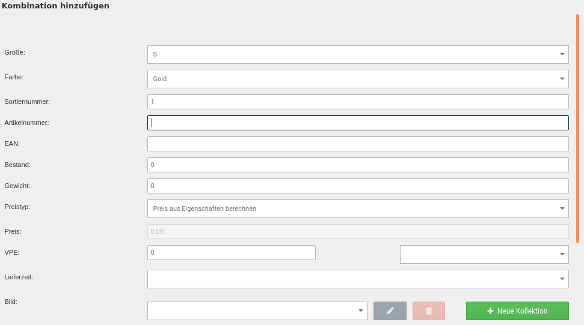

# Kombinationen erstellen 

Das Zuweisen der Eigenschaftswerte zu einem Artikel kann manuell oder automatisch erfolgen. Hierbei werden die einzelnen Eigenschaftswerte miteinander kombiniert. Jede Variante, die vom Kunden ausgewählt werden kann, wird als Eigenschaften-Kombination bezeichnet.

!!! example "Beispiel"
    Es wird ein Artikel _**Freizeithemd**_ angelegt. Dieser ist in der Farbe _**schwarz**_ in den Größen _**M**_ und _**L**_ und in der Farbe _**rot**_ in den Größen _**S**_, _**M**_ und _**L**_ vorhanden.

    Der Artikel hat die Kombinationen:

    -   schwarz, M
    -   schwarz, L
    -   rot, S
    -   rot, M
    -   rot, L

## Kombinationen automatisch ermitteln 

Das automatische Ermitteln der Kombinationen ist die einfachste Möglichkeit.

Setze die Haken für die Eigenschaften, die du kombinieren möchtest. Bei Bedarf kannst du auch über das Plus-Zeichen die jeweilige Eigenschaft aufklappen und einzelne Eigenschaftswerte für die Kombination auswählen. Klicke auf _**Kombinationen automatisch ermitteln**_. Überzählige Kombinationen - also Varianten eines Artikels, die du nicht anbieten möchtest - können auch nachträglich wieder gelöscht werden.

## Kombinationen manuell erstellen 

Beim manuellen Erstellen der Kombinationen wird jede Variante des Artikels einzeln angelegt.

Setze zunächst den Haken bei allen Eigenschaften, aus denen du Eigenschaftswerte übernehmen möchtest und klicke auf _**Kombinationen manuell erstellen**_.

Es wird die Auflistung der aktuell vorhandenen Kombinationen angezeigt, die ganz zu Anfang leer ist. Klicke auf _**Kombination hinzufügen**_, um eine neue Kombination zu erstellen.

Es wird der Dialog zum Anlegen einer neuen Kombination angezeigt. Neben je einem Dropdown-Menü für jede Eigenschaft, gibt es die folgenden Einstellungen:

|Feldname|Beschreibung|
|--------|------------|
|Sortiernummer|Sortierreihenfolge der Kombination im Gambio Admin|
|Artikelnummer|Artikelnummer der Kombination / Variante|
|EAN|EAN \(Europäische Artikelnummer\) der Kombination / Variante|
|Bestand|Lagerstand der Kombination / Variante|
|Gewicht|Gewicht der Kombination / Variante|
|Preistyp|Soll der Aufpreis der Variante aus den Aufpreisen der Eigenschaftswerte berechnet \(Preis aus Eigenschaften berechnen\) oder als individueller Preis in die Kombination \(Kombinationsfestpreis\) eingetragen werden?|
|Preis|Kombinationsfestpreis der Kombination / Variante|
|VPE|Verpackungseinheit der Kombination / Variante|
|Lieferzeit|Lieferstatus der Kombination / Variante|
|Bild|Bild-Kollektion der Kombination / Variante \(siehe Kapitel _**Kollektionen**_\)|

Wähle die gewünschten Eigenschaftswerte aus und nimm, soweit möglich, die Eintragungen vor. Bestätige die Eingaben mit _**Speichern**_ bzw. _**Speichern & Schließen**_. Über _**Abbrechen**_ kannst du den Dialog wieder verlassen, ohne die Kombination anzulegen.

