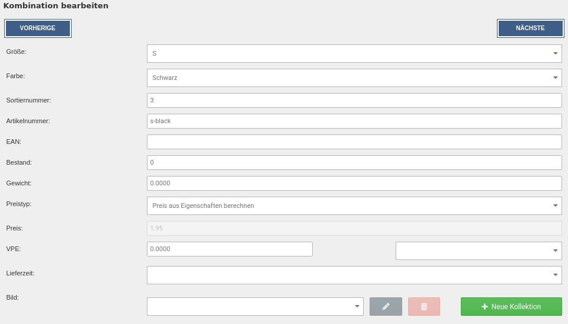

# Kombinationen bearbeiten 

Beim Bearbeiten einer Kombination stehen die gleichen Einstellungen zur Verfügung wie beim händischen Anlegen, abzüglich der auswählbaren Eigenschaften:

|Feldname|Beschreibung|
|--------|------------|
|Sortiernummer|Sortierreihenfolge der Kombination im Gambio Admin|
|Artikelnummer|Artikelnummer der Kombination / Variante|
|EAN|EAN \(Europäische Artikelnummer\) der Kombination / Variante|
|Bestand|Lagerstand der Kombination / Variante|
|Gewicht|Gewicht der Kombination / Variante|
|Preistyp|Soll der Aufpreis der Variante aus den Aufpreisen der Eigenschaftswerte berechnet \(Preis aus Eigenschaften berechnen\) oder als individueller Preis in die Kombination \(Kombinationsfestpreis\) eingetragen werden?|
|Preis|Kombinationsfestpreis der Kombination / Variante|
|VPE|Verpackungseinheit der Kombination / Variante|
|Lieferzeit|Lieferstatus der Kombination / Variante|
|Bild|Bild-Kollektion der Kombination / Variante \(siehe Kapitel _**Kollektionen**_\)|

Passe die gewünschten Eigenschaftswerte an und bestätige die Eingaben mit _**Speichern**_ bzw. _**Speichern & Schließen**_. Über _**Abbrechen**_ kannst du den Dialog wieder verlassen, ohne die Kombination zu ändern.

