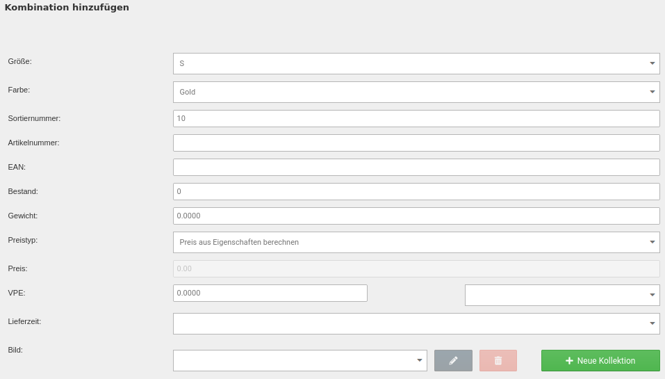

# Kombinationen hinzufügen 

!!! note "Hinweis"

    Kombinationen können nicht beliebig ergänzt werden. Es können nur Eigenschaftswerte zu neuen Kombinationen zusammengeführt werden, die beim Erstellen der ursprünglichen Kombinationen schon im Shop angelegt waren.

Es wird der Dialog zum Anlegen einer neuen Kombination angezeigt. Neben je einem Dropdown-Menü für jede Eigenschaft, gibt es die folgenden Einstellungen:

|Feldname|Beschreibung|
|--------|------------|
|Sortiernummer|Sortierreihenfolge der Kombination im Gambio Admin|
|Artikelnummer|Artikelnummer der Kombination / Variante|
|EAN|EAN \(Europäische Artikelnummer\) der Kombination / Variante|
|Bestand|Lagerstand der Kombination / Variante|
|Gewicht|Gewicht der Kombination / Variante|
|Preistyp|Soll der Aufpreis der Variante aus den Aufpreisen der Eigenschaftswerte berechnet \(Preis aus Eigenschaften berechnen\) oder als individueller Preis in die Kombination \(Kombinationsfestpreis\) eingetragen werden?|
|Preis|Kombinationsfestpreis der Kombination / Variante|
|VPE|Verpackungseinheit der Kombination / Variante|
|Lieferzeit|Lieferstatus der Kombination / Variante|
|Bild|Bild_\)|

Wähle die gewünschten Eigenschaftswerte aus und nimm, soweit möglich, die Eintragungen vor. Bestätige die Eingaben mit _**Speichern**_ bzw. _**Speichern & Schließen**_. Über _**Abbrechen**_ kannst du den Dialog wieder verlassen, ohne die Kombination anzulegen.

