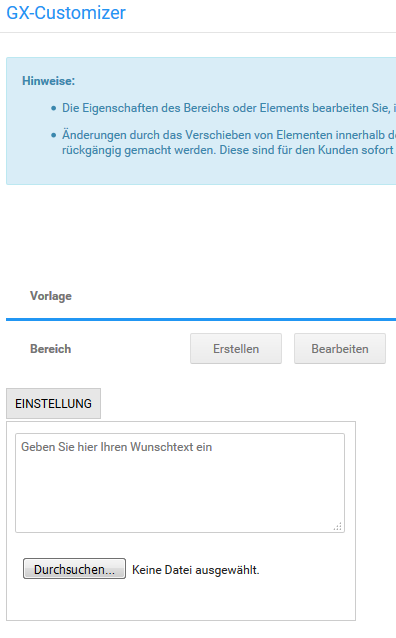
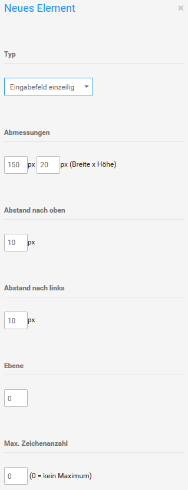
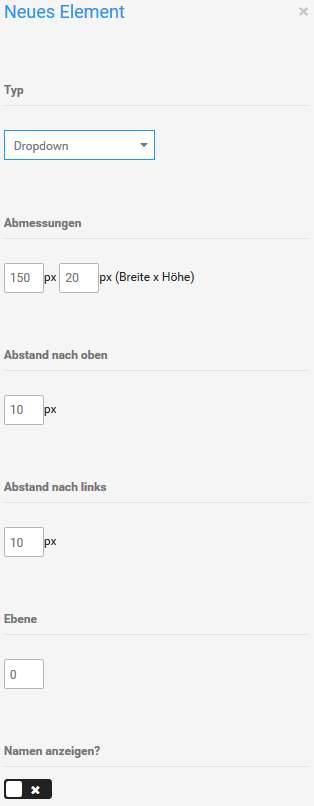

# Customizer-Set anlegen 

Neue Customizer-Sets kannst du im Gambio Admin unter Artikel \> GX-Customizer anlegen. Trage in das Feld Bezeichnung eine Bezeichnung für das neue Customizer-Set ein und klicke auf Erstellen.

Ein neues Customizer-Set wird angelegt und zum Bearbeiten geöffnet. Das neue Customizer-Set verfügt vorerst über keine Darstellungselemente. Eingabefelder und Listenfelder können in verschiedene Bereiche eingefügt werden. Jeder Bereich wird in der Shopansicht als Tab angezeigt.

1.  Klicke unter Bereich auf Erstellen, um einen neuen Bereich anzulegen
2.  Trage in das Feld Bezeichnung eine Bezeichnung für den neuen Bereich ein
3.  Trage in das Feld Abmessungen die Breite und die Höhe des neuen Bereichs ein

    Die voreingestellten Abmessungen sind bereits ideal, wenn das Customizer-Set auf der Artikel-Detailseite oberhalb der Preisanzeige eingebunden werden soll. Wenn das Customizer-Set in der Artikel-Beschreibung eingebunden werden soll, kann die Breite bis auf 760 Pixel erhöht werden.

    **Note:** Die Einstellungen im letzten Absatz gelten nur für das EyeCandy-Template.

4.  Klicke auf Erstellen, um den neuen Bereich zu speichern

    In deinem neuen GX-Customizer-Bereich kannst du die Elemente anlegen, die deine Kunden personalisieren können. In der Bestellbestätigung und auf der Rechnung werden die personalisierten Elemente in der Reihenfolge ausgegeben, in der sie angelegt wurden.

5.  Klicke unter Element auf Erstellen
6.  Wähle aus der Liste Typ den Elementtyp aus

    Eine Übersicht über die Elementtypen findest du in der nachfolgenden Auflistung.

7.  Trage in die Felder Abmessungen die Breite und die Höhe des neuen Elements ein
8.  Trage in die Felder Abstand nach oben und Abstand nach links die Abstände des Elements vom linken und rechten Bereichsrand ein
9.  Trage in das Feld Bezeichnung die Bezeichnung des Elements ein
10. Je nach Elementtyp sind zusätzliche Felder auszufüllen, bitte beachte die nachfolgenden Beschreibungen der einzelnen Elementtypen
11. Klicke auf Hinzufügen, um das Element hinzuzufügen

## Textfeld 

Mit dem Element Textfeld kannst du beschreibende Texte ausgeben, die deine Kunden nicht ändern können. Trage in das Feld Wert den auszugebenden Text ein. Weitere Einstellungen sind nicht vorzunehmen.

## Eingabefeld 

Das Element Eingabefeld liegt in den Varianten einzeilig und mehrzeilig vor. Einzeilige Eingabefelder werden dargestellt wie das Feld Bezeichnung, mehrzeilige Eingabefelder werden dargestellt, wie das Feld Wert. In Eingabefelder tragen deine Kunden personalisierten Text zu einem Artikel ein.

1.  Trage in das Feld Max. Zeichenanzahl die Zeichenbegrenzung für das Eingabefeld ein
2.  Aktiviere das KontrollkästchenNamen anzeigen?, wenn der Wert aus dem Feld Bezeichnung im Customizer-Set oberhalb des Eingabefeldes angezeigt werden soll
3.  Trage in das Feld Wert einen Vorgabewert für das Eingabefeld ein

## Dateiuploadfeld 

Über Dateiuploadfelder laden deine Kunden beispielsweise personalisierte Bilder oder andere Vorgaben hoch. Der Dateiname des Uploads wird beim Hochladen kryptisch verschlüsselt und die Datei in einem gesicherten Verzeichnis abgelegt. Hochgeladene Dateien kannst du in den Bestelldetails der Bestellung herunterladen.

1.  Trage im Feld Erlaubte Dateitypen kommagetrennt und ohne Leerzeichen die Dateiendungen ein, die von Kunden hochgeladene Dateien haben dürfen
2.  Trage im Feld Min. Dateigröße eine Mindestgröße für hochgeladene Dateien ein
3.  Trage im Feld Max. Dateigröße eine Maximalgröße für hochgeladene Dateien ein

## Dropdown 

Mit Dropdown-Feldern wählen deine Kunden aus einer Reihe von dir vorgegebener Werte aus.

1.  Aktiviere das Kontrollkästchen Namen anzeigen?, wenn der Wert aus dem Feld Bezeichnung im Customizer-Set oberhalb des Eignabefeldes angezeigt werden soll
2.  Füge über das Symbol + beim Feld Wert neue Eingabefelder für deine Vorgabewerte hinzu
3.  Trage in die Felder Wert die Vorgabewerte ein

## Bild 

Über das Element Bild kannst du deinem Customizer-Set ein Bild hinzufügen. Das Bild wird direkt angezeigt und kann durch deine Kunden nicht verändert werden. Lade im Dateifeld Bild ein Bild von deinem Computer hoch. Weitere Einstellungen sind nicht vorzunehmen.

**Note:** Die Abmessungen werden bei GX-Customizer-Bildern nicht automatisch angepasst und können nachträglich nicht verändert werden. Lade dein Bild in der Größe hoch, in der es später angezeigt werden soll.

