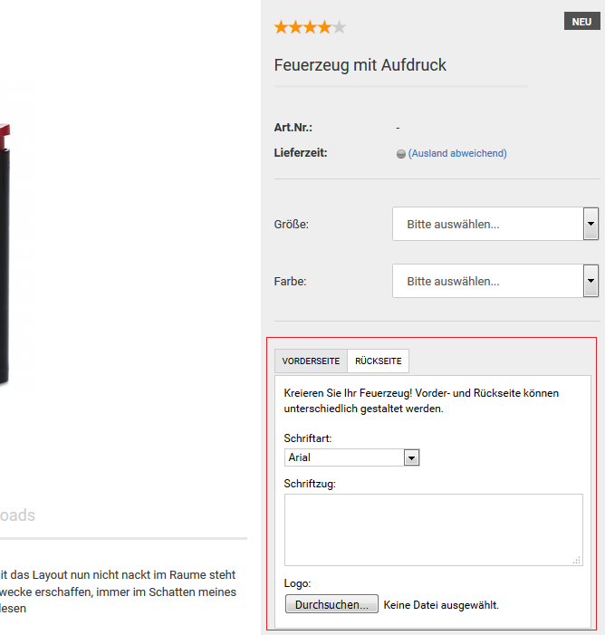

# GX-Customizer 

!!! Info "Hinweis
	 Mit dem GX-Customizer bietest du deinen Kunden die Möglichkeit Artikel in deinem Shop zu personalisieren. Du kannst dabei aus einer Vielzahl an Formularelementen wählen, wie Eingabefelder, Datei-Uploadfelder und Listenauswahl-Felder.

  

  

  

