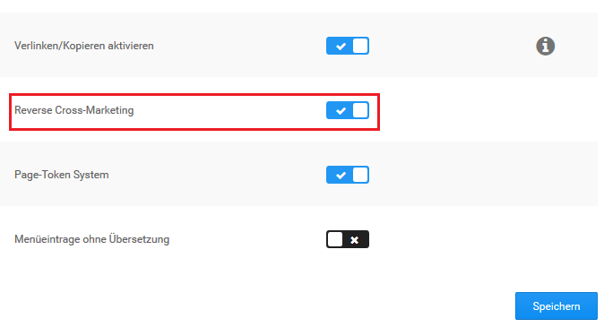

# Cross Selling 

Cross Selling ist eine Marketing-Funktion, mit der du einem Artikel weitere Artikel als Empfehlung hinzufügst. Die Empfehlungen werden im Shopbereich unterhalb der Artikelbeschreibung angezeigt.

")

## Artikelempfehlung hinzufügen 

1.  Markiere den Artikel, zu dem du Empfehlungen hinzufügen möchtest
2.  Klicke auf Cross Selling
3.  Trage im Feld Produktsuche eine Artikelnummer oder einen Artikelnamen ein, den du zum gewählten Artikel empfehlen möchtest und klicke auf Suchen
4.  Aktiviere das Kontrollkästchen in der Spalte Hinzufügen bei den gefundenen Artikeln, die du zum gewählten Artikel empfehlen möchtest
5.  Klicke auf Speichern

## Artikelempfehlung löschen 

1.  Markiere den Artikel, aus dem du Empfehlungen löschen möchtest
2.  Klicke in der rechten Spalte auf Cross Selling
3.  Aktiviere das Kontrollkästchen in der Spalte Löschen bei den Empfehlungen, die du löschen möchtest
4.  Klicke auf Speichern und bestätige das Speichern der Änderungen mit OK

## Automatische Rückverknüpfung 

Artikelempfehlungen werden in der Grundeinstellung des Shopsystems automatisch in beide Richtungen verknüpft. Im empfohlenen Artikel wird der ursprüngliche Artikel auf der Artikel-Detailseite unter Dieses Produkt ist kompatibel zu angezeigt. Die automatische Rückverknüpfung kannst du im Gambio Admin deines Shops unter Shop Einstellungen \> Zusatzmodule deaktivieren. Ändere die Option bei Reverse Cross-Marketing auf ✖ und speichere die Änderung.

Wenn du die automatische Rückverknüpfung deaktiviert hast und die Funktion reaktivieren möchtest, ändere die Option bei Reverse Cross-Marketing auf ✔ und speichere die Änderung.

