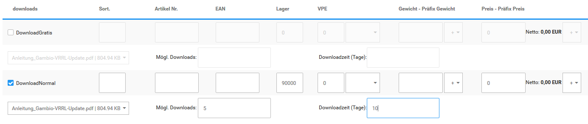

# Downloadartikel {#downloadartikel}

CAUTION:

Downloadartikel setzen die Verwendung des Attribut-Systems voraus. Es sollte daher sichergestellt werden dass unter Module \> Modul-Center das Modul Artikelattribute installiert ist.

Das Erstellen von Download-Artikeln wird im Shop über das Attribut-System ermöglicht. Gehe zunächst unter Artikel \> Artikelattribute, hier sollte das Attribut downloads vorhanden sein. Ist dies nicht der Fall, lege es bitte an. Gehe hierzu wie folgt vor:

In der oberen Tabelle findest du die Spalte Artikelmerkmal-Bezeichnung. Scrolle bis zum unteren Ende, hier findest du die Eingabefelder de: und en:. Trage unter de: den Begriff downloads ein, achte hierbei bitte auf die Kleinschreibung und das s am Ende. Klicke auf Einfügen um das Attribut hinzuzufügen.

Im zweiten Schritt scrolle bitte an das Ende der Tabelle Optionswerte. Wähle im Dropdown der Spalte Artikelmerkmal-Bezeichnung das Attribut downloads aus und trage im Feld de: eine Beschreibung ein, z.B. PDF-Download oder dergleichen. Klicke auf Einfügen um den Optionswert hinzuzufügen.

Beim Anlegen des zugehörigen Artikels unter Artikel \> Artikel/Kategorien gibt es nur wenige Unterschiede zu einem physischen Artikel. Zum Einen sollte die Einstellung Artikeltyp im Bereich Erweiterte Konfiguration von Standard auf Download geändert werden. Zum Anderen ist es vorgesehen, unter Preisoptionen die Einstellung Steuerklasse von Standard auf elektronisch erbrachte Leistung zu setzen.

CAUTION:

Bitte beachte, dass wir dir hinsichtlich der Steuer-Einstellungen nur die gängigen Voreinstellungen nennen können, die für die meisten Shopbetreiber anwendbar sind. Wie du für deinen individuellen Shop verfahren musst und ob es hierbei Besonderheiten gibt, die berücksichtigt werden müssen, erfrage bitte bei deinem Steuerberater oder Rechtsbeistand.

Um die Datei im Shop zur Verfügung stellen zu können, muss sie auf den FTP-Server hochgeladen werden. Verbinde dich hierzu mit deinem FTP-Server und wechsele in dein Shop-Verzeichnis. Lade die Datei in den Ordner download hoch.

Um den Download-Artikel einzurichten, muss das passende Attribut zugeordnet werden. Wähle hierzu den Artikel unterArtikel \> Artikel/Kategorien aus und wähle Attribute editieren über die Dropdown-Schaltfläche oder verwende die Auswahl unter Artikel \> Artikelattribute \> Attributverwaltung. Du siehst eine Auflistung aller Attribute, die dem Artikel zugeordnet werden können. Ein Aufruf ist auch direkt aus de Artikelmaske, über den Dropdown-Button Attribute möglich.

Setze den Haken bei der von dir gewählten Bezeichnung, in unserem Beispiel also bei PDF-Download. Die vorher ausgegrauten Eingabefelder zur Einrichtung von Attributen werden nun angezeigt. Unterhalb dieser Zeile finden sich zudem Einstellungen, die nur für Download-Artikel zur Verfügung stehen.

Trage im Feld Lager einen fiktiven Lagerstand ein, dieser wird benötigt, damit der Artikel heruntergeladen werden kann. Wenn du andere Attribute verwendest und den Lagerstand abziehst, sollte der Wert entsprechend hoch gewählt werden.

Im Dropdown-Menü unterhalb des Namens PDF-Download kannst du die vorher hochgeladene Datei auswählen.

**Note:** Wenn die Datei nicht angezeigt wird, kann ein Problem mit dem Dateinamen vorliegen. Prüfe in diesem Fall, ob dieser Umlaute oder Sonderzeichen enthält und ändere diese entsprechend ab.

Unter Mögl. Downloads wird hinterlegt, wie oft die Datei von einem Kunden heruntergeladen werden kann. Unter Downloadzeit \(Tage\) wird festgelegt, wie lange der Download-Link für den jeweiligen Kunden gültig ist. Beide Einträge müssen vorgenommen werden und größer als 0 sein, damit die Datei vom Kunden heruntergeladen werden kann.

Der Download-Link wird für den Kunden verfügbar, sodass er den Artikel in seinem Konto herunterladen kann, wenn ein bestimmter Bestellstatus erreicht wurde. Diesen kannst du selber unter Shop Einstellungen \> Download-Optionen im Bereich Download-Bestellstatus festlegen. Du kannst wahlweise einen \(oder mehrere\) bestehende\(n\) Bestellstatus verwenden oder einen neuen Status \(z.B. Download erlaubt\) unter Bestellungen \> Bestellstatus zu diesem Zweck anlegen.

**Note:** Über die Einstellung Download Zahlungsmodule unter Shop Einstellungen \> Download-Optionen kannst du festlegen, welche Zahlungsweisen bei Download-Artikeln nicht verwendet werden dürfen. Standardmäßig sind hier die Module banktransfer, cod, invoice und moneyorder eingetragen.

CAUTION:

Die Einstellung Download durch Weiterleitung ist standardmäßig abgeschaltet. Sie sollte nur verwendet werden, wenn dies unbedingt erforderlich ist.

Setze die Einstellungen im Bereich Download-Bestellstatus unter Shop Einstellungen \> Download-Optionen für die Bestellstatus, mit denen du einen Download ermöglichen möchtest. Wenn du den Status der Bestellung änderst, z.B. nach einem bestätigen Zahlungseingang, kannst du deinen Kunden über die Benachrichtigungsfunktion innerhalb der Bestellung \(Bestellstatus ändern, Haken setzen für Kunde benachrichtigen und Kommentare mitsenden\) darüber informieren, dass der Download nun zur Verfügung steht.

Bei Zahlung per Zahlungsweisen mit sofortiger Transaktionsbestätigung wie PayPal oder Sofortüberweisung, kann der Kunde den Artikel direkt nach Abschluss der Bestellung herunterladen. Achte hierbei darauf, dass der betreffende Status unter Shop Einstellungen \> Download-Optionen aktiviert ist.

Bei Zahlung per PayPal kannst du unter Module \> Zahlungsweisen \> PayPal und PayPal Plus \> Konfiguration \> Experteneinstellungen unter Bestellstatusänderungen nach Aktionen einen Bestellstatus auswählen, der nach erfolgreicher Bestellung automatisch zugewiesen wird. Wenn du einen eigenen Status verwendest kann dieser hier eingestellt werden \(z.B. Download erlaubt\). Nach erfolgreicher Bestellung mit Zahlung über PayPal wird im Konto des Kunden der Downloadlink zum Herunterladen der hinterlegten Datei freigeschaltet.

