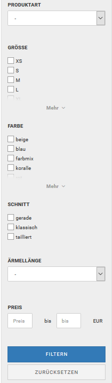

# Artikel-Filter 

Filter dienen dazu, die Artikel in deinem Shop zu strukturieren und dem Kunden die Möglichkeit zu geben, gezielt zu den gewünschten Artikeln zu gelangen. Indem du für eine Kategorie einzelne Filter \(wie z.B. Produktart, Größe, Farbe\) anlegst, kann der Kunde einfach und schnell zu den passenden Artikeln navigieren. Er kann seine Suche durch die Filter immer weiter eingrenzen, bis er genau die Artikel findet, die ihn interessieren. So ist die Navigation durch Filter eine gute Erweiterung zur Navigation über die Kategorien, da sie \(für jede Kategorie angepasst\) spezifische Merkmale einbezieht, die für eine Suche relevant sein können. Im Beispiel siehst du die Kategorie Damenbekleidung, in der sechs Filter angelegt wurden. Die Darstellungsweisen der einzelnen Filterwerte variieren je nachdem, wie diese vom Administrator eingestellt wurden \(s. hierzu den Abschnitt Verknüpfungsart, Reihenfolge und Darstellung des Filters festlegen\).

## Artikel-Filter anlegen 

Wie du auf dem Bild sehen kannst, befindet sich am linken Rand das Filterset, welches sich aus \(in unserem Beispiel sechs\) einzelnen Filtern \(Produktart, Größe, Farbe usw.\) zusammensetzt. Jeder einzelne Filter ist mit Werten bestückt, die ihm vom Shopbetreiber zugewiesen werden \(wie z.B. Blazer und Blusen dem Filter Produktart oder XS und S dem Filter Größe\). Diese Werte entsprechen den Merkmalen, die ein Artikel aufweist. Um neue Filter anzulegen, die du anschließend einer oder mehreren Kategorien zuweist und für die du Filterwerte hinterlegst, klicke im Gambio Admin auf Artikel \> Artikel-Filter. Gebe eine Filterbezeichnung, wie z.B. Größe, in das Feld Neue Filterauswahl ein und klicke auf Anlegen.

## Filterwerte einrichten 

Auf der rechten Seite erscheint ein neues Fenster, in welches du für den neu angelegten Filter Auswahlwerte, wie z.B. XS, S, M usw., eingeben kannst. Hierfür kannst du in das Feld unter der Überschrift Neuer Auswahlwert einfach einen einzelnen Wert eingeben und klickst auf Speichern. Nachdem du alle gewünschten Werte eingerichtet hast, bestimmst du die Reihenfolge, in der diese Werte später in den Filterfenstern angezeigt werden sollen, indem du mit 0 für den obersten Wert beginnst, aufsteigend nummerierst und abschließend speicherst. Möchtst du einen bereits angelegten Filter bearbeiten, so klicke den Wert in dem linken Feld Filterauswahl \(eingerichte\) an und bearbeite diesen dann im rechten Feld, indem du einzelne Auswahlwerte umbenennst, die Werte umsortierst, neue Werte hinzufügst oder ganze Filter oder einzelne Werte \(durch Klick in das rechte Löschen-Kästchen\) löscht. Abschließend musst du immer speichern, damit deine Änderungen übernommen werden.

## Filter einer Kategorie zuweisen 

Wenn du die angelegten Filter einer Kategorie zuweisen möchtest, sodass diese am linken Rand deines Shops angezeigt werden, so markiere im Gambio Admin unter Artikel \> Artikel/ Kategorien per Klick die gewünschte Kategorie und klicke dann rechts auf Bearbeiten. Im rechten Feld findest du die Überschrift Filterauswahl. In dem Drop-Down-Menü darunter kannst du einen der von dir angelegten Filter auswählen und mit Hinzufügen bestätigen. Darunter erscheint dann eine Liste mit den von dir ausgewählten Filtern. Für das Dropdown-Menü Auswahlmodus sind zwei Einstellungen möglich

-   Standard: alle Filter werden von Anfang an angezeigt
-   Stufenweise: nur der erste Filter ist am Anfang sichtbar, der jeweils nächste Filter wird nach Auswahl eines Wertes eingeblendet

Die Filterwertdeaktivierung legt fest, ob \(je nach Auswahl\) nicht verfügbare Filterwerte ausgeblendet oder deaktiviert werden sollen. Um den Kategorie-Filter anzuzeigen, setze bitte die Einstellung Kategorie-Filter anzeigen? und speichere anschließend die Änderung.

## Verknüpfungsart, Reihenfolge und Darstellung des Filters festlegen 

Unter der Überschrift AND kannst du die Einstellung gesetzt lassen, wenn du für die Filterwerte des Filters eine Und-Verknüpfung wünscht. Dies bedeutet, dass im Falle einer späteren Mehrfachauswahl \(also wenn der Käufer bei seiner Suche mehrere Werte, wie z.B. blau und rot auswählt\), nur diejenigen Artikel angezeigt werden, die beide Eigenschaften haben.

Nimmst du die Einstellung heraus, so besteht in dem Filter eine Oder-Verknüpfung. Es werden also bei einer Mehrfachauswahl diejenigen Artikel angezeigt, die entweder das eine Merkmal oder das andere Merkmal aufweisen. Unter Sort kannst du \(auf oben beschriebene Weise\) die Reihenfolge einstellen und unter Vorlage wählst du die Darstellungsart des Filters aus. Checkboxes und Multiselect ermöglichen dem Käufer eine Mehrfachauswahl der Filterwerte – deswegen solltest du hier besonders darauf achten, ob du eine Und- oder Oder-Verknüpfung einstellst, also ob du die Einstellung unter AND setzt oder nicht. Beim Dropdown-Menü kann nur jeweils ein Wert ausgewählt werden. Die Linklist ermöglicht dem User per Klick auf den einzelnen Wert ein direktes Springen zu der Übersicht der Artikel, die seiner Suche entsprechen.

**Note:** In der linken Spalte befinden sich unter den Filtern noch zwei Felder, in denen sich als weitere Filteroption eine Preisspanne eingeben lässt. Diese Felder brauchst du nicht manuell zu aktivieren, da sie deinen Filtern \(sofern du welche angelegt hast\) automatisch hinzugefügt werden.

## Filterauswahl Startseite 

Im Bereich Filterauswahl Startseite können Filter für die Startseite eingerichtet werden. Wenn die Einstellung bei Aktivieren gesetzt ist, wird die Box auf der Startseite angezeigt, sofern sie im Template bzw. Theme aktiv geschaltet worden ist.

Mit dem darunterstehenden Dropdown-Menü kann der Filter ausgewählt und über die Schaltlfäche Hinzufügen zur Auswahl Startseite hinzugefügt werden. Die ausgewählten Filter werden in einer tabellarischen Auflistung im unteren Drittel der Box aufgeführt. Die Einstellungen für AND, Sortierung, Vorlage und Löschen entsprechen ihren Gegenstücken in den Kategorien \(siehe Filter einer Kategorie zuweisen und Verknüpfungsart, Reihenfolge und Darstellung des Filters festlegen\).

Für das Dropdown-Menü Auswahlmodus sind zwei Einstellungen möglich

-   Standard: alle Filter werden von Anfang an angezeigt
-   Stufenweise: nur der erste Filter ist am Anfang sichtbar, der jeweils nächste Filter wird nach Auswahl eines Wertes eingeblendet

Die Filterwertdeaktivierung legt fest, ob \(je nach Auswahl\) nicht verfügbare Filterwerte ausgeblendet oder deaktiviert werden sollen.

Durch Setzen der Einstellung Globaler Startseitenfilter kann der Startseitenfilter automatisch in Kategorien angezeigt werden, für die kein Filter eingrichtet ist. Ist die Einstellung gesetzt, kann die Einstellung Persistenter Startseitenfilter aktiviert werden. Dadurch werden beim Wechsel der Kategorien die zuvor ausgewählten Filterwerte, soweit wie möglich beibehalten.

## Filterwerte einem Artikel zuweisen 

Klicke unter Filterauswahl auf Hinzufügen. Es öffnet sich ein neues Fenster, in dem die einzelnenen Filter aufgeführt werden. Wenn kürzlich neue Filter hinzugefügt wurden, steht das Dropdown-Menü --Neuen Filter hinzufügen-- zur Verfügung. Wähle hier die gewünschten Filter aus, um diese der Ansicht hinzuzufügen. Anschließend können über einen einfachen Klick die Filterwerte an- \(türkis hinterlegt\) und abgewählt werden. Wähle alle Werte aus, die gleichzeitig für den Artikel zutreffen, um das Filter-Set zu erstellen. Mit einem Klick auf Speichern können gemachte Einstellungen übernommen und das Set dem Artikel hinzugefügt werden. Das Fenster Set hinzufügen bleibt geöffnet, sodass durch eine erneute Auswahl weitere Filter-Sets mit abweichenden Kombinationen erzeugt werden können.

Über die Schaltfläche Speichern & Schließen werden die Änderungen übernommen und das Fenster Set hinzufügen geschlossen. Mit einem Klick auf Abbrechen oder das x-Symbol wird das Fenster geschlossen und die Änderungen verworfen.

Ein bestehendes Filter-Set kann mit Klick auf Bearbeiten \(Bleistift-Symbol\) geändert werden. Über Klick auf Löschen \(Mülleimer\) kann ein Filter-Set wieder aus dem Artikel entfernt werden. Das betroffene Set und dessen Filterwert\(e\) werden in einem Abfrage-Dialog angezeigt, mit dem das Löschen bestätigt werden muss.

**Note:** Filter und die ausgewählten Filter-Werte gehören nur zu einem Filter-Set, wenn diese zusammen in einer waagerechten Box angeordnet sind. Untereinander angeordnete Filter-Auswahlen stehen in keiner Beziehung zueinander.

