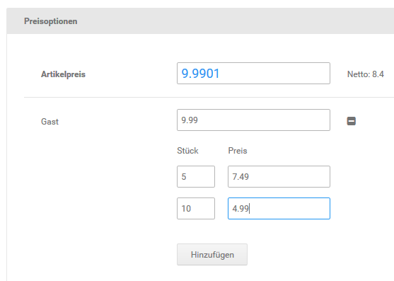
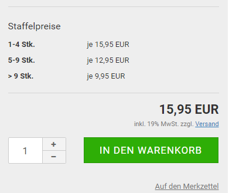

# Staffelpreise {#staffelpreise}

Mit Staffelpreisen hast du die Möglichkeit, deine Artikelpreise abhängig von der verkauften Stückzahl je Bestellung zu gestalten. Staffelpreise werden in der Artikel-Eingabemaske angelegt und müssen für jede Kundengruppe explizit aktiviert werden. Je Kundengruppe können eigene Staffelpreise angelegt werden, sodass die Preismodelle für Händler und Endverbraucher getrennt gehalten werden können. Bei Artikeln mit Varianten über die Artikeleigenschaften oder Artikelattribute wird nur der Preis des Hauptartikels als Grundlage für die Berechnung der Staffelpreise verwendet.

**Note:** Administratoren können aus technischen Gründen keine Kundengruppen- oder Staffelpreise angezeigt werden. Lege zum Testen gegebenenfalls ein Testkonto in der betroffenen Kundengruppe an.

Bearbeite den Artikel, dem du Staffelpreise zuordnen möchtest. Im unteren Bereich der Artikel-Eingabemaske siehst du ein allgemeines Feld für den Artikelpreis, sowie ein Feld für den Kundengruppenpreis jeder Kundengruppe. Klicke auf das Plus-Zeichen hinter dem Preisfeld der Kundengruppe, es erscheinen zwei neue Eingabefelder. Wenn du bereits Staffelpreise angelegt hast, werden diese unter den bestehenden Staffelpreisen angezeigt.

**Note:** Gib für die Kundengruppe, für die du Staffelpreise einrichtest, einen Kundengruppenpreis an. Der Kundengruppenpreis kann identisch zum regulären Artikelpreis sein. Wenn kein Kundengruppenpreis angegeben wird, kann die Anzeige und die Berechnung der Staffelpreise im Shop fehlerhaft sein.

Der Kundengruppenpreis funktioniert gleichzeitig als Staffelpreis ab 1 Stück. Wenn du eine Mindestbestellmenge konfiguriert hast, wird der Kundengruppenpreis als Staffelpreis ab der Mindestbestellmenge berechnet. Trage in das Feld Stück die nächste ab-Menge und in das Feld Preis den Preis pro Stück ab dieser Menge ein und klicke auf Hinzufügen. Wenn du noch weitere Staffeln eintragen möchtest, wiederhole den Vorgang. Klicke nach dem Eintragen der letzten Staffel auf die Schaltfläche Speichern.

**Note:** Du verkaufst einen Artikel, der für Händler mit Staffelpreisen angeboten werden soll. Bis fünf Stück wird der Artikel zu 4.99 EUR angeboten. Fünf bis zehn Stück kosten 4.49 EUR und ab 20 Stück bezahlen Händler 3.99 EUR. Trage in das Preisfeld Händler den Händlerpreis von 4.99 EUR ein. Trage in das Feld Stück den Wert 5 und in das Feld Preis den Preis ab fünf Stück von 4.49 EUR ein. Klicke auf Aktualisieren und trage in das Feld Stück den Wert 20 sowie in das Feld Preis den Preis 3.99 EUR ein.

