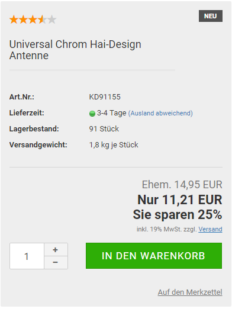

# Artikelrabatt 

Du hast in jedem Artikel die Möglichkeit, einen Artikelrabatt festzulegen, den bestimmte Kundengruppen dann ganz oder zum Teil in Anspruch nehmen können.

**Note:** Der tatsächliche Rabatt ergibt sich später aus dem Artikelrabatt und dem Kundengruppenrabatt, es wird der jeweils kleinere Prozentsatz verwendet.

Den maximalen Kundengruppenrabatt in Prozent kannst du direkt in der Übersicht unter Kunden \> Kundengruppen in der Spalte Rabatt einsehen, dieser ist der erste Wert. Um den Kundengruppenrabatt zu ändern, bearbeite die entsprechende Kundengruppe und trage im Feld Maximaler Rabatt auf Artikel den gewünschten maximalen Rabatt für diese Kundengruppe ein.

**Note:** Du kannst eine neue Kundengruppe Stammkunde anlegen und dieser einen maximalen Rabatt von 20% gewähren. Trage hierzu in der Kundengruppe im Feld Maximaler Rabatt auf Artikel 20 ein. Unabhängig vom vergebenen Artikelrabatt erhält diese Kundengruppe maximal einen Rabatt von 20 % und minimal den vergebenen Artikelrabatt.

Bearbeite nun unter Artikel \> Artikel / Kategorien die Artikel, die einen Artikelrabatt erhalten sollen und trage im Feld Rabattden gewünschten maximalen Rabatt für den jeweiligen Artikel ein. Ein Artikelrabatt von 50 % kann nur von Kunden voll ausgeschöpft werden, die sich in einer Kundengruppe mit einem Kundengruppenrabatt von 50 % oder höher befinden. Alle anderen Kunden erhalten maximal den Kundengruppenrabatt Ihrer Kundengruppe.

**Note:** Lege drei Artikel mit den Namen Test 10 Prozent, Test 20 Prozent und Test 30 Prozent an. Vergebe für alle Artikel einen Artikelpreis von 10 Euro Brutto und trage im Feld Artikelrabatt den jeweiligen Rabatt ein. Rufe deinen Shop nun mit einem Kundenkonto auf, das Mitglied der Kundengruppe Stammkunde ist. Im Shop siehst du jetzt für den Artikel Test 10 Prozent einen Artikepreis von 9 Euro und den Hinweis Sie sparen 10%. Bei den Artikeln Test 20 Prozent und Test 30 Prozent ändert sich der Artikelpreis auf 8 Euro und der Hinweis Sie sparen 20% wird ausgegeben. Da die Kundengruppe Stammkunde maximal 20 % Rabatt erhält, werden von den 30 % des Artikels Test 30 Prozent nur die erlaubten 20 % berücksichtigt.

