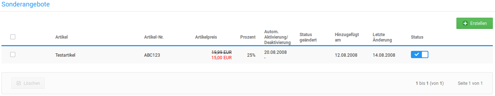
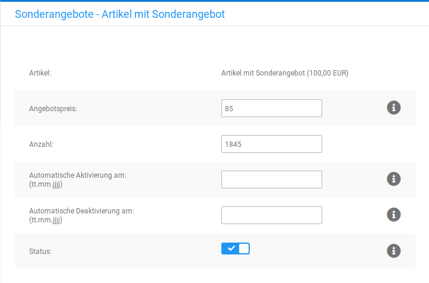

# Sonderangebote 

Mit Sonderangeboten bietest du ausgewählte Mengen eines Artikels zu einem Sonderpreis an. Sonderpreise können sowohl höher als auch geringer als der reguläre Artikelpreis sein.

## Sonderangebot anlegen { .section}

Neue Sonderangebote kannst du im Gambio Admin deines Shops unter Artikel \> Sonderangebote anlegen.

1.  Klicke auf Erstellen
2.  Wähle aus der Liste Artikel den Artikel aus, zu dem du ein Sonderangebot anlegen möchtest
3.  Trage im Feld Angebotspreis den Angebotspreis des Sonderangebots als Festpreis \(10.95\) oder prozentualen Nachlass \(10%\) ein

    Beachte, dass sämtliche Preise im Shop mit einem Dezimalpunkt angegeben werden müssen!

4.  Trage im Feld Anzahl ein, wie oft der Artikel zum Sonderangebotspreis gekauft werden darf
5.  Klicke bei Automatische Aktivierung am in das Eingabefeld und wähle aus dem Kalender das Datum aus, an dem der Angebotspreis aktiviert werden soll

    Wenn du Automatische Aktivierung am leer lässt, muss das Angebot händisch über die Einstellung Status aktiv geschaltet werden

6.  Klicke bei Automatische Deaktivierung am in das Eingabefeld und wähle aus dem Kalender das Datum aus, an dem das Angebot abgeschaltet werden soll

    Wenn du Automatische Deaktivierung am leer lässt, ist das Angebot zeitlich nicht begrenzt

7.  Klicke auf Speichern um das Sonderangebot hinzuzufügen

