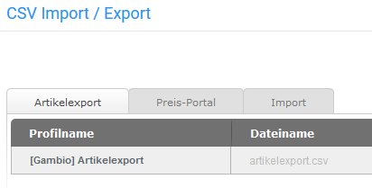

# Export 

Über die Reiter Artikelexport und Preis-Portal können Artikel aus dem Shop heraus exportiert werden. In den meisten Fällen werden die Artikel in eine sogenannte CSV-Datei geschrieben, die mit einem Tabellenkalkulationsprogramm geöffnet und bearbeitet werden kann.

**Note:** CSV \(Character Separated Values\) steht für zeichengetrennte Werte. Für CSV-Dateien besteht kein einheitliches Format, da das Trennzeichen nicht innerhalb der Spaltentexte vorkommen darf und CSV-Dateien für eine Vielzahl von Anwendungszwecken genutzt werden. Da auch Spalten-Namen nicht einheitlich normiert sind, können sich CSV-Dateien von zwei verschiedenen Programmen grundlegend voneinander unterscheiden.

Das Trennzeichen und das Texterkennungszeichen für den Export kannst du unter Import/Export \> Artikeldaten konfigurieren, wenn du das Profil bearbeitest. Für den Import können beide Zeichen im Reiter Import festgelegt werden. Wenn keine Änderungen vorgenommen wurden, werden Exporte mit einer Pipe \(\|,Senkrechtstrich\) als Trennzeichen und einem doppelten Anführungszeichen \("\) als Texttrenner/Texterkennungszeichen angelegt und Importe anhand derselben Einstellungen vorgenommen.

Exporte und Importe sind auf die Dateiformate .csv bzw. .txt beschränkt. Hierbei muss immer der Zeichensatz UTF-8 ohne BOM \(BOM steht für Byte Order Mark\) verwendet werden.

Wenn du den Menüpunkt Import/Export \> Artikeldaten das erste Mal aufrufst, findest du im Reiter Artikelexport das Standard-Export-Profil \[Gambio\] Artikelexport. Über die Profile werden die Einstellungen für den Export verwaltet. Du kannst beliebig viele Profile für unterschiedliche Exporte anlegen und diese ganz nach deinen Wünschen anpassen. Zunächst gehen wir von einem Export aller Artikel aus.

Du kannst wahlweise das Standard-Profil bearbeiten, um deine Einstellungen vorzunehmen oder durch einen Klick auf das Plus-Zeichen eine Kopie dieses Profils anlegen. Wenn du das Profil zuerst kopierst, hast du immer eine Sicherung der Original-Konfiguration vorliegen.

Um das Profil zu konfigurieren klicke bitte auf das Bleistift-Symbol, es öffnet sich das gewählte Profil mit geöffnetem Reiter Einstellungen.

**Note:** Wenn du ein vorgegebenes Profil bearbeitest, sind bestimmte Einstellungsmöglichkeiten standardmäßig ausgegraut und lassen sich nicht anpassen. Wenn du diese Einstellungen ändern möchtest, empfehlen wir eine Kopie des Profils anzulegen, indem du in der Übersicht auf das grüne Pluszeichen klickst.

Hier kannst du zunächst den Namen des Profils und den Dateinamen deiner Export-Datei anpassen. Wichtig ist, dass die Dateiendung .csv hierbei erhalten bleibt. Die Einstellungen für Trennzeichen und Texttrenner können im Normalfall beibehalten werden. Wenn du Eigenschaften verwendest und die zugewiesenen Eigenschaften-Kombinationen mit exportieren möchtest, setze bitte den Haken bei Eigenschaften. Wenn du Änderungen vorgenommem hast, müssen diese mit einem Klick auf Speichern bestätigt werden, bevor du den aktuellen Reiter verlässt.

Wechsele nun in den Reiter Kategorien. Bevor du einen Export vornehmen kannst, müssen die Kategorien ausgewählt werden, aus denen die Artikel exportiert werden sollen. Setze hierzu hinter die jeweiligen Kategorien und Unterkategorien die Haken. Wahlweise kannst du auch über die oberste Checkbox Alle auswählen / Auswahl aufheben alle Kategorien auf ein Mal anhaken. Bestätige auch diese Änderung mit einem Klick auf Speichern.

Wechsele abschließend in den Reiter Spalten. Hier sollten nun in der Vorschau-Ansicht einige deiner Artikel angezeigt werden. Wenn du zuvor den Haken für Eigenschaften gesetzt hast, müssen nun die einzelnen Felder festgelegt werden. Wenn du keine Eigenschaften-Kombinationen exportieren möchtest, kannst du diesen Schritt einfach überspringen.

Scrolle hierzu mit dem oberen Scrollbalken ganz nach rechts, sodass die graue Box Eigenschaften in der oberen Hälfte des Fensters angezeigt wird und klicke darauf. Wähle im Bereich Eigenschaftsauswahl die Eigenschaften aus, dessen Kombinationen du mit exportieren willst. Um mehrere Eigenschaften auszuwählen, kannst du wahlweise die Strg- oder Shift-Taste gedrückt halten, während du diese anklickst. Wiederhole das Gleiche im Feld Kombinationsdaten, im Normalfall sollten hier alle Einträge ausgewählt werden. Bestätige die Auswahl mit einem Klick auf OK und speichere die Änderung.

Die Grundeinstellungen, die vor dem ersten Export mit einem neuen Profil vorgenommen werden sollten, sind nun abgeschlossen. Verlasse die Profilansicht mit einem Klick auf Schließen. Über die Schaltflächen Profil exportieren bzw. Exportieren und herunterladen kannst du den Export durchführen.

Eine genaue Beschreibung der möglichen Einstellungen findest du in den nachfolgenden Abschnitten.

  

  

  

